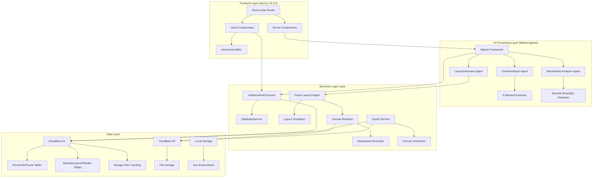
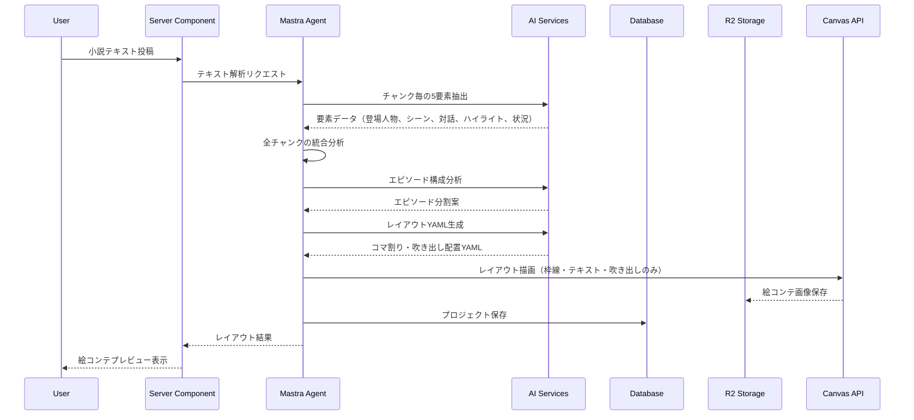
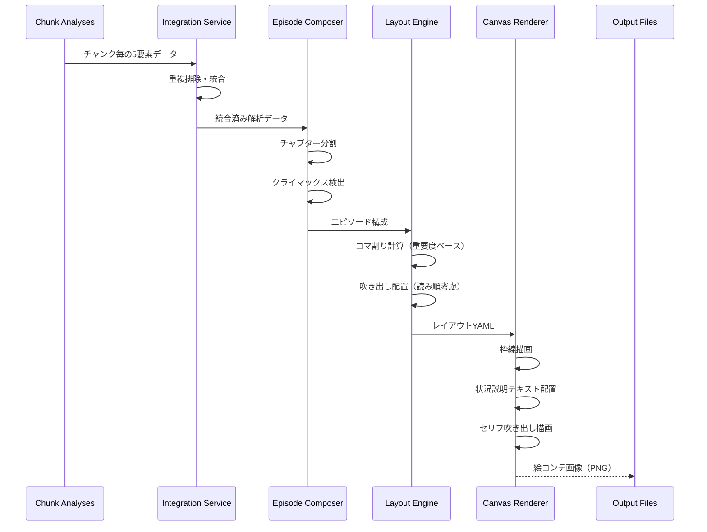
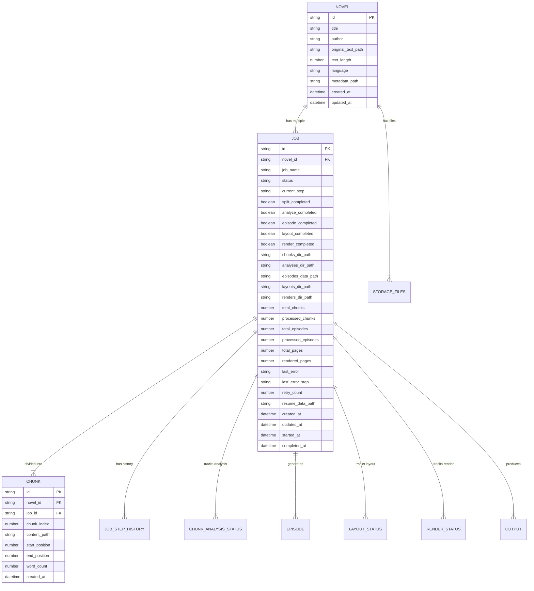
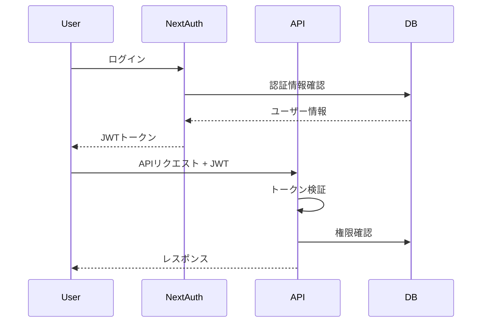
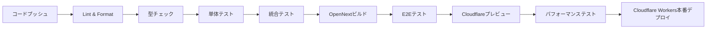

# Technical Design

## Overview

本設計書は、小説テキストをマンガ形式のレイアウト（絵コンテ）に自動変換するWebアプリケーションの技術実装について定義します。本ツールは編集者を補佐するツールであり、マンガの絵そのものを生成するのではなく、コマ割りと吹き出し配置の構成案を提供します。Mastra AIフレームワークをベースに、TypeScriptとNext.js 14を使用して、長文テキストの解析、5要素の抽出（登場人物・シーン・対話・ハイライト・状況）、連載エピソード構成、マンガレイアウト生成を実現します。

## Requirements Mapping

### Design Component Traceability

各設計コンポーネントが対応する要件：

- **テキスト解析エンジン** → REQ-1: テキスト入力と解析（チャンク分割、会話/地の文識別）
- **5要素抽出AI** → REQ-1.4: チャンク毎に会話部分、地の文、シーン転換の自動識別
- **エピソード構成エンジン** → REQ-3: 連載マンガとしてのエピソード分割
- **マンガレイアウト設計エンジン** → REQ-3: YAMLで漫画レイアウトを記述する（コマ割りと吹き出し配置）
- **マンガレイアウト生成エンジン** → YAMLからCanvas APIで、枠と状況説明とセリフによる絵コンテの描画（編集者向けの構成案として、マンガそのものの絵は含まない）
- **エクスポートサービス** → REQ-5: エクスポートと共有
- **プロジェクト管理** → REQ-6: データ管理とプロジェクト保存

### User Story Coverage

- 小説著者のニーズ: テキスト解析エンジンと5要素抽出AIで自動シーン解析を実現
- 読者のニーズ: Mastra統合によるYAMLで構造化されたマンガレイアウト
- マンガ制作者のニーズ: 日本式レイアウトエンジンによるプロフェッショナルなコマ割り
- カスタマイズニーズ: React Server Componentsによる高速なインタラクティブ編集
- 共有ニーズ: Next.js APIルートによる効率的なエクスポート処理

## Architecture



### Technology Stack (2025-08-09 更新)

調査結果に基づく技術選定：

- **Frontend**: Next.js 15.3.3 (App Router) + TypeScript 5 + Tailwind CSS v4
- **AI Framework**: Mastra (TypeScript agent framework)
- **絵コンテ生成**: Canvas API（枠線・テキスト・吹き出しのみ、イラストは含まない）
- **Backend**: Next.js API Routes + Mastra Agents
- **Database**: Cloudflare D1 (SQLite ベース) / SQLite (開発環境)
- **Cache**: Cloudflare KV (APIレスポンスキャッシュ)
- **File Storage**: Cloudflare R2 (プロダクション) / Local Storage (開発)
- **LLM Providers**: OpenRouter (primary), Gemini, Claude（フォールバックチェーン。Gemini対応を追加）
- **LLM Factory**: 動的プロバイダー選択とフォールバック機能実装済み（AI SDK v5との型差異により、一部一時的な型キャストでMastra Agentへ適合させています。後述のタスク参照）
- **Configuration**: app.config.ts による集中管理 + 環境変数 (シークレットのみ)
- **Font**: Google Inter (next/font/google)
- **Authentication**: NextAuth.js v5 (未実装)
- **Testing**: Vitest + Playwright + React Testing Library
- **Deployment**: Cloudflare Workers (OpenNext adapter)

### Architecture Decision Rationale

- **Next.js 15.3.3 App Router**: Server Componentsによる高速レンダリング、RSCによるクライアントJSの削減、Cloudflare Workers対応
- **Mastra Framework**: TypeScript完全対応、エージェント型アーキテクチャ、統合済みのLLM/画像生成API連携
- **Cloudflare D1**: SQLiteベースのエッジデータベース、階層構造データ管理、ジョブステータス追跡
- **Cloudflare R2**: S3互換API、エッジ配信、コスト効率
- **Cloudflare Workers**: グローバルエッジ配信、低レイテンシー、自動スケーリング、KVキャッシュ統合
- **設定管理**: app.config.ts による一元管理、環境変数オーバーライド、チューニング用コメント付き
- **LLMフォールバックチェーン**: openrouter → gemini → claude の自動フォールバック、可用性向上（Gemini追加）

### 型互換性に関する注記（Mastra × Vercel AI SDK）

- 現状、Vercel AI SDK v5 の LanguageModelV2 と Mastra Agent 側の期待型（LanguageModelV1）に差異があり、`src/agents/layout-generator.ts` では一時的に `as any` キャストで適合させています。
- 恒久対策としては、Mastra側の更新または軽量アダプタ層（V1→V2ブリッジ）の導入を検討中（tasks.md: TASK-LLM-ADAPTER-001）。
- **StorageFactory Pattern**: 環境別ストレージ抽象化、開発・本番環境の自動切り替え

## Data Flow

### Primary User Flow: テキストからマンガレイアウト生成



### エピソード構成とレイアウト生成フロー



## Components and Interfaces

### Backend Services & Method Signatures

```typescript
// Mastra Agent定義（実装済み）
// ChunkAnalyzerAgent - チャンク分析エージェント
const chunkAnalyzerAgent = new Agent({
  name: "chunk-analyzer",
  description:
    "小説のチャンクを分析してキャラクター、場面、対話、ハイライト、状況を抽出するエージェント",
  instructions: () => getTextAnalysisConfig().systemPrompt,
  model: async () => {
    const llm = await getTextAnalysisLLM();
    return llm.provider(llm.model);
  },
});

// NarrativeArcAnalyzerAgent - 物語構造分析エージェント
const narrativeArcAnalyzerAgent = new Agent({
  name: "narrative-arc-analyzer",
  description:
    "小説全体の物語構造を分析してエピソード境界を検出するエージェント",
  instructions: () => getNarrativeAnalysisConfig().systemPrompt,
  model: async () => {
    const llm = await getNarrativeAnalysisLLM();
    return llm.provider(llm.model);
  },
});

// LayoutGeneratorAgent - レイアウト生成エージェント
const layoutGeneratorAgent = new Agent({
  name: "layout-generator",
  description:
    "エピソード分析結果からマンガレイアウトYAMLを生成するエージェント",
  instructions: () => getLayoutGenerationConfig().systemPrompt,
  model: async () => {
    const llm = await getLayoutGenerationLLM();
    return llm.provider(llm.model);
  },
});

// LLMプロバイダー設定
interface LLMProviderConfig {
  provider: "openai" | "gemini" | "groq" | "local" | "openrouter" | "claude";
  apiKey?: string;
  model: string;
  temperature?: number;
  maxTokens?: number;
  timeout?: number;
}

// フォールバックチェーン機能（実装済み）
// LLM Factory関数群
export async function getTextAnalysisLLM() {
  const config = getTextAnalysisConfig();
  const preferredProvider =
    config.provider === "default"
      ? appConfig.llm.defaultProvider
      : config.provider;
  const llmInstance = await getProviderWithFallback(preferredProvider);
  return llmInstance;
}

export async function getNarrativeAnalysisLLM() {
  const config = getNarrativeAnalysisConfig();
  const preferredProvider =
    config.provider === "default"
      ? appConfig.llm.defaultProvider
      : config.provider;
  return await getProviderWithFallback(preferredProvider);
}

export async function getProviderWithFallback(preferredProvider?: string) {
  // appConfig.llmFallbackChainに基づくフォールバック処理実装
  // openrouter → gemini → claude の順でフォールバック
}

// ジョブ管理サービス（実装済み）
export class JobNarrativeProcessor {
  constructor(config: NarrativeProcessorConfig) {
    this.config = config;
    this.dbService = new DatabaseService();
  }

  async processJob(
    jobId: string,
    onProgress?: (progress: JobProgress) => void,
  ): Promise<JobProgress> {
    // 分割→分析→エピソード分析の完全フロー実装済み
  }

  async canResumeJob(jobId: string): Promise<boolean> {
    // ジョブ再開可能性チェック実装済み
  }
}

// データベースサービス（実装済み）
// src/services/database.ts で完全実装済み
/*
export class DatabaseService {
  private db = getDatabase()

  // Novel管理 - 実装済み
  async createNovel(novel: Omit<Novel, 'id' | 'createdAt'>): Promise<string>
  async getNovel(id: string): Promise<Novel | null>
  async getAllNovels(): Promise<Novel[]>
  async ensureNovel(novel: Omit<Novel, 'id' | 'createdAt'>): Promise<string>

  // Job管理 - 実装済み
  async createJob(job: Omit<Job, 'id' | 'createdAt'>): Promise<string>
  async getJob(id: string): Promise<Job | null>
  async getJobWithProgress(id: string): Promise<JobWithProgress | null>
  async updateJobStatus(id: string, status: JobStatus, error?: string): Promise<void>
  async updateJobProgress(id: string, progress: Partial<JobProgress>): Promise<void>
  async updateJobStep(id: string, step: JobStep, metadata?: any): Promise<void>
  async updateJobError(id: string, error: string, step: string): Promise<void>
  async markJobStepCompleted(id: string, step: JobStep): Promise<void>
  async getJobsByNovelId(novelId: string): Promise<Job[]>

  // Chunk管理 - 実装済み
  async createChunk(chunk: Omit<Chunk, 'id' | 'createdAt'>): Promise<string>
  async getChunksByJobId(jobId: string): Promise<Chunk[]>

  // Episode管理 - 実装済み
  async createEpisode(episode: Omit<Episode, 'id' | 'createdAt'>): Promise<string>
  async createEpisodes(episodes: Episode[]): Promise<void>
  async getEpisodesByJobId(jobId: string): Promise<Episode[]>

  // レンダリング状態管理 - 実装済み
  async updateRenderStatus(status: RenderStatusUpdate): Promise<void>
}
*/
```

### Frontend Components

| Component Name     | Responsibility                       | Props/State Summary                       | Status          |
| ------------------ | ------------------------------------ | ----------------------------------------- | --------------- |
| HomeClient         | メインクライアント境界コンポーネント | sampleText, processing states             | Implemented     |
| TextInputArea      | テキスト入力UI                       | text, onChange, maxLength, characterCount | Implemented     |
| ProcessingProgress | 処理進捗表示                         | currentStep, progress, message            | Implemented     |
| ResultsDisplay     | 結果表示コンポーネント               | episodes, layouts, renders                | Implemented     |
| Logger             | ログ表示コンポーネント               | logs, maxLogs                             | Implemented     |
| NovelUploader      | 小説アップロードUI                   | onUpload, accepted formats                | Partially       |
| MangaPreview       | マンガプレビュー表示                 | layout, panels, editable                  | Not Implemented |
| PanelEditor        | コマ編集インターフェース             | panel, onResize, onMove                   | Not Implemented |
| SpeechBubbleEditor | 吹き出し編集                         | bubble, text, style, onEdit               | Not Implemented |
| ExportDialog       | エクスポート設定                     | formats, onExport                         | Not Implemented |
| ProjectManager     | プロジェクト管理UI                   | projects, onSave, onLoad                  | Not Implemented |

### API Endpoints

| Method | Route                           | Purpose                                      | Auth                  | Status Codes       |
| ------ | ------------------------------- | -------------------------------------------- | --------------------- | ------------------ |
| POST   | /api/novel                      | 小説登録（テキスト + メタデータ）            | Implemented           | 200, 400, 413, 500 |
| GET    | /api/novel/storage/:id          | 小説テキスト取得                             | Implemented           | 200, 404, 500      |
| POST   | /api/novel/db                   | 小説メタデータDB保存                         | Implemented           | 200, 400, 500      |
| GET    | /api/novel/[uuid]/chunks        | チャンク分割・取得                           | Implemented           | 200, 404, 500      |
| POST   | /api/analyze                    | 統合分析（チャンク分割→分析→エピソード分析） | Implemented           | 200, 400, 500      |
| POST   | /api/analyze/chunk              | チャンク単位の5要素分析                      | Implemented           | 200, 400, 500      |
| POST   | /api/analyze/episode            | エピソード境界分析                           | Implemented           | 200, 400, 500      |
| POST   | /api/analyze/narrative-arc/full | 全体物語構造分析                             | Implemented           | 200, 400, 500      |
| GET    | /api/job/[id]                   | ジョブ情報取得                               | Implemented           | 200, 404, 500      |
| GET    | /api/jobs/[jobId]/status        | ジョブステータス取得                         | Implemented           | 200, 404, 500      |
| GET    | /api/jobs/[jobId]/episodes      | エピソード一覧取得                           | Implemented           | 200, 404, 500      |
| POST   | /api/jobs/[jobId]/resume        | ジョブ再開                                   | Implemented           | 200, 400, 404, 500 |
| POST   | /api/layout/generate            | レイアウトYAML生成                           | Implemented           | 200, 400, 500      |
| POST   | /api/render                     | Canvasレンダリング                           | Implemented           | 201, 400, 500      |
| POST   | /api/render/batch               | バッチレンダリング                           | Implemented           | 201, 400, 500      |
| GET    | /api/render/status/[jobId]      | レンダリング状況確認                         | Implemented           | 200, 400, 500      |
| POST   | /api/export                     | マンガエクスポート（PDF・ZIP）               | Partially Implemented | 201, 400, 500      |
| POST   | /api/share                      | 共有リンク生成                               | Partially Implemented | 201, 401, 500      |

## Data Models

### Domain Entities (新スキーマ対応)

1. **Novel**: 小説エンティティ（最上位）
2. **Job**: 変換ジョブ（Novelに対する処理単位）
3. **JobStepHistory**: 各処理ステップの履歴
4. **Chunk**: 分割されたテキストチャンク
5. **ChunkAnalysisStatus**: チャンク分析状態
6. **Episode**: エピソード境界情報
7. **LayoutStatus**: レイアウト生成状態
8. **RenderStatus**: 描画状態
9. **Output**: 最終成果物
10. **StorageFiles**: ファイル管理

### Entity Relationships



### Data Model Definitions

```typescript
// TypeScript 型定義（Drizzle ORM + Zodスキーマ統合）

// Core Models - Drizzle自動生成型とZodスキーマの併用
export type Novel = typeof novels.$inferSelect; // Drizzle自動生成
export type NewNovel = typeof novels.$inferInsert; // Insert用
export type Job = typeof jobs.$inferSelect; // Drizzle自動生成
export type NewJob = typeof jobs.$inferInsert; // Insert用
export type Chunk = typeof chunks.$inferSelect;
export type NewChunk = typeof chunks.$inferInsert;
export type Episode = typeof episodes.$inferSelect;
export type NewEpisode = typeof episodes.$inferInsert;
export type StorageFile = typeof storageFiles.$inferSelect;
export type NewStorageFile = typeof storageFiles.$inferInsert;

// Zodスキーマベース型（バリデーション付き）
export type NovelZod = z.infer<typeof NovelSchema>;
export type JobZod = z.infer<typeof JobSchema>;
export type TextAnalysis = z.infer<typeof TextAnalysisSchema>;

// 分析結果型（統合定義）
export interface ChunkAnalysisResult {
  chunkIndex: number;
  characters: Array<{
    name: string;
    role: "protagonist" | "antagonist" | "supporting" | "minor";
    description?: string;
  }>;
  scenes: Array<{
    location: string;
    timeOfDay?: string;
    atmosphere?: string;
    description?: string;
  }>;
  dialogues: Array<{
    speaker: string;
    content: string;
    emotion?: string;
    importance: "high" | "medium" | "low";
  }>;
  highlights: Array<{
    type: "action" | "emotion" | "plot" | "description";
    content: string;
    importance: number;
    intensity: number;
    relevance: number;
    startIndex: number;
    endIndex: number;
  }>;
  situations: Array<{
    type: "conflict" | "resolution" | "transition" | "development";
    description: string;
    significance: number;
  }>;
  narrativeElements: {
    tension: number;
    pacing: "slow" | "medium" | "fast";
    emotionalTone: string;
    plotRelevance: number;
  };
}

// マンガレイアウト型
export interface MangaLayout {
  title: string;
  author?: string;
  created_at: string;
  episodeNumber: number;
  episodeTitle?: string;
  pages: Page[];
}

export interface Page {
  pageNumber: number;
  panels: Panel[];
  dimensions: {
    width: number;
    height: number;
  };
}

export interface Panel {
  id: string;
  position: {
    x: number;
    y: number;
    width: number;
    height: number;
  };
  content: {
    type: "dialogue" | "narration" | "action" | "transition";
    text?: string;
    speaker?: string;
    emotion?: string;
  };
  speechBubbles?: SpeechBubble[];
}

export interface SpeechBubble {
  id: string;
  position: {
    x: number;
    y: number;
    width: number;
    height: number;
  };
  style: "speech" | "thought" | "narration" | "effect";
  text: string;
  speaker?: string;
  tailPosition?: {
    x: number;
    y: number;
  };
}

// 統合分析型（エピソード分析結果）
export interface NarrativeArcAnalysis {
  episodes: Array<{
    episodeNumber: number;
    title?: string;
    summary?: string;
    startChunk: number;
    startCharIndex: number;
    endChunk: number;
    endCharIndex: number;
    estimatedPages: number;
    confidence: number;
    keyEvents: string[];
    emotionalArc: string[];
  }>;
  overallStructure: {
    totalEpisodes: number;
    averageEpisodeLength: number;
    genreClassification: string[];
    mainThemes: string[];
  };
  metadata: {
    analysisTimestamp: string;
    processingTimeMs: number;
    modelUsed: string;
  };
}

// Zodスキーマ例（参考）
/*
const NovelSchema = z.object({
  id: z.string(),
  title: z.string().optional(),
  author: z.string().optional(),
  originalTextPath: z.string(),
  textLength: z.number(),
  language: z.string(),
  metadataPath: z.string().optional(),
  createdAt: z.date(),
  updatedAt: z.date(),
})

const TextAnalysisSchema = z.object({
  id: z.string(),
  chunkId: z.string().optional(),
  characters: z.array(CharacterSchema),
  scenes: z.array(SceneSchema),
  dialogues: z.array(DialogueSchema),
  highlights: z.array(HighlightSchema),
  situations: z.array(SituationSchema),
  createdAt: z.date(),
  updatedAt: z.date(),
})
*/
```

### Database Schema (Drizzle ORM)

現在のデータベーススキーマはDrizzle ORMを使用して定義されています。

```typescript
// src/db/schema.ts - Drizzle Schema Definition

// 小説テーブル（最上位エンティティ）
export const novels = sqliteTable(
  "novels",
  {
    id: text("id").primaryKey(),
    title: text("title"),
    author: text("author"),
    originalTextPath: text("original_text_path").notNull(), // ストレージ上の小説ファイルパス
    textLength: integer("text_length").notNull(),
    language: text("language").default("ja"),
    metadataPath: text("metadata_path"), // ストレージ上のメタデータJSONファイルパス
    createdAt: text("created_at").default(sql`CURRENT_TIMESTAMP`),
    updatedAt: text("updated_at").default(sql`CURRENT_TIMESTAMP`),
  },
  (table) => ({
    createdAtIdx: index("idx_novels_created_at").on(table.createdAt),
  }),
);

// 変換ジョブテーブル（小説に対する変換処理）
export const jobs = sqliteTable(
  "jobs",
  {
    id: text("id").primaryKey(),
    novelId: text("novel_id")
      .notNull()
      .references(() => novels.id, { onDelete: "cascade" }),
    jobName: text("job_name"),

    // ステータス管理
    status: text("status").notNull().default("pending"), // pending/processing/completed/failed/paused
    currentStep: text("current_step").notNull().default("initialized"), // initialized/split/analyze/episode/layout/render/complete

    // 各ステップの完了状態
    splitCompleted: integer("split_completed", { mode: "boolean" }).default(
      false,
    ),
    analyzeCompleted: integer("analyze_completed", { mode: "boolean" }).default(
      false,
    ),
    episodeCompleted: integer("episode_completed", { mode: "boolean" }).default(
      false,
    ),
    layoutCompleted: integer("layout_completed", { mode: "boolean" }).default(
      false,
    ),
    renderCompleted: integer("render_completed", { mode: "boolean" }).default(
      false,
    ),

    // 各ステップの成果物パス（ディレクトリ）
    chunksDirPath: text("chunks_dir_path"),
    analysesDirPath: text("analyses_dir_path"),
    episodesDataPath: text("episodes_data_path"),
    layoutsDirPath: text("layouts_dir_path"),
    rendersDirPath: text("renders_dir_path"),

    // 進捗詳細
    totalChunks: integer("total_chunks").default(0),
    processedChunks: integer("processed_chunks").default(0),
    totalEpisodes: integer("total_episodes").default(0),
    processedEpisodes: integer("processed_episodes").default(0),
    totalPages: integer("total_pages").default(0),
    renderedPages: integer("rendered_pages").default(0),

    // エラー管理
    lastError: text("last_error"),
    lastErrorStep: text("last_error_step"),
    retryCount: integer("retry_count").default(0),

    // 再開用の状態保存
    resumeDataPath: text("resume_data_path"),

    // タイムスタンプ
    createdAt: text("created_at").default(sql`CURRENT_TIMESTAMP`),
    updatedAt: text("updated_at").default(sql`CURRENT_TIMESTAMP`),
    startedAt: text("started_at"),
    completedAt: text("completed_at"),
  },
  (table) => ({
    novelIdIdx: index("idx_jobs_novel_id").on(table.novelId),
    statusIdx: index("idx_jobs_status").on(table.status),
    novelIdStatusIdx: index("idx_jobs_novel_id_status").on(
      table.novelId,
      table.status,
    ),
    currentStepIdx: index("idx_jobs_current_step").on(table.currentStep),
  }),
);

// ジョブステップ履歴テーブル（各ステップの実行記録）
export const jobStepHistory = sqliteTable(
  "job_step_history",
  {
    id: text("id").primaryKey(),
    jobId: text("job_id")
      .notNull()
      .references(() => jobs.id, { onDelete: "cascade" }),
    stepName: text("step_name").notNull(), // split/analyze/episode/layout/render
    status: text("status").notNull(), // started/completed/failed/skipped
    startedAt: text("started_at").notNull(),
    completedAt: text("completed_at"),
    durationSeconds: integer("duration_seconds"),
    inputPath: text("input_path"),
    outputPath: text("output_path"),
    errorMessage: text("error_message"),
    metadata: text("metadata"), // JSON形式の追加情報
    createdAt: text("created_at").default(sql`CURRENT_TIMESTAMP`),
  },
  (table) => ({
    jobIdIdx: index("idx_job_step_history_job_id").on(table.jobId),
  }),
);

// チャンクテーブル（分割されたテキスト）
export const chunks = sqliteTable(
  "chunks",
  {
    id: text("id").primaryKey(),
    novelId: text("novel_id")
      .notNull()
      .references(() => novels.id, { onDelete: "cascade" }),
    jobId: text("job_id")
      .notNull()
      .references(() => jobs.id, { onDelete: "cascade" }),
    chunkIndex: integer("chunk_index").notNull(),
    contentPath: text("content_path").notNull(),
    startPosition: integer("start_position").notNull(),
    endPosition: integer("end_position").notNull(),
    wordCount: integer("word_count"),
    createdAt: text("created_at").default(sql`CURRENT_TIMESTAMP`),
  },
  (table) => ({
    novelIdIdx: index("idx_chunks_novel_id").on(table.novelId),
    jobIdIdx: index("idx_chunks_job_id").on(table.jobId),
    uniqueJobChunk: index("unique_job_chunk").on(table.jobId, table.chunkIndex),
  }),
);

// チャンク分析状態テーブル（各チャンクの分析完了状態）
export const chunkAnalysisStatus = sqliteTable(
  "chunk_analysis_status",
  {
    id: text("id").primaryKey(),
    jobId: text("job_id")
      .notNull()
      .references(() => jobs.id, { onDelete: "cascade" }),
    chunkIndex: integer("chunk_index").notNull(),
    isAnalyzed: integer("is_analyzed", { mode: "boolean" }).default(false),
    analysisPath: text("analysis_path"),
    analyzedAt: text("analyzed_at"),
    retryCount: integer("retry_count").default(0),
    lastError: text("last_error"),
    createdAt: text("created_at").default(sql`CURRENT_TIMESTAMP`),
  },
  (table) => ({
    jobIdIdx: index("idx_chunk_analysis_status_job_id").on(table.jobId),
    uniqueJobChunk: index("unique_job_chunk_analysis").on(
      table.jobId,
      table.chunkIndex,
    ),
  }),
);

// エピソードテーブル
export const episodes = sqliteTable(
  "episodes",
  {
    id: text("id").primaryKey(),
    novelId: text("novel_id")
      .notNull()
      .references(() => novels.id, { onDelete: "cascade" }),
    jobId: text("job_id")
      .notNull()
      .references(() => jobs.id, { onDelete: "cascade" }),
    episodeNumber: integer("episode_number").notNull(),
    title: text("title"),
    summary: text("summary"),
    startChunk: integer("start_chunk").notNull(),
    startCharIndex: integer("start_char_index").notNull(),
    endChunk: integer("end_chunk").notNull(),
    endCharIndex: integer("end_char_index").notNull(),
    estimatedPages: integer("estimated_pages").notNull(),
    confidence: real("confidence").notNull(),
    createdAt: text("created_at").default(sql`CURRENT_TIMESTAMP`),
  },
  (table) => ({
    novelIdIdx: index("idx_episodes_novel_id").on(table.novelId),
    jobIdIdx: index("idx_episodes_job_id").on(table.jobId),
    uniqueJobEpisode: index("unique_job_episode").on(
      table.jobId,
      table.episodeNumber,
    ),
  }),
);

// レイアウト状態テーブル（各エピソードのレイアウト生成状態）
export const layoutStatus = sqliteTable(
  "layout_status",
  {
    id: text("id").primaryKey(),
    jobId: text("job_id")
      .notNull()
      .references(() => jobs.id, { onDelete: "cascade" }),
    episodeNumber: integer("episode_number").notNull(),
    isGenerated: integer("is_generated", { mode: "boolean" }).default(false),
    layoutPath: text("layout_path"),
    totalPages: integer("total_pages"),
    totalPanels: integer("total_panels"),
    generatedAt: text("generated_at"),
    retryCount: integer("retry_count").default(0),
    lastError: text("last_error"),
    createdAt: text("created_at").default(sql`CURRENT_TIMESTAMP`),
  },
  (table) => ({
    jobIdIdx: index("idx_layout_status_job_id").on(table.jobId),
    uniqueJobEpisode: index("unique_job_episode_layout").on(
      table.jobId,
      table.episodeNumber,
    ),
  }),
);

// 描画状態テーブル（各ページの描画状態）
export const renderStatus = sqliteTable(
  "render_status",
  {
    id: text("id").primaryKey(),
    jobId: text("job_id")
      .notNull()
      .references(() => jobs.id, { onDelete: "cascade" }),
    episodeNumber: integer("episode_number").notNull(),
    pageNumber: integer("page_number").notNull(),
    isRendered: integer("is_rendered", { mode: "boolean" }).default(false),
    imagePath: text("image_path"),
    thumbnailPath: text("thumbnail_path"),
    width: integer("width"),
    height: integer("height"),
    fileSize: integer("file_size"),
    renderedAt: text("rendered_at"),
    retryCount: integer("retry_count").default(0),
    lastError: text("last_error"),
    createdAt: text("created_at").default(sql`CURRENT_TIMESTAMP`),
  },
  (table) => ({
    jobIdIdx: index("idx_render_status_job_id").on(table.jobId),
    uniqueJobEpisodePage: index("unique_job_episode_page").on(
      table.jobId,
      table.episodeNumber,
      table.pageNumber,
    ),
  }),
);

// 最終成果物テーブル
export const outputs = sqliteTable(
  "outputs",
  {
    id: text("id").primaryKey(),
    novelId: text("novel_id")
      .notNull()
      .references(() => novels.id, { onDelete: "cascade" }),
    jobId: text("job_id")
      .notNull()
      .references(() => jobs.id, { onDelete: "cascade" }),
    outputType: text("output_type").notNull(), // pdf/images_zip
    outputPath: text("output_path").notNull(),
    fileSize: integer("file_size"),
    pageCount: integer("page_count"),
    metadataPath: text("metadata_path"),
    createdAt: text("created_at").default(sql`CURRENT_TIMESTAMP`),
  },
  (table) => ({
    novelIdIdx: index("idx_outputs_novel_id").on(table.novelId),
    jobIdIdx: index("idx_outputs_job_id").on(table.jobId),
  }),
);

// ストレージ参照テーブル（全ファイルの追跡）
export const storageFiles = sqliteTable(
  "storage_files",
  {
    id: text("id").primaryKey(),
    novelId: text("novel_id")
      .notNull()
      .references(() => novels.id, { onDelete: "cascade" }),
    jobId: text("job_id").references(() => jobs.id, { onDelete: "cascade" }),
    filePath: text("file_path").notNull().unique(),
    fileCategory: text("file_category").notNull(), // original/chunk/analysis/episode/layout/render/output/metadata
    fileType: text("file_type").notNull(), // txt/json/yaml/png/jpg/pdf/zip
    mimeType: text("mime_type"), // 追加: 実際のMIMEタイプ (例: 'image/png')
    fileSize: integer("file_size"),
    createdAt: text("created_at").default(sql`CURRENT_TIMESTAMP`),
  },
  (table) => ({
    novelIdIdx: index("idx_storage_files_novel_id").on(table.novelId),
  }),
);

// インデックスはDrizzleテーブル定義内で管理：
// - novels: createdAtIdx
// - jobs: novelIdIdx, statusIdx, novelIdStatusIdx, currentStepIdx
// - jobStepHistory: jobIdIdx
// - chunks: novelIdIdx, jobIdIdx, uniqueJobChunk
// - chunkAnalysisStatus: jobIdIdx, uniqueJobChunkAnalysis
// - episodes: novelIdIdx, jobIdIdx, uniqueJobEpisode
// - layoutStatus: jobIdIdx, uniqueJobEpisode
// - renderStatus: jobIdIdx, uniqueJobEpisodePage
// - outputs: novelIdIdx, jobIdIdx
// - storageFiles: novelIdIdx

// 型エクスポート（Drizzle自動生成）
export type Novel = typeof novels.$inferSelect;
export type NewNovel = typeof novels.$inferInsert;
export type Job = typeof jobs.$inferSelect;
export type NewJob = typeof jobs.$inferInsert;
export type Episode = typeof episodes.$inferSelect;
export type NewEpisode = typeof episodes.$inferInsert;
// その他すべてのテーブル型も同様に自動生成

// データベースビューはDrizzleでは直接サポートされていないため、
// 必要に応じてクエリビルダーで複雑な集計を実装

// 小説の変換状況取得例：
/*
const novelStatusQuery = db
  .select({
    id: novels.id,
    title: novels.title,
    author: novels.author,
    totalJobs: count(jobs.id),
    completedJobs: count(case(when(eq(jobs.status, 'completed'), jobs.id), else(null))),
    activeJobs: count(case(when(eq(jobs.status, 'processing'), jobs.id), else(null))),
    totalOutputs: count(outputs.id),
    createdAt: novels.createdAt,
    lastJobCreatedAt: max(jobs.createdAt),
  })
  .from(novels)
  .leftJoin(jobs, eq(novels.id, jobs.novelId))
  .leftJoin(outputs, eq(novels.id, outputs.novelId))
  .groupBy(novels.id);
*/
```

### R2 Storage Structure

現在実装されている統合ストレージ構造：

```
novels/
└── {novelId}/
    ├── original/
    │   ├── text.txt                    # 元の小説テキスト
    │   └── metadata.json              # 小説のメタデータ
    │
    └── jobs/
        └── {jobId}/
            ├── chunks/
            │   ├── chunk_001.txt       # チャンクテキスト
            │   ├── chunk_002.txt
            │   └── ...
            │
            ├── analyses/
            │   ├── chunk_001.json      # チャンク分析結果
            │   ├── chunk_002.json
            │   └── ...
            │
            ├── episodes/
            │   ├── episodes.json       # エピソード一覧
            │   └── episode_{n}/
            │       ├── layout.yaml     # レイアウト定義
            │       └── metadata.json   # レイアウトメタデータ
            │
            ├── renders/
            │   ├── config.json         # 描画設定
            │   ├── episode_{n}/
            │   │   ├── page_001.png    # 描画済みページ
            │   │   ├── page_002.png
            │   │   └── ...
            │   └── thumbnails/
            │       └── episode_{n}/
            │           ├── page_001_thumb.png
            │           └── ...
            │
            ├── outputs/
            │   ├── manga.pdf           # PDF形式（ページ順JPEG統合）
            │   ├── manga_images.zip    # ZIP形式（JPEG画像＋YAML設定）
            │   └── metadata.json       # 成果物メタデータ
            │
            └── state/
                ├── job_progress.json   # ジョブ進捗状態
                └── resume_data.json    # 再開用データ
```

### Migration Strategy (Drizzle)

- **Drizzle Kit**: スキーマから自動マイグレーション生成
- **環境別マイグレーション**: 開発環境（SQLite）、本番環境（D1）
- **型安全性**: TypeScriptによるスキーマとクエリの型チェック
- **バージョン管理**: `drizzle/migrations/`ディレクトリで管理
- **マイグレーションコマンド**:

  ```bash
  # スキーマ変更からマイグレーション生成
  npx drizzle-kit generate

  # 開発環境適用
  npx drizzle-kit migrate

  # 本番環境適用（D1）
  npx wrangler d1 migrations apply novel2manga
  ```

- **インデックス戦略**: Drizzleテーブル定義内で複合インデックス管理

## Storage and Database Abstraction

### ストレージ抽象化設計（2025-08-01追加）

```typescript
// Custom Storage Interface（Web Storage APIとの競合を避けるため）
interface NovelStorage {
  put(
    key: string,
    value: string | Buffer,
    metadata?: Record<string, string>,
  ): Promise<void>;
  get(
    key: string,
  ): Promise<{ text: string; metadata?: Record<string, string> } | null>;
  delete(key: string): Promise<void>;
  exists(key: string): Promise<boolean>;
}

// Drizzle Database Connection
interface DrizzleDatabase {
  select(): SelectQueryBuilder;
  insert(table: SQLiteTable): InsertQueryBuilder;
  update(table: SQLiteTable): UpdateQueryBuilder;
  delete(table: SQLiteTable): DeleteQueryBuilder;
  batch(queries: any[]): Promise<any[]>;
}

// Environment-specific Implementations（実装済み）
// src/lib/storage/ で完全実装済み
/*
class LocalFileStorage implements NovelStorage {
  // ローカルファイルシステムへの保存実装
}
class R2Storage implements NovelStorage {
  // Cloudflare R2への保存実装
}
*/

// Drizzle統合データベース接続
class DatabaseService {
  private db: DrizzleDatabase;

  constructor() {
    if (process.env.NODE_ENV === "development") {
      // SQLite + Drizzle
      const sqliteDb = new Database(dbConfig.path);
      this.db = drizzle(sqliteDb, { schema });
    } else {
      // D1 + Drizzle
      this.db = drizzle(globalThis.DB, { schema });
    }
  }
}

// Storage Factory（実装済み）
// src/services/storage.ts で完全実装済み
/*
export class StorageFactory {
  static async getNovelStorage(): Promise<NovelStorage>
  static async getChunkStorage(): Promise<NovelStorage>
  static async getAnalysisStorage(): Promise<NovelStorage>
  static async getLayoutStorage(): Promise<NovelStorage>
  static async getRenderStorage(): Promise<NovelStorage>
  static async getDatabase(): Promise<DatabaseService>
}
*/
```

## Error Handling

### エラー処理戦略（2025-08-10更新）

本プロジェクトのAPIエラーハンドリングは `src/utils/api-error.ts` に集約し、全ルートは `createErrorResponse` を用いて単一の形でJSONエラーを返します。ルート実装では原則として `ApiError` 階層を throw し、その他の例外は共通レスポンダが安全に変換します。

### 2025-08-12 更新 (PR#59 レビュー反映)

- 成功レスポンスも `createSuccessResponse` に統一。`/api/layout/generate` を含む全ての新/更新ルートはトップレベル `{ success: true, ...payload }` 形式を使用。
- 旧 `NextResponse.json` 直接返却は段階的廃止（互換保持が不要になり次第リファクタ継続）。
- StorageKeys に ID バリデーション（英数/`_-` のみ & `..`/先頭`/`禁止）を追加しパストラバーサルを防止。
- Job 作成APIをオーバーロード (id, novelId, jobName) / ({ novelId,... }) から単一シグネチャ `createJob({ id?, novelId, title?, totalChunks?, status? })` に集約。2025-08-12 時点の後方互換ヘルパ `createWithId` はレビュー反映で削除（呼び出し箇所無しを確認済み）。
- RepositoryFactory 生成時に DatabaseService の存在と代表メソッド (`getJob`, `getNovel`) を実行前検証し、初期化失敗を早期検出。

- 主要クラスと型
  - ApiError（基底）/ ValidationError / NotFoundError / ForbiddenError / AuthenticationError / ExternalApiError / DatabaseError / StorageError
  - RetryableError / RateLimitError（再試行系）と型ガード（isRetryableError 等）
- カノニカルレスポンダ: `createErrorResponse(error, defaultMessage)`
  - ApiError: statusCode を尊重し、`{ error, code, details }` を返却
  - ZodError: 400 + `details` に zod の issues を格納
  - Legacy HttpError: status + code/details をマップ（後方互換のみ）
  - 再試行系（RetryableError/RateLimitError）: 429/503 + `Retry-After` 等のヘッダ
  - システムエラー（ENOENT/EACCES/ENOSPC/ETIMEDOUT など）: 安全な 503/500 へ変換
  - 汎用 Error/unknown: `error` は `defaultMessage`、`details` に元の message を格納（テスト互換のため）

- エラーコード体系: すべてのエラーコードは typed const `ERROR_CODES` に集約し、`ErrorCode` ユニオン型として利用します。コードのばらつきを防ぎ、型で漏れを検出します。

```ts
// src/utils/api-error.ts 抜粋
export const ERROR_CODES = {
  VALIDATION_ERROR: "VALIDATION_ERROR",
  NOT_FOUND: "NOT_FOUND",
  FORBIDDEN: "FORBIDDEN",
  AUTH_REQUIRED: "AUTH_REQUIRED",
  EXTERNAL_API_ERROR: "EXTERNAL_API_ERROR",
  DATABASE_ERROR: "DATABASE_ERROR",
  STORAGE_ERROR: "STORAGE_ERROR",
  INVALID_STATE: "INVALID_STATE",
  RATE_LIMIT: "RATE_LIMIT",
  RETRYABLE_ERROR: "RETRYABLE_ERROR",
  FILE_ACCESS_DENIED: "FILE_ACCESS_DENIED",
  INSUFFICIENT_STORAGE: "INSUFFICIENT_STORAGE",
  TIMEOUT: "TIMEOUT",
  INTERNAL_ERROR: "INTERNAL_ERROR",
  UNKNOWN_ERROR: "UNKNOWN_ERROR",
} as const;
export type ErrorCode = (typeof ERROR_CODES)[keyof typeof ERROR_CODES];
```

運用ガイド:

- ルート内で新たに識別したい状態（例: 再開不能など）は `ERROR_CODES` にコードを追加してから `ApiError` に付与します（例: INVALID_STATE）。
- `HttpError` は新規使用禁止。2025-08-12 に ESLint ガードを全体適用（`api-error.ts` 互換層内のみ許可）。既存分は responder で互換処理されます。

レスポンスの標準形:

```json
{
  "error": "Human-friendly message",
  "code": "optional_code",
  "details": { "...optional structured info..." }
}
```

実装上のガイド:

- ルートでは `throw new ValidationError('...')` などのドメイン例外を使用する。
- 例外は最上位の try/catch で `return createErrorResponse(err, 'Route specific fallback')` に渡す。
- 旧 `toErrorResponse` / `api-error-response.ts` は廃止。互換層は削除済みで、`HttpError` は新実装によりブリッジされるが新規使用は非推奨。

注: ルート毎のデフォルトメッセージはテスト仕様に合わせて選定し、`details` に内部メッセージを残すことでデバッグ可能性とユーザー向けメッセージの両立を図る。

### エラーシナリオ

- テキスト解析失敗: 適切なフォールバックとユーザー通知
- Canvas API処理エラー: デフォルトレイアウトへのフォールバック
- レイアウト生成エラー: デフォルトレイアウトへのフォールバック
- ストレージエラー: ローカルキャッシュとリトライ

## Configuration Management

### 設定ファイル構造

```typescript
// src/config/app.config.ts
export const appConfig = {
  // チャンク分割設定
  chunks: {
    defaultChunkSize: 5000, // 【ここを設定】
    defaultOverlapSize: 500, // 【ここを設定】
    minChunkSize: 1000,
    maxChunkSize: 10000,
  },

  // LLMプロバイダー設定
  llm: {
    defaultProvider: "openrouter", // 【ここを設定】
    providers: {
      openai: { model: "o3" }, // OpenAI o3 (reasoningモデル、temperatureパラメータなし)
      gemini: { model: "gemini-2.5-flash", temperature: 0.7 },
      groq: { model: "compound-beta", maxTokens: 8192 },
      local: { model: "gpt-oss:20b", baseUrl: "http://localhost:11434" },
      openrouter: { model: "openai/gpt-oss-120b", temperature: 0.7 },
    },
  },

  // 処理設定
  processing: {
    maxConcurrentChunks: 3, // 【ここを設定】
    retryAttempts: 3,
    retryDelay: 1000,
    cacheEnabled: true,
    cacheTTL: 86400000, // 24時間
  },

  // LLMフォールバックチェーン設定
  llmFallbackChain: ["openrouter", "gemini", "claude"], // 【ここを設定】
};
```

### 設定の優先順位

1. **ハードコード値** (app.config.ts)
2. **環境変数オーバーライド** (process.env)
3. **ランタイム設定** (APIパラメータ)

### 環境変数

```bash
# .env - シークレットのみ
OPENAI_API_KEY=sk-...
GEMINI_API_KEY=...
GROQ_API_KEY=gsk_...
OPENROUTER_API_KEY=sk-or-...

# オーバーライド用環境変数
APP_LLM_DEFAULT_PROVIDER=openrouter
APP_CHUNKS_DEFAULT_SIZE=7000
APP_PROCESSING_MAX_CONCURRENT=5
```

## Cloudflare Bindings

### 型定義

```typescript
// src/types/cloudflare.d.ts
declare global {
  // R2 Bucket
  const NOVEL_STORAGE: R2Bucket;

  // D1 Database
  const DB: D1Database;

  // KV Namespace
  const CACHE: KVNamespace;

  // Environment Variables
  interface CloudflareEnv {
    NOVEL_STORAGE: R2Bucket;
    DB: D1Database;
    CACHE: KVNamespace;
    OPENAI_API_KEY?: string;
    GEMINI_API_KEY?: string;
    GROQ_API_KEY?: string;
    OPENROUTER_API_KEY?: string;
  }
}

export interface R2Bucket {
  put(
    key: string,
    value: ReadableStream | ArrayBuffer | string,
    options?: R2PutOptions,
  ): Promise<R2Object | null>;
  get(key: string, options?: R2GetOptions): Promise<R2ObjectBody | null>;
  delete(key: string): Promise<void>;
  list(options?: R2ListOptions): Promise<R2Objects>;
}

export interface D1Database {
  prepare(query: string): D1PreparedStatement;
  batch<T>(statements: D1PreparedStatement[]): Promise<D1Result<T>[]>;
  exec<T>(query: string): Promise<D1ExecResult>;
}
```

### wrangler.toml設定

```toml
name = "novel2manga"
compatibility_date = "2024-01-01"

[vars]
NEXT_PUBLIC_APP_NAME = "Novel2Manga"

[[d1_databases]]
binding = "DB"
database_name = "novel2manga"
database_id = "your-database-id"

[[r2_buckets]]
binding = "NOVEL_STORAGE"
bucket_name = "novel2manga-storage"

[[kv_namespaces]]
binding = "CACHE"
id = "your-kv-namespace-id"
```

## Security Considerations

### Authentication & Authorization



### Data Protection

- 入力検証: Zodによるスキーマバリデーション
- XSS対策: React自動エスケープ + CSP設定
- SQLインジェクション対策: Drizzle ORM使用
- ファイルアップロード: 形式とサイズの厳格な検証
- API レート制限: Upstashによるレート制限

### Security Best Practices

- OWASP Top 10対策実装
- 環境変数による機密情報管理
- HTTPS強制とセキュアクッキー
- CORSポリシーの適切な設定
- 定期的な依存関係の脆弱性スキャン

## Performance & Scalability

### Performance Targets

| Metric               | Target           | Measurement       |
| -------------------- | ---------------- | ----------------- |
| 初期表示時間 (FCP)   | < 1.5秒          | Lighthouse        |
| API レスポンス (p95) | < 200ms          | APIエンドポイント |
| 絵コンテ生成時間     | < 5秒/ページ     | Canvas API測定    |
| テキスト解析         | < 5秒/10,000文字 | 処理時間測定      |
| 同時ユーザー数       | > 1,000          | 負荷テスト        |

### Caching Strategy

- **ブラウザキャッシュ**: Next.js自動最適化、静的アセット
- **CDN**: Cloudflare経由での画像配信
- **アプリケーションキャッシュ**: 2層構造
  - **L1 - MemoryCache**: インメモリキャッシュ、高速アクセス、TTL管理
  - **L2 - Cloudflare KV**: 永続化キャッシュ、グローバル分散、大容量対応

  ```typescript
  // キャッシュ実装例
  async function getCachedData<T>(key: string): Promise<T | null> {
    // L1: MemoryCacheチェック
    const memCached = memoryCache.get<T>(key);
    if (memCached) return memCached;

    // L2: Cloudflare KVチェック
    const kvCached = await CACHE.get(key, "json");
    if (kvCached) {
      memoryCache.set(key, kvCached, 3600); // 1時間メモリキャッシュ
      return kvCached as T;
    }

    return null;
  }
  ```

- **データベースキャッシュ**: D1クエリ結果キャッシュ
- **Edge キャッシュ**: Cloudflare Tiered Cacheによる多階層キャッシュ
- **キャッシュ戦略**:
  - チャンク分析結果: 24時間TTL
  - 統合分析結果: 7日間TTL
  - LRU eviction policy for MemoryCache

### Scalability Approach

- Cloudflare Workersによるグローバルエッジスケーリング
- Mastraワークフローの並列処理
- 大規模テキスト処理のキューシステム実装（Cloudflare Queues）
- D1の自動レプリケーション機能
- Cloudflareの自動スケーリングとDDoS保護

### Native モジュール (better-sqlite3) 取扱い指針（2025-08-12 追加）

開発/CI で `better-sqlite3` が Node.js ABI 差異 (ERR_DLOPEN_FAILED / NODE_MODULE_VERSION 不一致) によりロード失敗しフルフローテストが 500 を返す事象が発生したため、以下を設計に組み込み対応済み。

対策:

1. `package.json` に `postinstall` で `npm rebuild better-sqlite3 || true` を追加（依存再取得直後に ABI 再構築）
2. 障害時ログで再ビルド指示（Database 初期化箇所での catch 追加は今後の改善余地）
3. ドキュメント本節に標準リカバリ手順を明記

手動リカバリ手順:

```bash
npm rebuild better-sqlite3
# 失敗が続く場合:
rm -rf node_modules package-lock.json
npm ci
```

将来改善案:

- `.nvmrc` / Volta による Node バージョン固定化
- D1 (Cloudflare) をローカル開発で優先利用するアダプタに切替しネイティブ依存を排除
- 失敗時に自動フォールバック: better-sqlite3 → `sqlite3` (パフォーマンス低下許容モード)

確認結果 (2025-08-12): 再ビルド後 `npm run test:full-flow:win` は 5/5 テスト成功、再発なし。

## 実装状況更新（2025-08-07）

### 🎯 現在の実装状況（現実的評価）

**実際の完成率: 15%**

```
✅ 完成: フロントエンドUI、小説アップロード、設定管理
🚨 未完成: Job処理、LLM統合、分析処理、進捗更新
❌ 未着手: エピソード分析、レイアウト生成、画像レンダリング、エクスポート
```

### 🔴 発見された致命的問題

#### 1. Job Status Endpoint完全停止

**現象**:

- UI上は「処理中」表示だが実際は何も処理されていない
- `/api/jobs/[jobId]/status`が継続的に500エラー
- データベースからJobデータが読み取れない

**原因**: `DatabaseService.getJobWithProgress()`が例外をthrow

#### 2. Mastraエージェント統合失敗

**現象**:

- チャンク分析が開始されない
- LLMプロバイダーとの接続が確立されない
- 環境変数はあるがMastra設定が不適切

**原因**: LLM Factory の設定ミスまたはMastraエージェントの初期化失敗

#### 3. 分析パイプライン完全停止

**現象**:

- 小説アップロード後、表面的にはJobが作成されるが処理が進まない
- チャンク分割・分析・エピソード構成等が一切実行されない

### 🚨 緊急修正が必要なタスク（優先順）

#### Task 1: Job Status読み取り修正 [CRITICAL]

```typescript
// 問題: src/services/database.ts の getJobWithProgress が失敗
// 修正必要: 例外ハンドリングとnullチェック
async getJobWithProgress(id: string) {
  try {
    const job = await this.db.select().from(jobs).where(eq(jobs.id, id)).limit(1)
    if (!job[0]) return null

    return {
      ...job[0],
      progress: null // 一旦null固定で基本動作を確保
    }
  } catch (error) {
    console.error('getJobWithProgress error:', error)
    return null // エラー時はnullを返して継続
  }
}
```

#### Task 2: LLM統合の基本動作確認 [CRITICAL]

```typescript
// 問題: src/utils/llm-factory.ts でプロバイダー接続失敗
// 修正必要: フォールバック機能と基本接続テスト
export async function validateLLMConnection() {
  const providers = ["openai", "openrouter", "gemini"];

  for (const provider of providers) {
    const config = getLLMProviderConfig(provider);
    if (config.apiKey) {
      console.log(`Testing ${provider} connection...`);
      // 基本接続テストを実装
      return provider;
    }
  }
  throw new Error("No working LLM provider found");
}
```

#### Task 3: 分析パイプライン修正 [CRITICAL]

```typescript
// 問題: src/app/api/analyze/route.ts でMastraエージェント呼び出し失敗
// 修正必要: エラーハンドリングと段階的処理
try {
  // まずはシンプルなテキスト分析から開始
  const simpleAnalysis = {
    summary: chunkText.substring(0, 100) + "...",
    characters: [],
    dialogues: [],
    scenes: [],
    highlights: [],
  };

  // Mastra呼び出しは後回し、まずは固定値で動作確認
  await analysisStorage.put(analysisPath, JSON.stringify(simpleAnalysis));
} catch (error) {
  console.error("Analysis failed:", error);
  await dbService.updateJobError(jobId, error.message, "analyze");
  throw error;
}
```

### 📅 段階的修復計画

#### Week 1: 基盤修復

- [ ] Job Status APIを最低限動作させる
- [ ] データベース読み書きの基本動作確認
- [ ] 簡単なテキスト処理で分析パイプラインを疎通させる

#### Week 2: LLM統合

- [ ] 1つのLLMプロバイダーとの接続を確立
- [ ] Mastraエージェントの基本動作確認
- [ ] 実際のテキスト分析処理を実装

#### Week 3: 処理完成

- [ ] 全分析ステップの実装
- [ ] エピソード分析・レイアウト生成の基本実装
- [ ] エラーハンドリングとリトライ機能

### 🔧 完了済み機能（限定的）

1. **フロントエンドUI基盤**
   - Next.js 15.3 + Tailwind CSS v4 構成
   - RSC/Client境界の適切な分離
   - サンプル小説の即時読込機能（public/docs/配信）
   - 200万文字入力対応

2. **設定管理システム**
   - app.config.tsでの一元管理
   - LLMフォールバックチェーン設定（openrouter → gemini → claude）
   - 環境別ストレージ切り替え

3. **API骨格**
   - エンドポイントの基本構造は実装済み
   - エラーハンドリングの基本枠組み
   - ストレージ抽象化レイヤー

### ⚠️ 推定修復時間

**基本動作まで**: 最低2-3週間
**完全機能まで**: 2-3ヶ月

現在の状態では「デモ画面」以上の価値は提供できない状況です。

## Testing Strategy

### Test Coverage Requirements

- **単体テスト**: ≥85% カバレッジ（ビジネスロジック）
- **統合テスト**: 全APIエンドポイントとMastra統合
- **E2Eテスト**: 主要ユーザーフロー
- **パフォーマンステスト**: 想定ピーク時の2倍負荷

### Testing Approach

1. **単体テスト (Vitest)**

   ```typescript
   describe("TextAnalyzer", () => {
     it("should extract 5 elements from novel text", async () => {
       const result = await analyzer.analyze(sampleText);
       expect(result.characters).toHaveLength(3);
       expect(result.scenes).toBeDefined();
     });
   });
   ```

2. **統合テスト**
   - Mastra エージェントのモック
   - API契約テスト
   - データベース統合テスト

3. **E2Eテスト (Playwright)**
   - テキスト投稿から絵コンテ生成フロー
   - レイアウト編集機能の動作確認
   - エクスポート機能テスト

4. **パフォーマンステスト**
   - k6による負荷テスト
   - Canvas API処理のストレステスト
   - メモリリーク検出

### CI/CD Pipeline



## 実装状況更新（2025-08-08）

本日の変更と現在の実動状況を追補します。

### 1) パイプラインの最低限復旧（splitOnly）

- アップロード→ジョブ作成→チャンク分割→ステータス取得までの一連が安定動作
- `/api/jobs/:jobId/status`: 正常応答・進捗マッピング強化（chunks_created / analysis_completed 等を許容）
- `/api/jobs/:jobId/episodes`: 分割直後は404（仕様として明示）
- `/api/render/status/:jobId`: エピソード未生成時は `no_episodes` を返却（仕様として明示）

### 2) API契約の明確化

- `/api/analyze` において、Mastra出力の型を zod スキーマに基づき明示（型安全性の向上）
- Episodes取得の404を「未生成状態の正規レスポンス」としてUI/テストで扱う前提に変更
- Job Statusの`currentStep`は以下をサポート: `initialized | split | analyze | episode | layout | render | complete`（互換ラベル: `chunks_created`, `analysis_completed` などの状態補助をUIで吸収）

### 3) フロントエンドの堅牢化

- ProcessingProgress:
  - ポーリングの安定化（3s）、依存配列の是正、同一データ時の再レンダー抑制
  - DEV限定のログパネル・重複抑止・キー重複回避
  - ステップ別進捗%の丸め・安全計算、完成・失敗時の停止
- ResultsDisplay:
  - カードをbutton要素へ変更しアクセシビリティ向上
  - 型参照の整合性（Episode型の参照先統一）

### 4) 設定/LLM/構成

- OpenRouterの既定モデルを `qwen/qwen3-235b-a22b-thinking-2507` へ変更
- 環境変数オーバーライドの型安全化（プロバイダ/ログレベルのバリデーションを追加）
- `config-loader` を環境変数ベースに簡素化（深いマージユーティリティの撤去）

### 5) ストレージの最適化

- JSON保存時はインデント無しでI/Oを軽量化
- メタデータファイルは必要時のみ作成（不要なディレクトリ作成を削減）

### 6) 既知の課題（継続）

- LLM実行（analyze以降）の本稼働、Mastraエージェントの疎通確認
- エピソード生成→レイアウト→レンダリングの本処理実装とAPI/DB契約の固定
- `resumeDataPath`の実装と中断復旧（リトライ/再開）
- PlaywrightによるE2E拡張（エピソード〜レンダリングまで）

以上をもって、08-07時点の「致命的停止」から、08-08時点では「分割までの基盤」復旧を確認。
