# Technical Design

## Overview

本設計書は、小説テキストをマンガ形式のレイアウト（絵コンテ）に自動変換するWebアプリケーションの技術実装について定義します。本ツールは編集者を補佐するツールであり、マンガの絵そのものを生成するのではなく、コマ割りと吹き出し配置の構成案を提供します。Mastra AIフレームワークをベースに、TypeScriptとNext.js 14を使用して、長文テキストの解析、5要素の抽出（登場人物・シーン・対話・ハイライト・状況）、連載エピソード構成、マンガレイアウト生成を実現します。

## Requirements Mapping

### Design Component Traceability

各設計コンポーネントが対応する要件：

- **テキスト解析エンジン** → REQ-1: テキスト入力と解析（チャンク分割、会話/地の文識別）
- **5要素抽出AI** → REQ-1.4: チャンク毎に会話部分、地の文、シーン転換の自動識別
- **エピソード構成エンジン** → REQ-3: 連載マンガとしてのエピソード分割
- **マンガレイアウト設計エンジン** → REQ-3: YAMLで漫画レイアウトを記述する（コマ割りと吹き出し配置）
- **マンガレイアウト生成エンジン** → YAMLからCanvas APIで、枠と状況説明とセリフによる絵コンテの描画（編集者向けの構成案として、マンガそのものの絵は含まない）
- **エクスポートサービス** → REQ-5: エクスポートと共有
- **プロジェクト管理** → REQ-6: データ管理とプロジェクト保存

### User Story Coverage

- 小説著者のニーズ: テキスト解析エンジンと5要素抽出AIで自動シーン解析を実現
- 読者のニーズ: Mastra統合によるYAMLで構造化されたマンガレイアウト
- マンガ制作者のニーズ: 日本式レイアウトエンジンによるプロフェッショナルなコマ割り
- カスタマイズニーズ: React Server Componentsによる高速なインタラクティブ編集
- 共有ニーズ: Next.js APIルートによる効率的なエクスポート処理

## Architecture


### Technology Stack

調査結果に基づく技術選定：

- **Frontend**: Next.js 15.3.3 (App Router) + TypeScript 5 + Tailwind CSS v4
- **AI Framework**: Mastra (TypeScript agent framework)
- **絵コンテ生成**: Canvas API（枠線・テキスト・吹き出しのみ、イラストは含まない）
- **Backend**: Next.js API Routes + Mastra Agents
- **Database**: Cloudflare D1 (SQLite ベース) / SQLite (開発環境)
- **Cache**: Cloudflare KV (APIレスポンスキャッシュ)
- **File Storage**: Cloudflare R2 (プロダクション) / Local Storage (開発)
- **LLM Providers**: OpenRouter (primary), Gemini, Claude (フォールバックチェーン)
- **LLM Factory**: 動的プロバイダー選択とフォールバック機能実装済み
- **Configuration**: app.config.ts による集中管理 + 環境変数 (シークレットのみ)
- **Font**: Google Inter (next/font/google)
- **Authentication**: NextAuth.js v5 (未実装)
- **Testing**: Vitest + Playwright + React Testing Library
- **Deployment**: Cloudflare Workers (OpenNext adapter)

### Architecture Decision Rationale

- **Next.js 15.3.3 App Router**: Server Componentsによる高速レンダリング、RSCによるクライアントJSの削減、Cloudflare Workers対応
- **Mastra Framework**: TypeScript完全対応、エージェント型アーキテクチャ、統合済みのLLM/画像生成API連携
- **Cloudflare D1**: SQLiteベースのエッジデータベース、階層構造データ管理、ジョブステータス追跡
- **Cloudflare R2**: S3互換API、エッジ配信、コスト効率
- **Cloudflare Workers**: グローバルエッジ配信、低レイテンシー、自動スケーリング、KVキャッシュ統合
- **設定管理**: app.config.ts による一元管理、環境変数オーバーライド、チューニング用コメント付き
- **LLMフォールバックチェーン**: openrouter → gemini → claude の自動フォールバック、可用性向上
- **StorageFactory Pattern**: 環境別ストレージ抽象化、開発・本番環境の自動切り替え

## Data Flow

### Primary User Flow: テキストからマンガレイアウト生成

```mermaid
sequenceDiagram
    participant User
    participant RSC as Server Component
    participant Mastra as Mastra Agent
    participant AI as AI Services
    participant DB as Database
    participant Storage as R2 Storage
    participant Canvas as Canvas API

    User->>RSC: 小説テキスト投稿
    RSC->>Mastra: テキスト解析リクエスト
    Mastra->>AI: チャンク毎の5要素抽出
    AI-->>Mastra: 要素データ（登場人物、シーン、対話、ハイライト、状況）
    Mastra->>Mastra: 全チャンクの統合分析
    Mastra->>AI: エピソード構成分析
    AI-->>Mastra: エピソード分割案
    Mastra->>AI: レイアウトYAML生成
    AI-->>Mastra: コマ割り・吹き出し配置YAML
    Mastra->>Canvas: レイアウト描画（枠線・テキスト・吹き出しのみ）
    Canvas-->>Storage: 絵コンテ画像保存
    Mastra->>DB: プロジェクト保存
    Mastra-->>RSC: レイアウト結果
    RSC-->>User: 絵コンテプレビュー表示
```



### エピソード構成とレイアウト生成フロー

```mermaid
sequenceDiagram
    participant Chunks as Chunk Analyses
    participant Integration as Integration Service
    participant Episode as Episode Composer
    participant Layout as Layout Engine
    participant Canvas as Canvas Renderer
    participant Output as Output Files

    Chunks->>Integration: チャンク毎の5要素データ
    Integration->>Integration: 重複排除・統合
    Integration->>Episode: 統合済み解析データ
    Episode->>Episode: チャプター分割
    Episode->>Episode: クライマックス検出
    Episode->>Layout: エピソード構成
    Layout->>Layout: コマ割り計算（重要度ベース）
    Layout->>Layout: 吹き出し配置（読み順考慮）
    Layout->>Canvas: レイアウトYAML
    Canvas->>Canvas: 枠線描画
    Canvas->>Canvas: 状況説明テキスト配置
    Canvas->>Canvas: セリフ吹き出し描画
    Canvas-->>Output: 絵コンテ画像（PNG）
```



## Components and Interfaces

### Backend Services & Method Signatures

```typescript
// Mastra Agent定義（実装済み）
// ChunkAnalyzerAgent - チャンク分析エージェント
const chunkAnalyzerAgent = new Agent({
  name: 'chunk-analyzer',
  description: '小説のチャンクを分析してキャラクター、場面、対話、ハイライト、状況を抽出するエージェント',
  instructions: () => getTextAnalysisConfig().systemPrompt,
  model: async () => {
    const llm = await getTextAnalysisLLM()
    return llm.provider(llm.model)
  }
})

// NarrativeArcAnalyzerAgent - 物語構造分析エージェント
const narrativeArcAnalyzerAgent = new Agent({
  name: 'narrative-arc-analyzer',
  description: '小説全体の物語構造を分析してエピソード境界を検出するエージェント',
  instructions: () => getNarrativeAnalysisConfig().systemPrompt,
  model: async () => {
    const llm = await getNarrativeAnalysisLLM()
    return llm.provider(llm.model)
  }
})

// LayoutGeneratorAgent - レイアウト生成エージェント
const layoutGeneratorAgent = new Agent({
  name: 'layout-generator',
  description: 'エピソード分析結果からマンガレイアウトYAMLを生成するエージェント',
  instructions: () => getLayoutGenerationConfig().systemPrompt,
  model: async () => {
    const llm = await getLayoutGenerationLLM()
    return llm.provider(llm.model)
  }
})

// LLMプロバイダー設定
interface LLMProviderConfig {
  provider: 'openai' | 'gemini' | 'groq' | 'local' | 'openrouter' | 'claude';
  apiKey?: string;
  model: string;
  temperature?: number;
  maxTokens?: number;
  timeout?: number;
}

// フォールバックチェーン機能（実装済み）
// LLM Factory関数群
export async function getTextAnalysisLLM() {
  const config = getTextAnalysisConfig()
  const preferredProvider = config.provider === 'default' ? appConfig.llm.defaultProvider : config.provider
  const llmInstance = await getProviderWithFallback(preferredProvider)
  return llmInstance
}

export async function getNarrativeAnalysisLLM() {
  const config = getNarrativeAnalysisConfig()
  const preferredProvider = config.provider === 'default' ? appConfig.llm.defaultProvider : config.provider
  return await getProviderWithFallback(preferredProvider)
}

export async function getProviderWithFallback(preferredProvider?: string) {
  // appConfig.llmFallbackChainに基づくフォールバック処理実装
  // openrouter → gemini → claude の順でフォールバック
}

// ジョブ管理サービス（実装済み）
export class JobNarrativeProcessor {
  constructor(config: NarrativeProcessorConfig) {
    this.config = config
    this.dbService = new DatabaseService()
  }

  async processJob(
    jobId: string,
    onProgress?: (progress: JobProgress) => void
  ): Promise<JobProgress> {
    // 分割→分析→エピソード分析の完全フロー実装済み
  }

  async canResumeJob(jobId: string): Promise<boolean> {
    // ジョブ再開可能性チェック実装済み
  }
}

// データベースサービス（実装済み）
// src/services/database.ts で完全実装済み
/*
export class DatabaseService {
  private db = getDatabase()

  // Novel管理 - 実装済み
  async createNovel(novel: Omit<Novel, 'id' | 'createdAt'>): Promise<string>
  async getNovel(id: string): Promise<Novel | null>
  async getAllNovels(): Promise<Novel[]>
  async ensureNovel(novel: Omit<Novel, 'id' | 'createdAt'>): Promise<string>

  // Job管理 - 実装済み
  async createJob(job: Omit<Job, 'id' | 'createdAt'>): Promise<string>
  async getJob(id: string): Promise<Job | null>
  async getJobWithProgress(id: string): Promise<JobWithProgress | null>
  async updateJobStatus(id: string, status: JobStatus, error?: string): Promise<void>
  async updateJobProgress(id: string, progress: Partial<JobProgress>): Promise<void>
  async updateJobStep(id: string, step: JobStep, metadata?: any): Promise<void>
  async updateJobError(id: string, error: string, step: string): Promise<void>
  async markJobStepCompleted(id: string, step: JobStep): Promise<void>
  async getJobsByNovelId(novelId: string): Promise<Job[]>

  // Chunk管理 - 実装済み
  async createChunk(chunk: Omit<Chunk, 'id' | 'createdAt'>): Promise<string>
  async getChunksByJobId(jobId: string): Promise<Chunk[]>

  // Episode管理 - 実装済み
  async createEpisode(episode: Omit<Episode, 'id' | 'createdAt'>): Promise<string>
  async createEpisodes(episodes: Episode[]): Promise<void>
  async getEpisodesByJobId(jobId: string): Promise<Episode[]>

  // レンダリング状態管理 - 実装済み
  async updateRenderStatus(status: RenderStatusUpdate): Promise<void>
}
*/
```

### Frontend Components

| Component Name | Responsibility | Props/State Summary | Status |
|----------------|----------------|---------------------|--------|
| HomeClient | メインクライアント境界コンポーネント | sampleText, processing states | Implemented |
| TextInputArea | テキスト入力UI | text, onChange, maxLength, characterCount | Implemented |
| ProcessingProgress | 処理進捗表示 | currentStep, progress, message | Implemented |
| ResultsDisplay | 結果表示コンポーネント | episodes, layouts, renders | Implemented |
| Logger | ログ表示コンポーネント | logs, maxLogs | Implemented |
| NovelUploader | 小説アップロードUI | onUpload, accepted formats | Partially |
| MangaPreview | マンガプレビュー表示 | layout, panels, editable | Not Implemented |
| PanelEditor | コマ編集インターフェース | panel, onResize, onMove | Not Implemented |
| SpeechBubbleEditor | 吹き出し編集 | bubble, text, style, onEdit | Not Implemented |
| ExportDialog | エクスポート設定 | formats, onExport | Not Implemented |
| ProjectManager | プロジェクト管理UI | projects, onSave, onLoad | Not Implemented |

### API Endpoints

| Method | Route | Purpose | Auth | Status Codes |
|--------|-------|---------|------|--------------|
| POST | /api/novel | 小説登録（テキスト + メタデータ） | Implemented | 200, 400, 413, 500 |
| GET | /api/novel/storage/:id | 小説テキスト取得 | Implemented | 200, 404, 500 |
| POST | /api/novel/db | 小説メタデータDB保存 | Implemented | 200, 400, 500 |
| GET | /api/novel/[uuid]/chunks | チャンク分割・取得 | Implemented | 200, 404, 500 |
| POST | /api/analyze | 統合分析（チャンク分割→分析→エピソード分析） | Implemented | 200, 400, 500 |
| POST | /api/analyze/chunk | チャンク単位の5要素分析 | Implemented | 200, 400, 500 |
| POST | /api/analyze/episode | エピソード境界分析 | Implemented | 200, 400, 500 |
| POST | /api/analyze/narrative-arc/full | 全体物語構造分析 | Implemented | 200, 400, 500 |
| GET | /api/job/[id] | ジョブ情報取得 | Implemented | 200, 404, 500 |
| GET | /api/jobs/[jobId]/status | ジョブステータス取得 | Implemented | 200, 404, 500 |
| GET | /api/jobs/[jobId]/episodes | エピソード一覧取得 | Implemented | 200, 404, 500 |
| POST | /api/jobs/[jobId]/resume | ジョブ再開 | Implemented | 200, 400, 404, 500 |
| POST | /api/layout/generate | レイアウトYAML生成 | Implemented | 200, 400, 500 |
| POST | /api/render | Canvasレンダリング | Implemented | 201, 400, 500 |
| POST | /api/render/batch | バッチレンダリング | Implemented | 201, 400, 500 |
| GET | /api/render/status/[jobId] | レンダリング状況確認 | Implemented | 200, 400, 500 |
| POST | /api/export | マンガエクスポート（PDF・ZIP） | Partially Implemented | 201, 400, 500 |
| POST | /api/share | 共有リンク生成 | Partially Implemented | 201, 401, 500 |

## Data Models

### Domain Entities (新スキーマ対応)

1. **Novel**: 小説エンティティ（最上位）
2. **Job**: 変換ジョブ（Novelに対する処理単位）
3. **JobStepHistory**: 各処理ステップの履歴
4. **Chunk**: 分割されたテキストチャンク
5. **ChunkAnalysisStatus**: チャンク分析状態
6. **Episode**: エピソード境界情報
7. **LayoutStatus**: レイアウト生成状態
8. **RenderStatus**: 描画状態
9. **Output**: 最終成果物
10. **StorageFiles**: ファイル管理

### Entity Relationships


### Data Model Definitions

```typescript
// TypeScript 型定義（Drizzle ORM + Zodスキーマ統合）

// Core Models - Drizzle自動生成型とZodスキーマの併用
export type Novel = typeof novels.$inferSelect    // Drizzle自動生成
export type NewNovel = typeof novels.$inferInsert // Insert用
export type Job = typeof jobs.$inferSelect        // Drizzle自動生成
export type NewJob = typeof jobs.$inferInsert     // Insert用
export type Chunk = typeof chunks.$inferSelect
export type NewChunk = typeof chunks.$inferInsert
export type Episode = typeof episodes.$inferSelect
export type NewEpisode = typeof episodes.$inferInsert
export type StorageFile = typeof storageFiles.$inferSelect
export type NewStorageFile = typeof storageFiles.$inferInsert

// Zodスキーマベース型（バリデーション付き）
export type NovelZod = z.infer<typeof NovelSchema>
export type JobZod = z.infer<typeof JobSchema>
export type TextAnalysis = z.infer<typeof TextAnalysisSchema>

// 分析結果型（統合定義）
export interface ChunkAnalysisResult {
  chunkIndex: number
  characters: Array<{
    name: string
    role: 'protagonist' | 'antagonist' | 'supporting' | 'minor'
    description?: string
  }>
  scenes: Array<{
    location: string
    timeOfDay?: string
    atmosphere?: string
    description?: string
  }>
  dialogues: Array<{
    speaker: string
    content: string
    emotion?: string
    importance: 'high' | 'medium' | 'low'
  }>
  highlights: Array<{
    type: 'action' | 'emotion' | 'plot' | 'description'
    content: string
    importance: number
    intensity: number
    relevance: number
    startIndex: number
    endIndex: number
  }>
  situations: Array<{
    type: 'conflict' | 'resolution' | 'transition' | 'development'
    description: string
    significance: number
  }>
  narrativeElements: {
    tension: number
    pacing: 'slow' | 'medium' | 'fast'
    emotionalTone: string
    plotRelevance: number
  }
}

// マンガレイアウト型
export interface MangaLayout {
  title: string
  author?: string
  created_at: string
  episodeNumber: number
  episodeTitle?: string
  pages: Page[]
}

export interface Page {
  pageNumber: number
  panels: Panel[]
  dimensions: {
    width: number
    height: number
  }
}

export interface Panel {
  id: string
  position: {
    x: number
    y: number
    width: number
    height: number
  }
  content: {
    type: 'dialogue' | 'narration' | 'action' | 'transition'
    text?: string
    speaker?: string
    emotion?: string
  }
  speechBubbles?: SpeechBubble[]
}

export interface SpeechBubble {
  id: string
  position: {
    x: number
    y: number
    width: number
    height: number
  }
  style: 'speech' | 'thought' | 'narration' | 'effect'
  text: string
  speaker?: string
  tailPosition?: {
    x: number
    y: number
  }
}

// 統合分析型（エピソード分析結果）
export interface NarrativeArcAnalysis {
  episodes: Array<{
    episodeNumber: number
    title?: string
    summary?: string
    startChunk: number
    startCharIndex: number
    endChunk: number
    endCharIndex: number
    estimatedPages: number
    confidence: number
    keyEvents: string[]
    emotionalArc: string[]
  }>
  overallStructure: {
    totalEpisodes: number
    averageEpisodeLength: number
    genreClassification: string[]
    mainThemes: string[]
  }
  metadata: {
    analysisTimestamp: string
    processingTimeMs: number
    modelUsed: string
  }
}

// Zodスキーマ例（参考）
/*
const NovelSchema = z.object({
  id: z.string(),
  title: z.string().optional(),
  author: z.string().optional(),
  originalTextPath: z.string(),
  textLength: z.number(),
  language: z.string(),
  metadataPath: z.string().optional(),
  createdAt: z.date(),
  updatedAt: z.date(),
})

const TextAnalysisSchema = z.object({
  id: z.string(),
  chunkId: z.string().optional(),
  characters: z.array(CharacterSchema),
  scenes: z.array(SceneSchema),
  dialogues: z.array(DialogueSchema),
  highlights: z.array(HighlightSchema),
  situations: z.array(SituationSchema),
  createdAt: z.date(),
  updatedAt: z.date(),
})
*/
```

### Database Schema (Drizzle ORM)

現在のデータベーススキーマはDrizzle ORMを使用して定義されています。

```typescript
// src/db/schema.ts - Drizzle Schema Definition

// 小説テーブル（最上位エンティティ）
export const novels = sqliteTable(
  'novels',
  {
    id: text('id').primaryKey(),
    title: text('title'),
    author: text('author'),
    originalTextPath: text('original_text_path').notNull(), // ストレージ上の小説ファイルパス
    textLength: integer('text_length').notNull(),
    language: text('language').default('ja'),
    metadataPath: text('metadata_path'), // ストレージ上のメタデータJSONファイルパス
    createdAt: text('created_at').default(sql`CURRENT_TIMESTAMP`),
    updatedAt: text('updated_at').default(sql`CURRENT_TIMESTAMP`),
  },
  (table) => ({
    createdAtIdx: index('idx_novels_created_at').on(table.createdAt),
  }),
)

// 変換ジョブテーブル（小説に対する変換処理）
export const jobs = sqliteTable(
  'jobs',
  {
    id: text('id').primaryKey(),
    novelId: text('novel_id')
      .notNull()
      .references(() => novels.id, { onDelete: 'cascade' }),
    jobName: text('job_name'),

    // ステータス管理
    status: text('status').notNull().default('pending'), // pending/processing/completed/failed/paused
    currentStep: text('current_step').notNull().default('initialized'), // initialized/split/analyze/episode/layout/render/complete

    // 各ステップの完了状態
    splitCompleted: integer('split_completed', { mode: 'boolean' }).default(false),
    analyzeCompleted: integer('analyze_completed', { mode: 'boolean' }).default(false),
    episodeCompleted: integer('episode_completed', { mode: 'boolean' }).default(false),
    layoutCompleted: integer('layout_completed', { mode: 'boolean' }).default(false),
    renderCompleted: integer('render_completed', { mode: 'boolean' }).default(false),

    // 各ステップの成果物パス（ディレクトリ）
    chunksDirPath: text('chunks_dir_path'),
    analysesDirPath: text('analyses_dir_path'),
    episodesDataPath: text('episodes_data_path'),
    layoutsDirPath: text('layouts_dir_path'),
    rendersDirPath: text('renders_dir_path'),

    // 進捗詳細
    totalChunks: integer('total_chunks').default(0),
    processedChunks: integer('processed_chunks').default(0),
    totalEpisodes: integer('total_episodes').default(0),
    processedEpisodes: integer('processed_episodes').default(0),
    totalPages: integer('total_pages').default(0),
    renderedPages: integer('rendered_pages').default(0),

    // エラー管理
    lastError: text('last_error'),
    lastErrorStep: text('last_error_step'),
    retryCount: integer('retry_count').default(0),

    // 再開用の状態保存
    resumeDataPath: text('resume_data_path'),

    // タイムスタンプ
    createdAt: text('created_at').default(sql`CURRENT_TIMESTAMP`),
    updatedAt: text('updated_at').default(sql`CURRENT_TIMESTAMP`),
    startedAt: text('started_at'),
    completedAt: text('completed_at'),
  },
  (table) => ({
    novelIdIdx: index('idx_jobs_novel_id').on(table.novelId),
    statusIdx: index('idx_jobs_status').on(table.status),
    novelIdStatusIdx: index('idx_jobs_novel_id_status').on(table.novelId, table.status),
    currentStepIdx: index('idx_jobs_current_step').on(table.currentStep),
  }),
)

// ジョブステップ履歴テーブル（各ステップの実行記録）
export const jobStepHistory = sqliteTable(
  'job_step_history',
  {
    id: text('id').primaryKey(),
    jobId: text('job_id')
      .notNull()
      .references(() => jobs.id, { onDelete: 'cascade' }),
    stepName: text('step_name').notNull(), // split/analyze/episode/layout/render
    status: text('status').notNull(), // started/completed/failed/skipped
    startedAt: text('started_at').notNull(),
    completedAt: text('completed_at'),
    durationSeconds: integer('duration_seconds'),
    inputPath: text('input_path'),
    outputPath: text('output_path'),
    errorMessage: text('error_message'),
    metadata: text('metadata'), // JSON形式の追加情報
    createdAt: text('created_at').default(sql`CURRENT_TIMESTAMP`),
  },
  (table) => ({
    jobIdIdx: index('idx_job_step_history_job_id').on(table.jobId),
  }),
)

// チャンクテーブル（分割されたテキスト）
export const chunks = sqliteTable(
  'chunks',
  {
    id: text('id').primaryKey(),
    novelId: text('novel_id')
      .notNull()
      .references(() => novels.id, { onDelete: 'cascade' }),
    jobId: text('job_id')
      .notNull()
      .references(() => jobs.id, { onDelete: 'cascade' }),
    chunkIndex: integer('chunk_index').notNull(),
    contentPath: text('content_path').notNull(),
    startPosition: integer('start_position').notNull(),
    endPosition: integer('end_position').notNull(),
    wordCount: integer('word_count'),
    createdAt: text('created_at').default(sql`CURRENT_TIMESTAMP`),
  },
  (table) => ({
    novelIdIdx: index('idx_chunks_novel_id').on(table.novelId),
    jobIdIdx: index('idx_chunks_job_id').on(table.jobId),
    uniqueJobChunk: index('unique_job_chunk').on(table.jobId, table.chunkIndex),
  }),
)

// チャンク分析状態テーブル（各チャンクの分析完了状態）
export const chunkAnalysisStatus = sqliteTable(
  'chunk_analysis_status',
  {
    id: text('id').primaryKey(),
    jobId: text('job_id')
      .notNull()
      .references(() => jobs.id, { onDelete: 'cascade' }),
    chunkIndex: integer('chunk_index').notNull(),
    isAnalyzed: integer('is_analyzed', { mode: 'boolean' }).default(false),
    analysisPath: text('analysis_path'),
    analyzedAt: text('analyzed_at'),
    retryCount: integer('retry_count').default(0),
    lastError: text('last_error'),
    createdAt: text('created_at').default(sql`CURRENT_TIMESTAMP`),
  },
  (table) => ({
    jobIdIdx: index('idx_chunk_analysis_status_job_id').on(table.jobId),
    uniqueJobChunk: index('unique_job_chunk_analysis').on(table.jobId, table.chunkIndex),
  }),
)

// エピソードテーブル
export const episodes = sqliteTable(
  'episodes',
  {
    id: text('id').primaryKey(),
    novelId: text('novel_id')
      .notNull()
      .references(() => novels.id, { onDelete: 'cascade' }),
    jobId: text('job_id')
      .notNull()
      .references(() => jobs.id, { onDelete: 'cascade' }),
    episodeNumber: integer('episode_number').notNull(),
    title: text('title'),
    summary: text('summary'),
    startChunk: integer('start_chunk').notNull(),
    startCharIndex: integer('start_char_index').notNull(),
    endChunk: integer('end_chunk').notNull(),
    endCharIndex: integer('end_char_index').notNull(),
    estimatedPages: integer('estimated_pages').notNull(),
    confidence: real('confidence').notNull(),
    createdAt: text('created_at').default(sql`CURRENT_TIMESTAMP`),
  },
  (table) => ({
    novelIdIdx: index('idx_episodes_novel_id').on(table.novelId),
    jobIdIdx: index('idx_episodes_job_id').on(table.jobId),
    uniqueJobEpisode: index('unique_job_episode').on(table.jobId, table.episodeNumber),
  }),
)

// レイアウト状態テーブル（各エピソードのレイアウト生成状態）
export const layoutStatus = sqliteTable(
  'layout_status',
  {
    id: text('id').primaryKey(),
    jobId: text('job_id')
      .notNull()
      .references(() => jobs.id, { onDelete: 'cascade' }),
    episodeNumber: integer('episode_number').notNull(),
    isGenerated: integer('is_generated', { mode: 'boolean' }).default(false),
    layoutPath: text('layout_path'),
    totalPages: integer('total_pages'),
    totalPanels: integer('total_panels'),
    generatedAt: text('generated_at'),
    retryCount: integer('retry_count').default(0),
    lastError: text('last_error'),
    createdAt: text('created_at').default(sql`CURRENT_TIMESTAMP`),
  },
  (table) => ({
    jobIdIdx: index('idx_layout_status_job_id').on(table.jobId),
    uniqueJobEpisode: index('unique_job_episode_layout').on(table.jobId, table.episodeNumber),
  }),
)

// 描画状態テーブル（各ページの描画状態）
export const renderStatus = sqliteTable(
  'render_status',
  {
    id: text('id').primaryKey(),
    jobId: text('job_id')
      .notNull()
      .references(() => jobs.id, { onDelete: 'cascade' }),
    episodeNumber: integer('episode_number').notNull(),
    pageNumber: integer('page_number').notNull(),
    isRendered: integer('is_rendered', { mode: 'boolean' }).default(false),
    imagePath: text('image_path'),
    thumbnailPath: text('thumbnail_path'),
    width: integer('width'),
    height: integer('height'),
    fileSize: integer('file_size'),
    renderedAt: text('rendered_at'),
    retryCount: integer('retry_count').default(0),
    lastError: text('last_error'),
    createdAt: text('created_at').default(sql`CURRENT_TIMESTAMP`),
  },
  (table) => ({
    jobIdIdx: index('idx_render_status_job_id').on(table.jobId),
    uniqueJobEpisodePage: index('unique_job_episode_page').on(
      table.jobId,
      table.episodeNumber,
      table.pageNumber,
    ),
  }),
)

// 最終成果物テーブル
export const outputs = sqliteTable(
  'outputs',
  {
    id: text('id').primaryKey(),
    novelId: text('novel_id')
      .notNull()
      .references(() => novels.id, { onDelete: 'cascade' }),
    jobId: text('job_id')
      .notNull()
      .references(() => jobs.id, { onDelete: 'cascade' }),
    outputType: text('output_type').notNull(), // pdf/images_zip
    outputPath: text('output_path').notNull(),
    fileSize: integer('file_size'),
    pageCount: integer('page_count'),
    metadataPath: text('metadata_path'),
    createdAt: text('created_at').default(sql`CURRENT_TIMESTAMP`),
  },
  (table) => ({
    novelIdIdx: index('idx_outputs_novel_id').on(table.novelId),
    jobIdIdx: index('idx_outputs_job_id').on(table.jobId),
  }),
)

// ストレージ参照テーブル（全ファイルの追跡）
export const storageFiles = sqliteTable(
  'storage_files',
  {
    id: text('id').primaryKey(),
    novelId: text('novel_id')
      .notNull()
      .references(() => novels.id, { onDelete: 'cascade' }),
    jobId: text('job_id').references(() => jobs.id, { onDelete: 'cascade' }),
    filePath: text('file_path').notNull().unique(),
    fileCategory: text('file_category').notNull(), // original/chunk/analysis/episode/layout/render/output/metadata
    fileType: text('file_type').notNull(), // txt/json/yaml/png/jpg/pdf/zip
    mimeType: text('mime_type'), // 追加: 実際のMIMEタイプ (例: 'image/png')
    fileSize: integer('file_size'),
    createdAt: text('created_at').default(sql`CURRENT_TIMESTAMP`),
  },
  (table) => ({
    novelIdIdx: index('idx_storage_files_novel_id').on(table.novelId),
  }),
)

// インデックスはDrizzleテーブル定義内で管理：
// - novels: createdAtIdx
// - jobs: novelIdIdx, statusIdx, novelIdStatusIdx, currentStepIdx
// - jobStepHistory: jobIdIdx
// - chunks: novelIdIdx, jobIdIdx, uniqueJobChunk
// - chunkAnalysisStatus: jobIdIdx, uniqueJobChunkAnalysis
// - episodes: novelIdIdx, jobIdIdx, uniqueJobEpisode
// - layoutStatus: jobIdIdx, uniqueJobEpisode
// - renderStatus: jobIdIdx, uniqueJobEpisodePage
// - outputs: novelIdIdx, jobIdIdx
// - storageFiles: novelIdIdx

// 型エクスポート（Drizzle自動生成）
export type Novel = typeof novels.$inferSelect
export type NewNovel = typeof novels.$inferInsert
export type Job = typeof jobs.$inferSelect
export type NewJob = typeof jobs.$inferInsert
export type Episode = typeof episodes.$inferSelect
export type NewEpisode = typeof episodes.$inferInsert
// その他すべてのテーブル型も同様に自動生成

// データベースビューはDrizzleでは直接サポートされていないため、
// 必要に応じてクエリビルダーで複雑な集計を実装

// 小説の変換状況取得例：
/*
const novelStatusQuery = db
  .select({
    id: novels.id,
    title: novels.title,
    author: novels.author,
    totalJobs: count(jobs.id),
    completedJobs: count(case(when(eq(jobs.status, 'completed'), jobs.id), else(null))),
    activeJobs: count(case(when(eq(jobs.status, 'processing'), jobs.id), else(null))),
    totalOutputs: count(outputs.id),
    createdAt: novels.createdAt,
    lastJobCreatedAt: max(jobs.createdAt),
  })
  .from(novels)
  .leftJoin(jobs, eq(novels.id, jobs.novelId))
  .leftJoin(outputs, eq(novels.id, outputs.novelId))
  .groupBy(novels.id);
*/
```

### R2 Storage Structure

現在実装されている統合ストレージ構造：

```
novels/
└── {novelId}/
    ├── original/
    │   ├── text.txt                    # 元の小説テキスト
    │   └── metadata.json              # 小説のメタデータ
    │
    └── jobs/
        └── {jobId}/
            ├── chunks/
            │   ├── chunk_001.txt       # チャンクテキスト
            │   ├── chunk_002.txt
            │   └── ...
            │
            ├── analyses/
            │   ├── chunk_001.json      # チャンク分析結果
            │   ├── chunk_002.json
            │   └── ...
            │
            ├── episodes/
            │   ├── episodes.json       # エピソード一覧
            │   └── episode_{n}/
            │       ├── layout.yaml     # レイアウト定義
            │       └── metadata.json   # レイアウトメタデータ
            │
            ├── renders/
            │   ├── config.json         # 描画設定
            │   ├── episode_{n}/
            │   │   ├── page_001.png    # 描画済みページ
            │   │   ├── page_002.png
            │   │   └── ...
            │   └── thumbnails/
            │       └── episode_{n}/
            │           ├── page_001_thumb.png
            │           └── ...
            │
            ├── outputs/
            │   ├── manga.pdf           # PDF形式（ページ順JPEG統合）
            │   ├── manga_images.zip    # ZIP形式（JPEG画像＋YAML設定）
            │   └── metadata.json       # 成果物メタデータ
            │
            └── state/
                ├── job_progress.json   # ジョブ進捗状態
                └── resume_data.json    # 再開用データ
```

### Migration Strategy (Drizzle)

- **Drizzle Kit**: スキーマから自動マイグレーション生成
- **環境別マイグレーション**: 開発環境（SQLite）、本番環境（D1）
- **型安全性**: TypeScriptによるスキーマとクエリの型チェック
- **バージョン管理**: `drizzle/migrations/`ディレクトリで管理
- **マイグレーションコマンド**:
  ```bash
  # スキーマ変更からマイグレーション生成
  npx drizzle-kit generate

  # 開発環境適用
  npx drizzle-kit migrate

  # 本番環境適用（D1）
  npx wrangler d1 migrations apply novel2manga
  ```
- **インデックス戦略**: Drizzleテーブル定義内で複合インデックス管理

## Storage and Database Abstraction

### ストレージ抽象化設計（2025-08-01追加）

```typescript
// Custom Storage Interface（Web Storage APIとの競合を避けるため）
interface NovelStorage {
  put(key: string, value: string | Buffer, metadata?: Record<string, string>): Promise<void>;
  get(key: string): Promise<{ text: string; metadata?: Record<string, string> } | null>;
  delete(key: string): Promise<void>;
  exists(key: string): Promise<boolean>;
}

// Drizzle Database Connection
interface DrizzleDatabase {
  select(): SelectQueryBuilder;
  insert(table: SQLiteTable): InsertQueryBuilder;
  update(table: SQLiteTable): UpdateQueryBuilder;
  delete(table: SQLiteTable): DeleteQueryBuilder;
  batch(queries: any[]): Promise<any[]>;
}

// Environment-specific Implementations（実装済み）
// src/lib/storage/ で完全実装済み
/*
class LocalFileStorage implements NovelStorage {
  // ローカルファイルシステムへの保存実装
}
class R2Storage implements NovelStorage {
  // Cloudflare R2への保存実装
}
*/

// Drizzle統合データベース接続
class DatabaseService {
  private db: DrizzleDatabase

  constructor() {
    if (process.env.NODE_ENV === 'development') {
      // SQLite + Drizzle
      const sqliteDb = new Database(dbConfig.path)
      this.db = drizzle(sqliteDb, { schema })
    } else {
      // D1 + Drizzle
      this.db = drizzle(globalThis.DB, { schema })
    }
  }
}

// Storage Factory（実装済み）
// src/services/storage.ts で完全実装済み
/*
export class StorageFactory {
  static async getNovelStorage(): Promise<NovelStorage>
  static async getChunkStorage(): Promise<NovelStorage>
  static async getAnalysisStorage(): Promise<NovelStorage>
  static async getLayoutStorage(): Promise<NovelStorage>
  static async getRenderStorage(): Promise<NovelStorage>
  static async getDatabase(): Promise<DatabaseService>
}
*/
```

## Error Handling

### エラー処理戦略（2025-08-01更新）

```typescript
// APIエラークラス
export class ApiError extends Error {
  constructor(
    message: string,
    public statusCode: number,
    public code?: string,
    public details?: any
  ) {
    super(message);
    this.name = 'ApiError';
  }
}

// エラーレスポンス生成
export function createErrorResponse(
  error: unknown,
  defaultMessage: string = 'Internal server error'
): Response {
  if (error instanceof ApiError) {
    return NextResponse.json(
      {
        error: error.message,
        code: error.code,
        details: error.details
      },
      { status: error.statusCode }
    );
  }

  const message = error instanceof Error ? error.message : defaultMessage;
  return NextResponse.json(
    { error: message },
    { status: 500 }
  );
}
```

### エラーシナリオ

- テキスト解析失敗: 適切なフォールバックとユーザー通知
- Canvas API処理エラー: デフォルトレイアウトへのフォールバック
- レイアウト生成エラー: デフォルトレイアウトへのフォールバック
- ストレージエラー: ローカルキャッシュとリトライ

## Configuration Management

### 設定ファイル構造

```typescript
// src/config/app.config.ts
export const appConfig = {
  // チャンク分割設定
  chunks: {
    defaultChunkSize: 5000,        // 【ここを設定】
    defaultOverlapSize: 500,       // 【ここを設定】
    minChunkSize: 1000,
    maxChunkSize: 10000,
  },

  // LLMプロバイダー設定
  llm: {
    defaultProvider: 'openrouter', // 【ここを設定】
    providers: {
      openai: { model: 'o3' }, // OpenAI o3 (reasoningモデル、temperatureパラメータなし)
      gemini: { model: 'gemini-2.5-flash', temperature: 0.7 },
      groq: { model: 'compound-beta', maxTokens: 8192 },
      local: { model: 'gpt-oss:20b', baseUrl: 'http://localhost:11434' },
      openrouter: { model: 'openai/gpt-oss-120b', temperature: 0.7 },
    },
  },

  // 処理設定
  processing: {
    maxConcurrentChunks: 3,        // 【ここを設定】
    retryAttempts: 3,
    retryDelay: 1000,
    cacheEnabled: true,
    cacheTTL: 86400000, // 24時間
  },

  // LLMフォールバックチェーン設定
  llmFallbackChain: ['openrouter', 'gemini', 'claude'], // 【ここを設定】
};
```

### 設定の優先順位

1. **ハードコード値** (app.config.ts)
2. **環境変数オーバーライド** (process.env)
3. **ランタイム設定** (APIパラメータ)

### 環境変数

```bash
# .env - シークレットのみ
OPENAI_API_KEY=sk-...
GEMINI_API_KEY=...
GROQ_API_KEY=gsk_...
OPENROUTER_API_KEY=sk-or-...

# オーバーライド用環境変数
APP_LLM_DEFAULT_PROVIDER=openrouter
APP_CHUNKS_DEFAULT_SIZE=7000
APP_PROCESSING_MAX_CONCURRENT=5
```

## Cloudflare Bindings

### 型定義

```typescript
// src/types/cloudflare.d.ts
declare global {
  // R2 Bucket
  const NOVEL_STORAGE: R2Bucket;

  // D1 Database
  const DB: D1Database;

  // KV Namespace
  const CACHE: KVNamespace;

  // Environment Variables
  interface CloudflareEnv {
    NOVEL_STORAGE: R2Bucket;
    DB: D1Database;
    CACHE: KVNamespace;
    OPENAI_API_KEY?: string;
    GEMINI_API_KEY?: string;
    GROQ_API_KEY?: string;
    OPENROUTER_API_KEY?: string;
  }
}

export interface R2Bucket {
  put(key: string, value: ReadableStream | ArrayBuffer | string, options?: R2PutOptions): Promise<R2Object | null>;
  get(key: string, options?: R2GetOptions): Promise<R2ObjectBody | null>;
  delete(key: string): Promise<void>;
  list(options?: R2ListOptions): Promise<R2Objects>;
}

export interface D1Database {
  prepare(query: string): D1PreparedStatement;
  batch<T>(statements: D1PreparedStatement[]): Promise<D1Result<T>[]>;
  exec<T>(query: string): Promise<D1ExecResult>;
}
```

### wrangler.toml設定

```toml
name = "novel2manga"
compatibility_date = "2024-01-01"

[vars]
NEXT_PUBLIC_APP_NAME = "Novel2Manga"

[[d1_databases]]
binding = "DB"
database_name = "novel2manga"
database_id = "your-database-id"

[[r2_buckets]]
binding = "NOVEL_STORAGE"
bucket_name = "novel2manga-storage"

[[kv_namespaces]]
binding = "CACHE"
id = "your-kv-namespace-id"
```

## Security Considerations

### Authentication & Authorization

```mermaid
sequenceDiagram
    participant User
    participant NextAuth
    participant API
    participant DB

    User->>NextAuth: ログイン
    NextAuth->>DB: 認証情報確認
    DB-->>NextAuth: ユーザー情報
    NextAuth-->>User: JWTトークン
    User->>API: APIリクエスト + JWT
    API->>API: トークン検証
    API->>DB: 権限確認
    API-->>User: レスポンス
```



### Data Protection

- 入力検証: Zodによるスキーマバリデーション
- XSS対策: React自動エスケープ + CSP設定
- SQLインジェクション対策: Drizzle ORM使用
- ファイルアップロード: 形式とサイズの厳格な検証
- API レート制限: Upstashによるレート制限

### Security Best Practices

- OWASP Top 10対策実装
- 環境変数による機密情報管理
- HTTPS強制とセキュアクッキー
- CORSポリシーの適切な設定
- 定期的な依存関係の脆弱性スキャン

## Performance & Scalability

### Performance Targets

| Metric | Target | Measurement |
|--------|--------|-------------|
| 初期表示時間 (FCP) | < 1.5秒 | Lighthouse |
| API レスポンス (p95) | < 200ms | APIエンドポイント |
| 絵コンテ生成時間 | < 5秒/ページ | Canvas API測定 |
| テキスト解析 | < 5秒/10,000文字 | 処理時間測定 |
| 同時ユーザー数 | > 1,000 | 負荷テスト |

### Caching Strategy

- **ブラウザキャッシュ**: Next.js自動最適化、静的アセット
- **CDN**: Cloudflare経由での画像配信
- **アプリケーションキャッシュ**: 2層構造
  - **L1 - MemoryCache**: インメモリキャッシュ、高速アクセス、TTL管理
  - **L2 - Cloudflare KV**: 永続化キャッシュ、グローバル分散、大容量対応

  ```typescript
  // キャッシュ実装例
  async function getCachedData<T>(key: string): Promise<T | null> {
    // L1: MemoryCacheチェック
    const memCached = memoryCache.get<T>(key);
    if (memCached) return memCached;

    // L2: Cloudflare KVチェック
    const kvCached = await CACHE.get(key, 'json');
    if (kvCached) {
      memoryCache.set(key, kvCached, 3600); // 1時間メモリキャッシュ
      return kvCached as T;
    }

    return null;
  }
  ```
- **データベースキャッシュ**: D1クエリ結果キャッシュ
- **Edge キャッシュ**: Cloudflare Tiered Cacheによる多階層キャッシュ
- **キャッシュ戦略**:
  - チャンク分析結果: 24時間TTL
  - 統合分析結果: 7日間TTL
  - LRU eviction policy for MemoryCache

### Scalability Approach

- Cloudflare Workersによるグローバルエッジスケーリング
- Mastraワークフローの並列処理
- 大規模テキスト処理のキューシステム実装（Cloudflare Queues）
- D1の自動レプリケーション機能
- Cloudflareの自動スケーリングとDDoS保護

## 実装状況更新（2025-08-07）

### 🎯 現在の実装状況（現実的評価）

**実際の完成率: 15%**

```
✅ 完成: フロントエンドUI、小説アップロード、設定管理
🚨 未完成: Job処理、LLM統合、分析処理、進捗更新
❌ 未着手: エピソード分析、レイアウト生成、画像レンダリング、エクスポート
```

### 🔴 発見された致命的問題

#### 1. Job Status Endpoint完全停止
**現象**: 
- UI上は「処理中」表示だが実際は何も処理されていない
- `/api/jobs/[jobId]/status`が継続的に500エラー
- データベースからJobデータが読み取れない

**原因**: `DatabaseService.getJobWithProgress()`が例外をthrow

#### 2. Mastraエージェント統合失敗  
**現象**:
- チャンク分析が開始されない
- LLMプロバイダーとの接続が確立されない
- 環境変数はあるがMastra設定が不適切

**原因**: LLM Factory の設定ミスまたはMastraエージェントの初期化失敗

#### 3. 分析パイプライン完全停止
**現象**:
- 小説アップロード後、表面的にはJobが作成されるが処理が進まない  
- チャンク分割・分析・エピソード構成等が一切実行されない

### 🚨 緊急修正が必要なタスク（優先順）

#### Task 1: Job Status読み取り修正 [CRITICAL]
```typescript
// 問題: src/services/database.ts の getJobWithProgress が失敗
// 修正必要: 例外ハンドリングとnullチェック
async getJobWithProgress(id: string) {
  try {
    const job = await this.db.select().from(jobs).where(eq(jobs.id, id)).limit(1)
    if (!job[0]) return null
    
    return {
      ...job[0],
      progress: null // 一旦null固定で基本動作を確保
    }
  } catch (error) {
    console.error('getJobWithProgress error:', error)
    return null // エラー時はnullを返して継続
  }
}
```

#### Task 2: LLM統合の基本動作確認 [CRITICAL]
```typescript
// 問題: src/utils/llm-factory.ts でプロバイダー接続失敗
// 修正必要: フォールバック機能と基本接続テスト
export async function validateLLMConnection() {
  const providers = ['openai', 'openrouter', 'gemini']
  
  for (const provider of providers) {
    const config = getLLMProviderConfig(provider)
    if (config.apiKey) {
      console.log(`Testing ${provider} connection...`)
      // 基本接続テストを実装
      return provider
    }
  }
  throw new Error('No working LLM provider found')
}
```

#### Task 3: 分析パイプライン修正 [CRITICAL]  
```typescript
// 問題: src/app/api/analyze/route.ts でMastraエージェント呼び出し失敗
// 修正必要: エラーハンドリングと段階的処理
try {
  // まずはシンプルなテキスト分析から開始
  const simpleAnalysis = {
    summary: chunkText.substring(0, 100) + "...",
    characters: [],
    dialogues: [],
    scenes: [],
    highlights: []
  }
  
  // Mastra呼び出しは後回し、まずは固定値で動作確認
  await analysisStorage.put(analysisPath, JSON.stringify(simpleAnalysis))
  
} catch (error) {
  console.error('Analysis failed:', error)
  await dbService.updateJobError(jobId, error.message, 'analyze')
  throw error
}
```

### 📅 段階的修復計画

#### Week 1: 基盤修復
- [ ] Job Status APIを最低限動作させる
- [ ] データベース読み書きの基本動作確認  
- [ ] 簡単なテキスト処理で分析パイプラインを疎通させる

#### Week 2: LLM統合
- [ ] 1つのLLMプロバイダーとの接続を確立
- [ ] Mastraエージェントの基本動作確認
- [ ] 実際のテキスト分析処理を実装

#### Week 3: 処理完成
- [ ] 全分析ステップの実装
- [ ] エピソード分析・レイアウト生成の基本実装
- [ ] エラーハンドリングとリトライ機能

### 🔧 完了済み機能（限定的）

1. **フロントエンドUI基盤**
   - Next.js 15.3 + Tailwind CSS v4 構成
   - RSC/Client境界の適切な分離
   - サンプル小説の即時読込機能（public/docs/配信）
   - 200万文字入力対応

2. **設定管理システム**
   - app.config.tsでの一元管理
   - LLMフォールバックチェーン設定（openrouter → gemini → claude）
   - 環境別ストレージ切り替え

3. **API骨格**
   - エンドポイントの基本構造は実装済み
   - エラーハンドリングの基本枠組み
   - ストレージ抽象化レイヤー

### ⚠️ 推定修復時間

**基本動作まで**: 最低2-3週間  
**完全機能まで**: 2-3ヶ月  

現在の状態では「デモ画面」以上の価値は提供できない状況です。

## Testing Strategy

### Test Coverage Requirements

- **単体テスト**: ≥85% カバレッジ（ビジネスロジック）
- **統合テスト**: 全APIエンドポイントとMastra統合
- **E2Eテスト**: 主要ユーザーフロー
- **パフォーマンステスト**: 想定ピーク時の2倍負荷

### Testing Approach

1. **単体テスト (Vitest)**
   ```typescript
   describe('TextAnalyzer', () => {
     it('should extract 5 elements from novel text', async () => {
       const result = await analyzer.analyze(sampleText);
       expect(result.characters).toHaveLength(3);
       expect(result.scenes).toBeDefined();
     });
   });
   ```

2. **統合テスト**
   - Mastra エージェントのモック
   - API契約テスト
   - データベース統合テスト

3. **E2Eテスト (Playwright)**
   - テキスト投稿から絵コンテ生成フロー
   - レイアウト編集機能の動作確認
   - エクスポート機能テスト

4. **パフォーマンステスト**
   - k6による負荷テスト
   - Canvas API処理のストレステスト
   - メモリリーク検出

### CI/CD Pipeline

```mermaid
graph LR
    A[コードプッシュ] --> B[Lint & Format]
    B --> C[型チェック]
    C --> D[単体テスト]
    D --> E[統合テスト]
    E --> F[OpenNextビルド]
    F --> G[E2Eテスト]
    G --> H[Cloudflareプレビュー]
    H --> I[パフォーマンステスト]
    I --> J[Cloudflare Workers本番デプロイ]
```

