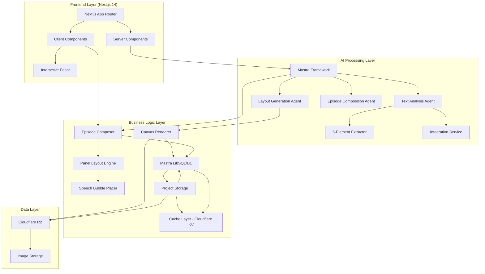
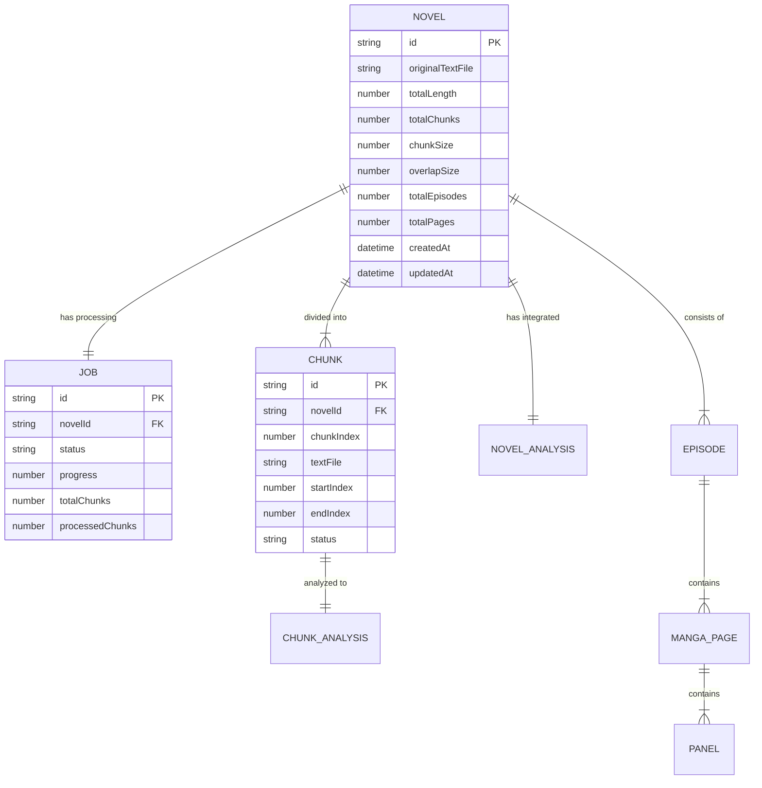

# Technical Design

## Overview

本設計書は、小説テキストをマンガ形式のレイアウト（絵コンテ）に自動変換するWebアプリケーションの技術実装について定義します。本ツールは編集者を補佐するツールであり、マンガの絵そのものを生成するのではなく、コマ割りと吹き出し配置の構成案を提供します。Mastra AIフレームワークをベースに、TypeScriptとNext.js 14を使用して、長文テキストの解析、5要素の抽出（登場人物・シーン・対話・ハイライト・状況）、連載エピソード構成、マンガレイアウト生成を実現します。

## Requirements Mapping

### Design Component Traceability

各設計コンポーネントが対応する要件：

- **テキスト解析エンジン** → REQ-1: テキスト入力と解析（チャンク分割、会話/地の文識別）
- **5要素抽出AI** → REQ-1.4: チャンク毎に会話部分、地の文、シーン転換の自動識別
- **エピソード構成エンジン** → REQ-3: 連載マンガとしてのエピソード分割
- **マンガレイアウト設計エンジン** → REQ-3: YAMLで漫画レイアウトを記述する（コマ割りと吹き出し配置）
- **マンガレイアウト生成エンジン** → YAMLからCanvas APIで、枠と状況説明とセリフによる絵コンテの描画（編集者向けの構成案として、マンガそのものの絵は含まない）
- **エクスポートサービス** → REQ-5: エクスポートと共有
- **プロジェクト管理** → REQ-6: データ管理とプロジェクト保存

### User Story Coverage

- 小説著者のニーズ: テキスト解析エンジンと5要素抽出AIで自動シーン解析を実現
- 読者のニーズ: Mastra統合によるYAMLで構造化されたマンガレイアウト
- マンガ制作者のニーズ: 日本式レイアウトエンジンによるプロフェッショナルなコマ割り
- カスタマイズニーズ: React Server Componentsによる高速なインタラクティブ編集
- 共有ニーズ: Next.js APIルートによる効率的なエクスポート処理

## Architecture



### Technology Stack

調査結果に基づく技術選定：

- **Frontend**: Next.js 15.4.4 (App Router) + TypeScript 5.8.3 + Tailwind CSS 4.1.11
- **AI Framework**: Mastra 0.10.15 (TypeScript agent framework)
- **絵コンテ生成**: Canvas API（枠線・テキスト・吹き出しのみ、イラストは含まない）
- **Backend**: Next.js API Routes + Mastra Workflows
- **Database**: Mastra LibSQL 0.11.2 (Edge-compatible SQLite)
- **Cache**: 2層キャッシュ構造 (MemoryCache + Cloudflare KV)
- **File Storage**: Cloudflare R2 (画像保存)
- **LLM Providers**: OpenAI, Gemini, Groq, Local (Ollama), OpenRouter
- **Configuration**: app.config.ts による集中管理 + 環境変数 (シークレットのみ)
- **Authentication**: NextAuth.js v5
- **Testing**: Vitest + Playwright + React Testing Library
- **Deployment**: Cloudflare Workers (OpenNext adapter)

### Architecture Decision Rationale

- **Next.js 15 App Router**: Server Componentsによる高速レンダリング、RSCによるクライアントJSの削減、Cloudflare Workers対応
- **Mastra Framework**: TypeScript完全対応、エージェント型アーキテクチャ、統合済みのLLM/画像生成API連携
- **Mastra LibSQL**: Edge環境対応のSQLite、Cloudflare D1互換、TypeScript型安全性
- **Cloudflare R2**: S3互換API、エッジ配信、コスト効率
- **Cloudflare Workers**: グローバルエッジ配信、低レイテンシー、自動スケーリング、KVキャッシュ統合
- **設定管理**: app.config.ts による一元管理、環境変数オーバーライド、チューニング用コメント付き
- **複数LLMプロバイダー**: 用途に応じた最適なモデル選択、フォールバック機能、コスト最適化

## Data Flow

### Primary User Flow: テキストからマンガレイアウト生成


### エピソード構成とレイアウト生成フロー


## Components and Interfaces

### Backend Services & Method Signatures

```typescript
// Mastra Agent定義
class NovelToMangaAgent {
  async analyzeText(text: string, options?: AnalysisOptions): Promise<TextAnalysis> // テキスト解析と5要素抽出
  async analyzeChunk(chunk: ChunkAnalysisRequest): Promise<ChunkAnalysisResult> // チャンク単位の分析（前後チャンク参照付き）
  async analyzeNarrativeArc(text: string): Promise<NarrativeArcAnalysis> // 物語構造分析
  async integrateChunkAnalyses(chunks: ChunkAnalysisResult[]): Promise<TextAnalysis> // チャンク分析結果の統合
  async generateEpisodes(analysis: TextAnalysis): Promise<Episode[]> // エピソード構成
  async createLayout(episode: Episode): Promise<MangaLayout> // レイアウトYAML生成（コマ割り・吹き出し配置）
  async renderStoryboard(layout: MangaLayout): Promise<StoryboardImage> // 絵コンテ画像生成（Canvas API）
}

// LLMプロバイダー設定
interface LLMProviderConfig {
  provider: 'openai' | 'gemini' | 'groq' | 'local' | 'openrouter';
  apiKey?: string;
  model: string;
  temperature?: number;
  maxTokens?: number;
  timeout?: number;
}

// エピソード構成サービス
class EpisodeComposer {
  splitIntoChapters(text: string): Chapter[] // チャプター分割
  identifyClimaxPoints(chapter: Chapter): ClimaxPoint[] // クライマックス検出
  composeEpisode(chapters: Chapter[]): Episode // エピソード構成
}

// レイアウトエンジン
class MangaLayoutEngine {
  generatePanelLayout(scenes: Scene[]): PanelLayout // コマ割り生成
  placeSpeechBubbles(panels: Panel[]): BubblePlacement[] // 吹き出し配置
  applyReadingOrder(layout: PanelLayout): OrderedLayout // 読み順適用
}
```

### Frontend Components

| Component Name | Responsibility | Props/State Summary |
|----------------|----------------|---------------------|
| TextInputEditor | テキスト入力UI | text, onAnalyze, maxLength |
| ProgressTracker | 処理進捗表示 | steps, currentStep, progress |
| MangaPreview | マンガプレビュー表示 | layout, panels, editable |
| PanelEditor | コマ編集インターフェース | panel, onResize, onMove |
| SpeechBubbleEditor | 吹き出し編集 | bubble, text, style, onEdit |
| ExportDialog | エクスポート設定 | formats, onExport |
| ProjectManager | プロジェクト管理UI | projects, onSave, onLoad |

### API Endpoints

| Method | Route | Purpose | Auth | Status Codes |
|--------|-------|---------|------|--------------|
| POST | /api/analyze | テキスト解析と5要素抽出 | Required | 200, 400, 401, 413, 500 |
| POST | /api/analyze/chunk | チャンク単位の分析（前後チャンク参照付き） | Required | 200, 400, 401, 500 |
| POST | /api/analyze/narrative-arc | 物語構造分析 | Required | 200, 400, 401, 500 |
| POST | /api/episodes | エピソード構成生成 | Required | 201, 400, 401, 500 |
| POST | /api/generate-storyboard | 絵コンテ画像生成（枠線・テキストのみ） | Required | 201, 400, 401, 500 |
| GET | /api/projects | プロジェクト一覧取得 | Required | 200, 401, 500 |
| GET | /api/projects/:id | プロジェクト詳細取得 | Required | 200, 401, 404, 500 |
| PUT | /api/projects/:id | プロジェクト更新 | Required | 200, 400, 401, 404, 500 |
| POST | /api/export | マンガエクスポート | Required | 201, 400, 401, 500 |
| POST | /api/share | 共有リンク生成 | Required | 201, 401, 500 |

## Data Models

### Domain Entities

1. **Novel**: 入力された小説全体（テキストはR2に保存）
2. **Job**: 処理ジョブ（進捗管理）
3. **Chunk**: 分割されたテキストチャンク（R2に保存）
4. **ChunkAnalysis**: チャンク毎の解析結果（R2に保存）
5. **NovelAnalysis**: 統合された解析結果（5要素、シーン、会話をR2に保存）
6. **Episode**: 連載エピソード単位のデータ
7. **MangaPage**: マンガページ（レイアウトYAMLはR2に保存）
8. **Panel**: 個別コマのデータ（位置、サイズ、読み順）

### Entity Relationships



### Data Model Definitions

```typescript
// TypeScript インターフェース定義

// Core Models
interface Novel {
  id: string;                    // UUID
  originalTextFile: string;      // R2: novels/{id}.json
  totalLength: number;           // 総文字数
  totalChunks: number;           // 分割されたチャンク数
  chunkSize: number;             // 1チャンクあたりの文字数（config値）
  overlapSize: number;           // オーバーラップサイズ（config値）
  totalEpisodes?: number;        // エピソード数（分析後に設定）
  totalPages?: number;           // 総ページ数（レイアウト生成後に設定）
  createdAt: Date;
  updatedAt: Date;
}

interface Job {
  id: string;
  novelId: string;
  type: 'text_analysis' | 'image_generation' | 'layout_generation';
  status: 'pending' | 'processing' | 'completed' | 'failed';
  progress: number;              // 0-100
  result?: any;                  // 処理結果
  error?: string;
  createdAt: Date;
  updatedAt: Date;
}

interface Chunk {
  id: string;
  novelId: string;
  chunkIndex: number;
  startPosition: number;         // テキスト内の開始位置
  endPosition: number;           // テキスト内の終了位置
  chunkSize: number;            // チャンクサイズ設定値
  overlapSize: number;          // オーバーラップサイズ設定値
  createdAt: Date;
}

// Analysis Models
interface ChunkAnalysis {
  id: string;
  chunkId: string;
  analysisFile: string;          // R2: novels/{novelId}/analysis/chunk_{index}.json
  processedAt: Date;
  summary: {
    characterCount: number;
    sceneCount: number;
    dialogueCount: number;
    highlightCount: number;
    situationCount: number;
  };
}

interface NovelAnalysis {
  id: string;
  novelId: string;
  analysisFile: string;          // R2: novels/{novelId}/analysis/integrated.json
  summary: {
    totalCharacters: number;
    totalScenes: number;
    totalDialogues: number;
    totalHighlights: number;
    totalSituations: number;
  };
  createdAt: Date;
  updatedAt: Date;
}

// Manga Models
interface Episode {
  id: string;
  novelId: string;
  episodeNumber: number;
  title: string;
  chapters: string[];
  climaxPoint?: number;
  startIndex: number;
  endIndex: number;
  createdAt: Date;
  updatedAt: Date;
}

interface MangaPage {
  id: string;
  episodeId: string;
  pageNumber: number;
  layoutFile: string;            // R2: novels/{novelId}/episodes/{episodeNumber}/pages/{pageNumber}/layout.yaml
  previewImageFile?: string;     // R2: novels/{novelId}/episodes/{episodeNumber}/pages/{pageNumber}/preview.png
  panels: Panel[];
  createdAt: Date;
  updatedAt: Date;
}

interface Panel {
  id: string;
  pageId: string;
  position: { x: number; y: number };
  size: { width: number; height: number };
  panelType: 'normal' | 'action' | 'emphasis';
  content: {
    sceneId?: string;
    dialogueIds?: string[];
    situationId?: string;
  };
  readingOrder: number;          // 日本式読み順
}

// 5要素の詳細（R2に保存）
interface TextAnalysis {
  chunkId?: string;              // ChunkAnalysisの場合
  characters: Character[];       // 登場人物
  scenes: Scene[];              // シーン
  dialogues: Dialogue[];        // 対話
  highlights: Highlight[];      // ハイライト
  situations: Situation[];      // 状況
  metadata?: {
    chunkIndex?: number;
    totalChunks?: number;
    previousChunkText?: string;
    nextChunkText?: string;
  };
  createdAt: Date;
  updatedAt: Date;
}

// キャッシュされた分析結果
interface CachedAnalysisResult {
  result: TextAnalysis;
  timestamp: number;
  ttl?: number;
}

interface Character {
  id: string;
  name: string;
  description: string;
  firstAppearance: number;
}

interface Scene {
  id: string;
  location: string;
  time?: string;
  description: string;
  startIndex: number;
  endIndex: number;
}

interface Dialogue {
  id: string;
  speakerId: string;
  text: string;
  emotion?: string;
  index: number;
}

interface Highlight {
  id: string;
  type: 'climax' | 'turning_point' | 'emotional_peak' | 'action_sequence';
  description: string;
  importance: number;  // 1-5
  startIndex: number;
  endIndex: number;
}

interface Situation {
  id: string;
  description: string;
  index: number;
}
```

### Database Schema

```sql
-- Cloudflare D1 スキーマ (SQLite)
-- 大容量データはR2に保存し、D1には参照のみ保存

CREATE TABLE novels (
  id TEXT PRIMARY KEY,  -- UUID
  original_text_file TEXT NOT NULL,  -- R2パス
  total_length INTEGER NOT NULL,
  total_chunks INTEGER NOT NULL DEFAULT 0,
  chunk_size INTEGER NOT NULL,  -- configで与えられた値
  overlap_size INTEGER NOT NULL,  -- configで与えられた値
  total_episodes INTEGER,  -- 分析後に更新
  total_pages INTEGER,  -- レイアウト生成後に更新
  created_at DATETIME DEFAULT CURRENT_TIMESTAMP,
  updated_at DATETIME DEFAULT CURRENT_TIMESTAMP
);

CREATE TABLE jobs (
  id TEXT PRIMARY KEY,
  novel_id TEXT NOT NULL,
  type TEXT NOT NULL,  -- 'text_analysis', 'image_generation' など
  status TEXT NOT NULL CHECK (status IN ('pending', 'processing', 'completed', 'failed')),
  progress REAL DEFAULT 0,
  result TEXT,  -- 処理結果JSON
  error TEXT,
  created_at DATETIME DEFAULT CURRENT_TIMESTAMP,
  updated_at DATETIME DEFAULT CURRENT_TIMESTAMP,
  FOREIGN KEY (novel_id) REFERENCES novels(id) ON DELETE CASCADE
);

CREATE TABLE chunks (
  id TEXT PRIMARY KEY,
  novel_id TEXT NOT NULL,
  chunk_index INTEGER NOT NULL,
  start_position INTEGER NOT NULL,  -- テキスト内の開始位置
  end_position INTEGER NOT NULL,    -- テキスト内の終了位置
  chunk_size INTEGER NOT NULL,      -- チャンクサイズ設定値
  overlap_size INTEGER NOT NULL,    -- オーバーラップサイズ設定値
  created_at DATETIME DEFAULT CURRENT_TIMESTAMP,
  FOREIGN KEY (novel_id) REFERENCES novels(id) ON DELETE CASCADE,
  UNIQUE(novel_id, chunk_index)
);

CREATE TABLE chunk_analyses (
  id TEXT PRIMARY KEY,
  chunk_id TEXT NOT NULL,
  analysis_file TEXT NOT NULL,  -- R2パス
  processed_at DATETIME DEFAULT CURRENT_TIMESTAMP,
  character_count INTEGER DEFAULT 0,
  scene_count INTEGER DEFAULT 0,
  dialogue_count INTEGER DEFAULT 0,
  highlight_count INTEGER DEFAULT 0,
  situation_count INTEGER DEFAULT 0,
  FOREIGN KEY (chunk_id) REFERENCES chunks(id) ON DELETE CASCADE
);

CREATE TABLE novel_analyses (
  id TEXT PRIMARY KEY,
  novel_id TEXT NOT NULL,
  analysis_file TEXT NOT NULL,  -- R2パス
  total_characters INTEGER DEFAULT 0,
  total_scenes INTEGER DEFAULT 0,
  total_dialogues INTEGER DEFAULT 0,
  total_highlights INTEGER DEFAULT 0,
  total_situations INTEGER DEFAULT 0,
  created_at DATETIME DEFAULT CURRENT_TIMESTAMP,
  updated_at DATETIME DEFAULT CURRENT_TIMESTAMP,
  FOREIGN KEY (novel_id) REFERENCES novels(id) ON DELETE CASCADE
);

CREATE TABLE episodes (
  id TEXT PRIMARY KEY,
  novel_id TEXT NOT NULL,
  episode_number INTEGER NOT NULL,
  title TEXT NOT NULL,
  chapters TEXT,  -- JSON配列
  climax_point INTEGER,
  start_index INTEGER NOT NULL,
  end_index INTEGER NOT NULL,
  created_at DATETIME DEFAULT CURRENT_TIMESTAMP,
  updated_at DATETIME DEFAULT CURRENT_TIMESTAMP,
  FOREIGN KEY (novel_id) REFERENCES novels(id) ON DELETE CASCADE,
  UNIQUE(novel_id, episode_number)
);

CREATE TABLE manga_pages (
  id TEXT PRIMARY KEY,
  episode_id TEXT NOT NULL,
  page_number INTEGER NOT NULL,
  layout_file TEXT NOT NULL,  -- R2パス (YAML)
  preview_image_file TEXT,  -- R2パス
  created_at DATETIME DEFAULT CURRENT_TIMESTAMP,
  updated_at DATETIME DEFAULT CURRENT_TIMESTAMP,
  FOREIGN KEY (episode_id) REFERENCES episodes(id) ON DELETE CASCADE,
  UNIQUE(episode_id, page_number)
);

CREATE TABLE panels (
  id TEXT PRIMARY KEY,
  page_id TEXT NOT NULL,
  position_x INTEGER NOT NULL,
  position_y INTEGER NOT NULL,
  width INTEGER NOT NULL,
  height INTEGER NOT NULL,
  panel_type TEXT NOT NULL CHECK (panel_type IN ('normal', 'action', 'emphasis')),
  content TEXT,  -- JSON（sceneId, dialogueIds, situationId）
  reading_order INTEGER NOT NULL,
  FOREIGN KEY (page_id) REFERENCES manga_pages(id) ON DELETE CASCADE
);

-- インデックス
CREATE INDEX idx_jobs_novel_id ON jobs(novel_id);
CREATE INDEX idx_chunks_novel_id ON chunks(novel_id);
CREATE INDEX idx_episodes_novel_id ON episodes(novel_id);
CREATE INDEX idx_manga_pages_episode_id ON manga_pages(episode_id);
CREATE INDEX idx_panels_page_id ON panels(page_id);
```

### R2 Storage Structure

```
novels/
└── {novelId}.json                     # 元の小説全文（メタデータ付き）
chunks/
└── {chunkId}.json                     # チャンクテキスト（メタデータ付き）
analysis/
└── {novelId}/
    ├── chunk_{index}.json             # チャンク毎の5要素解析結果
    └── integrated.json                # 統合された解析結果
episodes/
└── {novelId}/
    └── {episodeNumber}/
        └── pages/
            └── {pageNumber}/
                ├── layout.yaml         # レイアウト定義
                └── preview.png         # プレビュー画像
```

### Migration Strategy

- Wranglerのマイグレーション機能を使用 (D1)
- 後方互換性のためJSONフィールドでスキーマ進化に対応
- バージョン管理されたマイグレーションファイル
- インデックス戦略：project_id、episode_id、page_numberに複合インデックス

## Error Handling

### エラー処理戦略

```typescript
// カスタムエラークラス
class NovelToMangaError extends Error {
  constructor(
    message: string,
    public code: string,
    public statusCode: number,
    public details?: any
  ) {
    super(message);
  }
}

// エラーハンドリングミドルウェア
export function errorHandler(error: unknown): Response {
  if (error instanceof NovelToMangaError) {
    return NextResponse.json(
      { error: error.message, code: error.code, details: error.details },
      { status: error.statusCode }
    );
  }
  // デフォルトエラー処理
  return NextResponse.json(
    { error: 'Internal Server Error' },
    { status: 500 }
  );
}
```

### エラーシナリオ

- テキスト解析失敗: 適切なフォールバックとユーザー通知
- Canvas API処理エラー: デフォルトレイアウトへのフォールバック
- レイアウト生成エラー: デフォルトレイアウトへのフォールバック
- ストレージエラー: ローカルキャッシュとリトライ

## Configuration Management

### 設定ファイル構造

```typescript
// src/config/app.config.ts
export const appConfig = {
  // チャンク分割設定
  chunks: {
    defaultChunkSize: 5000,        // 【ここを設定】
    defaultOverlapSize: 500,       // 【ここを設定】
    minChunkSize: 1000,
    maxChunkSize: 10000,
  },
  
  // LLMプロバイダー設定
  llm: {
    defaultProvider: 'openrouter', // 【ここを設定】
    providers: {
      openai: { model: 'gpt-4-turbo', temperature: 0.7 },
      gemini: { model: 'gemini-1.5-pro-002', temperature: 0.7 },
      groq: { model: 'compound-beta', maxTokens: 8192 },
      local: { model: 'llama3.1:70b', baseUrl: 'http://localhost:11434' },
      openrouter: { model: 'nvidia/llama-3.1-nemotron-70b-instruct', temperature: 0.7 },
    },
  },
  
  // 処理設定
  processing: {
    maxConcurrentChunks: 3,        // 【ここを設定】
    retryAttempts: 3,
    retryDelay: 1000,
    cacheEnabled: true,
    cacheTTL: 86400000, // 24時間
  },
};
```

### 設定の優先順位

1. **ハードコード値** (app.config.ts)
2. **環境変数オーバーライド** (process.env)
3. **ランタイム設定** (APIパラメータ)

### 環境変数

```bash
# .env - シークレットのみ
OPENAI_API_KEY=sk-...
GEMINI_API_KEY=...
GROQ_API_KEY=gsk_...
OPENROUTER_API_KEY=sk-or-...

# オーバーライド用環境変数
APP_LLM_DEFAULT_PROVIDER=openrouter
APP_CHUNKS_DEFAULT_SIZE=7000
APP_PROCESSING_MAX_CONCURRENT=5
```

## Cloudflare Bindings

### 型定義

```typescript
// src/types/cloudflare.d.ts
declare global {
  // R2 Bucket
  const NOVEL_STORAGE: R2Bucket;
  
  // D1 Database
  const DB: D1Database;
  
  // KV Namespace
  const CACHE: KVNamespace;
  
  // Environment Variables
  interface CloudflareEnv {
    NOVEL_STORAGE: R2Bucket;
    DB: D1Database;
    CACHE: KVNamespace;
    OPENAI_API_KEY?: string;
    GEMINI_API_KEY?: string;
    GROQ_API_KEY?: string;
    OPENROUTER_API_KEY?: string;
  }
}

export interface R2Bucket {
  put(key: string, value: ReadableStream | ArrayBuffer | string, options?: R2PutOptions): Promise<R2Object | null>;
  get(key: string, options?: R2GetOptions): Promise<R2ObjectBody | null>;
  delete(key: string): Promise<void>;
  list(options?: R2ListOptions): Promise<R2Objects>;
}

export interface D1Database {
  prepare(query: string): D1PreparedStatement;
  batch<T>(statements: D1PreparedStatement[]): Promise<D1Result<T>[]>;
  exec<T>(query: string): Promise<D1ExecResult>;
}
```

### wrangler.toml設定

```toml
name = "novel2manga"
compatibility_date = "2024-01-01"

[vars]
NEXT_PUBLIC_APP_NAME = "Novel2Manga"

[[d1_databases]]
binding = "DB"
database_name = "novel2manga"
database_id = "your-database-id"

[[r2_buckets]]
binding = "NOVEL_STORAGE"
bucket_name = "novel2manga-storage"

[[kv_namespaces]]
binding = "CACHE"
id = "your-kv-namespace-id"
```

## Security Considerations

### Authentication & Authorization


### Data Protection

- 入力検証: Zodによるスキーマバリデーション
- XSS対策: React自動エスケープ + CSP設定
- SQLインジェクション対策: Prisma ORM使用
- ファイルアップロード: 形式とサイズの厳格な検証
- API レート制限: Upstashによるレート制限

### Security Best Practices

- OWASP Top 10対策実装
- 環境変数による機密情報管理
- HTTPS強制とセキュアクッキー
- CORSポリシーの適切な設定
- 定期的な依存関係の脆弱性スキャン

## Performance & Scalability

### Performance Targets

| Metric | Target | Measurement |
|--------|--------|-------------|
| 初期表示時間 (FCP) | < 1.5秒 | Lighthouse |
| API レスポンス (p95) | < 200ms | APIエンドポイント |
| 絵コンテ生成時間 | < 5秒/ページ | Canvas API測定 |
| テキスト解析 | < 5秒/10,000文字 | 処理時間測定 |
| 同時ユーザー数 | > 1,000 | 負荷テスト |

### Caching Strategy

- **ブラウザキャッシュ**: Next.js自動最適化、静的アセット
- **CDN**: Cloudflare経由での画像配信
- **アプリケーションキャッシュ**: 2層構造
  - **L1 - MemoryCache**: インメモリキャッシュ、高速アクセス、TTL管理
  - **L2 - Cloudflare KV**: 永続化キャッシュ、グローバル分散、大容量対応
  
  ```typescript
  // キャッシュ実装例
  async function getCachedData<T>(key: string): Promise<T | null> {
    // L1: MemoryCacheチェック
    const memCached = memoryCache.get<T>(key);
    if (memCached) return memCached;
    
    // L2: Cloudflare KVチェック
    const kvCached = await CACHE.get(key, 'json');
    if (kvCached) {
      memoryCache.set(key, kvCached, 3600); // 1時間メモリキャッシュ
      return kvCached as T;
    }
    
    return null;
  }
  ```
- **データベースキャッシュ**: D1クエリ結果キャッシュ
- **Edge キャッシュ**: Cloudflare Tiered Cacheによる多階層キャッシュ
- **キャッシュ戦略**:
  - チャンク分析結果: 24時間TTL
  - 統合分析結果: 7日間TTL
  - LRU eviction policy for MemoryCache

### Scalability Approach

- Cloudflare Workersによるグローバルエッジスケーリング
- Mastraワークフローの並列処理
- 大規模テキスト処理のキューシステム実装（Cloudflare Queues）
- D1の自動レプリケーション機能
- Cloudflareの自動スケーリングとDDoS保護

## Testing Strategy

### Test Coverage Requirements

- **単体テスト**: ≥85% カバレッジ（ビジネスロジック）
- **統合テスト**: 全APIエンドポイントとMastra統合
- **E2Eテスト**: 主要ユーザーフロー
- **パフォーマンステスト**: 想定ピーク時の2倍負荷

### Testing Approach

1. **単体テスト (Vitest)**
   ```typescript
   describe('TextAnalyzer', () => {
     it('should extract 5 elements from novel text', async () => {
       const result = await analyzer.analyze(sampleText);
       expect(result.characters).toHaveLength(3);
       expect(result.scenes).toBeDefined();
     });
   });
   ```

2. **統合テスト**
   - Mastra エージェントのモック
   - API契約テスト
   - データベース統合テスト

3. **E2Eテスト (Playwright)**
   - テキスト投稿から絵コンテ生成フロー
   - レイアウト編集機能の動作確認
   - エクスポート機能テスト

4. **パフォーマンステスト**
   - k6による負荷テスト
   - Canvas API処理のストレステスト
   - メモリリーク検出

### CI/CD Pipeline

