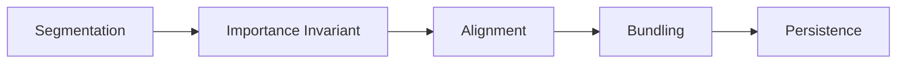
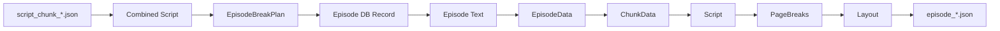

# エピソード境界推定からepisode_*.json生成までのフローチャート

## 概要

このドキュメントでは、script_chunk_*.jsonからepisode_*.jsonが生成されるまでの複雑な処理フローを詳細に分析し、現在の問題点とリファクタリング計画を提示します。

## 処理フロー全体図

```mermaid
graph TD
  A[script_chunk_*.json 生成完了] --> B[Combined Script作成]
  B --> BN[Panel Index 正規化\n(1..N 連番保証)]

  BN --> C{スクリプトサイズ判定}
  C -->|小さい| D[直接エピソード境界推定]
  C -->|大きい| E[スライディングウィンドウ分割]

    D --> F[LLMによるエピソード境界推定]
    E --> G[セグメント毎にLLM境界推定]
    G --> H[セグメント結果をマージ]

    F --> I[境界の正規化・検証]
    H --> I
    I --> J[エピソード長制限の強制]
    J --> K[ページ数によるバンドリング]
    K --> L[最終検証]

    L --> M[エピソード情報をDBに保存]
  M --> N[Episode Processing Step]
  %% 旧: N --> O[チャンクメタデータ取得] O --> P[テキスト抽出]
  %% 新フロー: チャンクメタは不要。Panel Index 直接参照でテキスト抽出。
  N --> P[パネル範囲に基づくテキスト抽出]
  P --> Q[エピソードテキストをストレージに保存]

    Q --> R[Layout Generation開始]
    R --> S[Episode Data構築]

  S --> T[SFX抽出(getSfxText)]
  T --> U[部分チャンク処理]
  U --> V[Script変換]
  V --> W[累積 >= 6 Page Break]
  W --> X[Panel Assignment]
  X --> Y[Layout正規化]
  Y --> Z[episode_*.json保存]
```

## 詳細フロー分析

### LayoutPipeline 概要（2025-09 リファクタ後）

本リファクタで Layout 生成は独立した決定的パイプライン `LayoutPipeline` に再構築された。旧来の PageBreakStep 内複合ロジックを以下 5 ステージへ分離し、各ステージの入出力と失敗点を明確化した。



| ステージ | 目的 | 主な入力 | 主な出力 | 失敗種別 (Error.kind) | フォールバック |
|----------|------|----------|----------|----------------------|----------------|
| Segmentation | ページ候補へ分割（LLM / 既存推定器 or deterministic mock） | Combined Script Panels | Segments 配列 | SEGMENTATION_FAILED | demo/test 時は簡易単一セグメント |
| Importance Invariant | importance 分布/閾値の正規化で推定品質の一貫性確保 | Segments | 正規化済み Segments | IMPORTANCE_INVARIANT_FAILED | 正規化失敗時 raw importance 継続 |
| Alignment | Episodes をページ境界へ拡張し連続被覆 1..N を保証 | 正規化 Segments + EpisodeRanges | PageAlignedEpisodes | ALIGNMENT_FAILED | 失敗時: ログ出力し処理中断 (fallback 無) |
| Bundling | 実ページ数最小化のため隣接小エピソードをマージ | PageAlignedEpisodes | BundledEpisodes | （内部では ALIGNMENT_FAILED の再発なし） | merge 無効設定時は no-op |
| Persistence | episode_* と full_pages.json 及び DB への保存 | BundledEpisodes + Layout構築結果 | 永続化副作用 (ファイル/DB) | LAYOUT_PERSIST_FAILED / EPISODE_PERSIST_FAILED | test 環境で一部 no-op (layout status) |

#### ステージ間インターフェース（簡略）

```ts
type SegmentationResult = { segments: Segment[] }
type ImportanceResult = { segments: NormalizedSegment[] }
type AlignmentResult = { episodes: PageAlignedEpisode[] }
type BundlingResult = { episodes: BundledEpisode[] }
type PersistenceResult = { episodes: StoredEpisodeMeta[]; fullPagesPath: string }
```

#### 主要特徴
1. 決定性: Segmentation を除く後続ステップは純アルゴリズムで LLM 非依存。テストでは segmentation を deterministic mock に差し替え再現性担保。
2. 単一責務: 各ステージは失敗理由を限定し、Error.kind による可観測性を向上。
3. フォールバック設計: 上流で recoverable なケース（Segmentation, Importance）以外は早期失敗し曖昧なレイアウト生成を避ける方針。
4. ログ降格: Panel 数ミスマッチや許容誤差内の deviation は info へ降格しノイズ抑制。
5. Storage Key 準拠: 永続化は `JsonStorageKeys.fullPages` / `StorageKeys.episodeLayout` を利用し手動パス組立を禁止。

#### 旧 PageBreakStep との比較 (サマリ)
| 観点 | 旧 | 新 LayoutPipeline |
|------|----|------------------|
| ロジック集中 | 単一クラス巨大メソッド | 5 ステージ分離 + helpers |
| エラー識別 | 例外 / メッセージ断片 | kind ベース分類 (5 種) |
| テスト容易性 | LLM / I/O 混在で不安定 | Segmentation 以外 deterministic |
| 重複実装 | alignment / bundling が PageBreakStep & 他所に重複 | `helpers.ts` に集約 |
| ログ | warn 過多 | downgrade ルールで抑制 |
| Fallback | 暗黙 demo 用組立 | 明示: dynamic import fallback + test no-op |

> 詳細: 本節後半の「エラー taxonomy」「helpers アルゴリズム」「テストモード挙動」を参照。

### エラー taxonomy (LayoutPipeline)

`LayoutPipeline` は失敗時に `{ success: false, error: { kind, message, cause? } }` 形式で返す。`kind` 一覧と意味・検出箇所・フォールバック/ログ方針は下表。

| kind | 発生ステージ | 主因 | 代表トリガ | ログレベル | フォールバック | 備考 |
|------|--------------|------|------------|------------|--------------|------|
| SEGMENTATION_FAILED | Segmentation | セグメント分割不能 / 空結果 | 推定器例外 / 0 panels | warn→info(テスト) | demo/test: 単一セグメント合成 | 以降継続可 |
| IMPORTANCE_INVARIANT_FAILED | Importance Invariant | 正規化計算内エラー | 分布計算で NaN / 不正importance | warn | raw importance 継続 | recoverable |
| ALIGNMENT_FAILED | Alignment | エピソード被覆不整合 | ギャップ / 重複 / 範囲外 | error | なし (即終了) | helpers 内バリデーション失敗 |
| LAYOUT_PERSIST_FAILED | Persistence(レイアウト保存) | ファイル書込 or layout status 更新失敗 | ストレージI/O例外 / statusメソッド欠落 | error→info(test) | test: status 更新を no-op | episode json 書込前後いずれもあり得る |
| EPISODE_PERSIST_FAILED | Persistence(DB) | DB upsert / 依存 config import 問題 | Drizzle 例外 / dynamic import 不備 | error | なし (再試行は呼出側) | config mock 不足で再発しやすい |

補足:
1. LOG 降格: test / demo 環境では期待される欠落（例: layout.upsertLayoutStatus 未実装）を info に降格。
2. cause: 内部例外スタックは verbose ログにのみ出力し、表層 message は簡潔に保つ。
3. retry: SEGMENTATION_FAILED / LAYOUT_PERSIST_FAILED / EPISODE_PERSIST_FAILED のうち I/O 一時障害と判定できるものは上位で再試行検討 (現行パイプ内では未実装)。

### Helpers アルゴリズム詳細

#### alignEpisodesToPages
目的: Episode の (startPanelIndex,endPanelIndex) 列が跨ぐページ境界を完全被覆するよう拡張し、さらに全ページ範囲 1..LastPage をギャップ無く連続被覆する PageAlignedEpisodes を生成。

手順(概略):
1. Page 情報 (pageNumber, startPanel, endPanel) を昇順で構築。
2. 各 Episode について、その (start..end) が触れる全ページの startPanel/endPanel を統合し Episode の panel 範囲を「最外側」に拡張。
3. 拡張後 Episode の pageSpan を再計算し、連続ページ番号でソート。
4. 先頭ページ > 1 の場合や最後の Episode が最終ページを覆わない場合は失敗 (ALIGNMENT_FAILED)。
5. ページ被覆ギャップ (pageNumber 飛び) / 重複被覆 (同一ページ複数 Episode) があれば失敗。

不変条件:
| 条件 | 説明 |
|------|------|
| 完全被覆 | ページ集合 = {1..N} を順序通り被覆 |
| 一意被覆 | 任意ページはちょうど1 Episode にのみ属する |
| 範囲拡張単調性 | 元 Episode 範囲は拡張後に包含される |

計算量: O(E * log P) (ページ探索は索引化で最適化余地あり)。

テスト観点: 連続/非連続 Episode, ギャップ挿入, 単一 Episode 全体被覆, ページ跨ぎ拡張。

#### bundleEpisodesByActualPageCount
目的: アップストリーム alignment 後の PageAlignedEpisodes を実際のページ使用量に基づき前方マージ + 終端マージして過剰断片化を抑制。

ルール:
1. 最大ページ数上限または最小ページ閾値に基づき「小さい Episode」を定義。
2. スキャンしながら直前 Episode と結合しても上限を超えない場合は前方マージ。
3. 末尾にサイズ閾値未満 Episode が残った場合、直前 Episode と終端マージ (terminal merge)。
4. disabled フラグが true の場合は入力をそのまま返す。

不変条件:
| 条件 | 説明 |
|------|------|
| ページ連続性維持 | alignment の完全被覆不変は保持 |
| 境界単調性 | マージ後 Episode の pageStart/pageEnd は昇順維持 |
| ページ数制約 | 任意 Episode のページ数 <= 設定上限 |

計算量: 一回の線形パス O(E)。

テスト観点: disabled=no-op, forward merge 成功, terminal merge 成功, 上限超過阻止, 1 Episode 入力。

### ログ降格ルール（panel mismatch / noisy warnings 抑制）

目的: テスト / 開発環境で期待される軽微な差分やヒューリスティック上許容可能なパネル数不一致に対し warn スパムを防止し観測性を向上。

対象: Segmentation 出力と最終 bundling / layout 構築後ページ内 panel 数・総 panel 数の差分。

降格条件 (いずれか満たす場合 warn→info):
1. 差分比率 (|expected - actual| / expected) <= 設定閾値 (現行 0.1)。
2. Segmentation が fallback パターン (demo/test 単一セグメント生成) を使用。
3. test / demo コンテキストフラグが true。

保持: 重大な不整合 (負数 / ページ欠落 / 連続被覆崩壊) は常に error。

実装要点:
- 差分計算は最後の Alignment 後 (bundling 前) と bundling 後 2 箇所で評価し、連続降格されたメッセージは抑制 (二重出力回避)。
- ログメタ: `{ stage, expectedPanels, actualPanels, ratio, downgraded: boolean }` を構造化出力。

テスト指針:
- ratio<閾値ケース: info 出力 & warn 非出力。
- ratio>閾値ケース: warn 出力。
- demo flag: 全て info。

### テストモード挙動 / Fallback 一覧

| 項目 | 本番 | test/demo | 目的 |
|------|------|----------|------|
| layout.upsertLayoutStatus | 必須 (進捗更新) | 実装欠落時 no-op (info ログ) | テスト用モック簡素化 |
| buildLayoutFromPageBreaks dynamic import | 正常 import | 失敗時 内部 simple builder fallback | モジュール未モック耐性 |
| Segmentation | 実推定器 (LLM/ヒューリスティック) | 決定的 fixed セグメント mock | 再現性確保 |
| panel-to-chunk-mapping | 実際の storage/config 読み込み | シンプル stub (連番マッピング) | 不要I/O排除 |
| Storage Keys | `JsonStorageKeys.fullPages` / `StorageKeys.episodeLayout` | 同一 | パス構築一貫性 |
| ログレベル降格 | 標準 | 一部 warn→info | ノイズ削減 |

ガイドライン: テストで必要な場合でも手動でパス文字列 (`full_pages.json` など) を組み立てず、必ずキー定数を介す。これにより本番/テストのストレージ階層差異が吸収される。

### Legacy PageBreakStep との移行状況

現状 Legacy `PageBreakStep` は内部で新 helpers (`alignEpisodesToPages` / `bundleEpisodesByActualPageCount`) を呼び出す薄いラッパとなり、重複アルゴリズムは排除済み。新規機能追加は LayoutPipeline 側のみで実装し、PageBreakStep は段階的に廃止予定 (後続タスク: 削除 + 呼出箇所置換)。

差分サマリ:
| 項目 | Legacy | 新 Pipeline |
|------|--------|-------------|
| 重複ロジック | alignment/bundling 内部実装 | helpers 共有 |
| エラーモデル | 例外文字列 | kind 分類結果オブジェクト |
| 拡張容易性 | 低 (巨大メソッド) | 高 (ステージ追加容易) |
| テスト | LLM 依存不安定 | segmentation stub で決定的 |

削除前チェックリスト:
1. すべての呼出箇所を LayoutPipeline へ移行
2. 旧ステップ専用テスト撤去
3. ドキュメントから Legacy 記述削除
4. Release Note に互換性影響なし明記


### フェーズ進捗サマリ (Effect + Panel Index リファクタ)

| フェーズ | 内容 | 状態 | 主成果 |
|----------|------|------|--------|
| F1 | EpisodeProcessingStep を Effect 化しエラー分類 (EpisodeError taxonomy) を導入 | 完了 | `ValidationError / InvariantViolation / ExternalIOError / DatabaseError / ParseError / ScriptNotFoundError` のタグ付与。Promise ラッパは後方互換のため残存。 |
| F2 | パネル検証スキーマと純テキストビルダー抽出 | 完了 | `schema.ts (PanelsSchema)` により 1..N 連番 & 上限数検証 (上限は config 化)。`builder.ts` で pure/Effect 二層分離。 |
| F3 | EpisodeDataAssembler 抽出 (panel range → text) | 完了 | `assembler.ts` で 範囲検証→slice→再index→PanelsSchema→plain build→空検証 を一括 Effect 化。Step 内重複コード撤去。 |
| F4 | Layout パイプライン Step 化 | 完了 | Segmentation→Importance Invariant→Alignment→Bundling→Persistence の5段ステージ化 / helper抽出 / 決定的テスト (unit+integration) / エラーtaxonomy整備 / ログ降格とfallback導入。 |

#### F2/F3 追加の設計要素

1. パネル Slice の再index
  - これまで: あるエピソードがグローバルパネル番号 3..5 のみを含む場合、抽出結果は no=3,4,5。
  - PanelsSchema は 1..M の連番不変条件を要求するため、エピソード内利用時に `i+1` で再index。
  - 理由: 後段バリデーションとテキスト組立を「エピソード内ローカル連番」前提に単純化し、欠番/飛び番号起因の ValidationError ノイズを排除。
  - 影響範囲: Layout / persistence はグローバル panel no を引き続き保持するため、ローカル再indexは Episode テキスト生成スコープ内の一時表現。今後 EpisodeDataAssembler 抽出時に明示的に `localPanels` として型区別予定。

2. PanelsSchema (抜粋)
  - 役割: ペイロード (panel 配列) の構造健全性と連番性、過剰数 (例: 5000 超) の早期失敗。
  - 実装: Zod refine により `every((p,i)=>p.no===i+1)` を検証。失敗時は `ValidationError`。

3. 純関数ビルダー `buildEpisodePlainText`
  - I/O や Effect に依存せず、テスト容易性を確保。
  - 空テキスト (トリム後長さ0) は上位 Effect ラッパで `InvariantViolation` に昇格。

4. エラー表現統一
  - テキスト生成段階での未知例外は一律 `InvariantViolation` として包み、観測性 (ログ集計) を改善。

5. Config 化
  - PanelsSchema の最大パネル数 5000 を `episodeProcessingConfig.limits.maxPanelsPerEpisode` へ移動しマジックナンバー排除。

6. テスト
  - `episode-text.builder.test.ts` で: 連番欠落 → ValidationError / 全要素空 → InvariantViolation / 正常結合パスを確認。
  - 既存 `episode-processing-step.panel.test.ts` は再index 導入後も後方互換 (エピソード2 など途中開始ケース) を満たすことを確認済み。

> NOTE: F3 の Assembler で再index 処理と空テキスト検証が集約されたため、EpisodeProcessingStep は I/O (保存) とログのみを担当。

---

### 1. エピソード境界推定フェーズ

#### (新) Panel Index 正規化ステップ
エピソード境界推定処理の最初に必ず **Panel Index 正規化** を実行し、以降の LLM / 検証 / バンドリング処理を以下の不変条件に揃える。

##### 目的
1. 欠番 / 重複 / 非整数 / 0 以下の index を排除し 1..N の連番へ再割当。
2. LLM プロンプトを単純化して出力ぶれ (gap, duplicate, out-of-range) を抑制。
3. validate/bundle ロジックを前提単純化し保守性 & 可観測性を向上。
4. 文字オフセット依存から panel index 正準化への移行基盤。

##### Post Normalization Invariants
- パネル番号集合 = {1, 2, ..., N} (欠番・重複なし)。
- すべて整数かつ 1 以上。
- 入力が既に満たす場合はオブジェクト再生成なし (idempotent)。
- 元番号が再割当された場合 `mapping: original -> normalized` を生成 (デバッグ用)。

##### 実装 (概要)
`src/utils/panel-normalization.ts`
```ts
export function normalizePanelIndices(script: Script): PanelNormalizationResult
export function withNormalizedPanels(script: Script): { script: Script; mapping: Mapping[]; changed: boolean }
```
手順: (1) index 昇順安定ソート → (2) 不正/重複をスキップし受理順に 1..k 割当 → (3) mapping 構築 → (4) 差異あれば changed=true。

計算量は O(P log P)。P はパネル総数 (現行規模で問題なし)。必要なら既ソート前提で最適化余地あり (将来タスク)。

##### LLM プロンプトへの影響
プロンプト内で「パネル番号は 1..N の連続整数。エピソード区間は startPanel/endPanel で表現し gap/重複禁止」を明示。出力検証では:
1. 全区間が 1..N を過不足なく被覆
2. 各区間 start <= end
3. 区間は昇順 (乱れた場合後段でソート&再正規化)

##### テスト
`panel-normalization.test.ts` で以下を検証:
- 正常 (変更なし)
- 欠番補填
- 重複排除
- 不正 index (0, 負, NaN) スキップ
- Idempotency

##### 文字オフセット移行
現状: char offset 境界 (startCharIndex/endCharIndex) は互換保持。今後 canonical: panel index / derived: char offsets へ移行 → 最終的に deprecated。tasks.md に deprecation タスク追加予定。

```mermaid
flowchart TD
  A[Combined Script] --> A1[Panel Index 正規化]
  A1 --> B{totalPanels > minPanelsForSegmentation?}

  B -->|NO| C[estimateEpisodeBreaksDirect]
  B -->|YES| D[estimateEpisodeBreaksWithSlidingWindow]

  C --> E[LLM Provider選択]
  E --> F[システムプロンプト + ユーザープロンプト作成 (正規化前提)]
  F --> G[LLM呼び出し: EpisodeBreakPlan]
  G --> H[結果検証 (連続性/範囲)]
  H -->|失敗| I[フォールバック: 単一エピソード]
  H -->|成功| J[境界正規化 (Episode-level)]

  D --> K[スクリプト分割]
  K --> L[各セグメントで境界推定]
  L --> M[結果をグローバルインデックスに調整]
  M --> N[全セグメント結果をマージ]

  I --> O[bundleAndValidate]
  J --> O
  N --> O

  O --> P[enforceEpisodeMaxLength]
  P --> Q[bundleEpisodesByPageCount]
  Q --> R[validateEpisodeBreaks]
  R -->|失敗| S[エラー]
  R -->|成功| T[確定したEpisodeBreakPlan]
```

### 2. Episode Processing Step (Panel Index ベース / CharOffset 廃止)

従来の chunk + char offset 境界抽出を完全撤去し、正規化済み `NewMangaScript.panels[].no (1..N)` と `EpisodeBreakPlan.episodes[].{startPanelIndex,endPanelIndex}` のみを根拠にテキストを構築するシンプルなステップへ刷新した。

```mermaid
flowchart TD
  A[Episode Processing Step開始] --> B[EpisodeBreakPlan 取得]
  B --> C[対象エピソード選択 (episodeNumber)]
  C --> D[Panel範囲検証 (グローバル 1..N)]
  D --> E[パネル抽出 (global no range)]
  E --> F[ローカル再index (1..m) + PanelsSchema検証]
  F --> G[buildEpisodeTextEffect (pure builder + 空検証)]
  G --> H[ストレージ+DBアトミック保存]
  H --> I[完了]
```

#### 入力
- Normalized `NewMangaScript` (前段 EpisodeBreakEstimationStep で panel index 正規化済)
- `EpisodeBreakPlan` (連続被覆 & 境界正規化後)
- `episodeNumber`

#### 不変条件 / バリデーション
1. `script.panels[].no` は {1..N} 連番 (欠番/重複なし)
2. 対象エピソードの `startPanelIndex >= 1`, `endPanelIndex <= N`, `start <= end`
3. 範囲抽出後パネル数 > 0 かつ生成テキストが空でない

#### テキスト組立ルール
| ソース | 変換 | 例 |
|--------|------|----|
| narration[] | 行そのまま (trim) | `"背景説明"` |
| dialogue[].{speaker?,type,text} | `speaker: [type] text` (`type==='speech'` は type 表示省略) | `A: [thought] 考えている` |
| sfx[] | `[SFX] value` | `[SFX] ゴゴゴ` |

パネル間は空行1行。SFX 表記は UI 側での表示明確化のため暫定。不要であれば後続で除去容易。

#### 実装
`EpisodeProcessingStep.extractEpisodeTextFromPanels(script, breaks, episodeNumber, context)`

F2 時点内部関数 / モジュール責務:
```ts
// 範囲抽出 (グローバル番号保持)
private slicePanels(script,start,end): MangaPanel[]

// 再index + 検証 + テキスト生成 (F2 で抽出されたモジュール群)
import { buildEpisodeTextEffect } from '@/services/application/episode-text/builder'
// buildEpisodeTextEffect 内部で PanelsSchema を適用し ValidationError / InvariantViolation を返す
```

#### 副作用
`storeEpisodeText` がテキストをストレージへ保存し、そのパスを DB `episodes.episodeTextPath` にアトミック更新。既存カラム (startChunk 等) は互換のため残存するが当ステップでは参照しない。将来マイグレーションで削除予定 (別タスク)。

#### 廃止事項
| 旧要素 | 状態 | 理由 |
|--------|------|------|
| chunk/char offset ベース抽出 | 削除 | Panel Index 正規化後は冗長かつ誤差混入源 |
| `extractFromScriptChunks` | 削除 | chunk ファイルI/O ループ撤去 |
| startCharIndex/endCharIndex 調整ロジック | 削除 | パネル単位へ移行 |

#### 期待効果
1. 境界抽出経路の単一化によりデバッグ容易化。
2. I/O (複数 chunk JSON 読込) 削減で高速化 (O(#panels in range) メモリ走査のみ)。
3. 今後の panel メタデータ拡張 (emotion, tags など) による Episode テキスト生成改善のベース確立。

#### 追加 / 更新テスト (F2)
`episode-processing-step.panel.test.ts`:
- 正常ケース (複数パネル)
- 単一パネル (途中開始 → 再index 後も成功)
- 不正 episodeNumber → ValidationError
- 不正範囲 (startPanelIndex < 1)

`episode-text.builder.test.ts`:
- パネル番号非連続 → ValidationError
- 全行空 (narration/dialogue/sfx いずれも有効文字なし) → InvariantViolation
- 正常: narration/dialogue/sfx のフォーマット確認

#### 移行ノート
DB の `episodes` テーブル内 `startChunk / endChunk / startCharIndex / endCharIndex` は読み取り不要になった。別途マイグレーションで `startPanelIndex / endPanelIndex` カラムを追加し旧カラムを段階的に削除する提案 (未実装)。

#### 現状コードとのギャップと改善方針

`EpisodeProcessingStep` はリファクタ済みで、`extractFromScriptChunks` 内で `script_chunk_*.json` を直接読み込みテキストを構築する。`ports.chunk.getChunk` による原文参照は撤去済み。

| 項目 | 状態 | コメント |
|------|------|----------|
| 入力ソース | script_chunk_*.json | 原文チャンク本文アクセスは排除 |
| SFX扱い | Layout側で抽出 | EpisodeProcessingStep では非対応のまま (方針通り) |
| 部分切り出し | start/endCharIndex を script ベーステキストに適用 | 今後 panel index 方式へ移行予定 |
| 移行戦略 | 完了 | 追加トグル不要 |

短期的にはドキュメントを現実装へ寄せつつ、「原文チャンク参照は将来的に script_chunk へ移行」注釈を明記。移行タスクは `tasks.md` へ以下項目を追加推奨: `Replace EpisodeProcessingStep raw chunk reads with script_chunk source`。

> NOTE: panel index ベース境界への移行が次段タスク。文字オフセット境界は暫定互換レイヤ。

### 3. Layout Generation (現行・簡素化方針)

```mermaid
flowchart TD
  A[Layout Generation開始] --> B[Episode情報解決]
  B --> C[Combined Script 取得]
  C --> D[Importance 正規化 (1..6 分布調整)]
  D --> E[累積 >= 6 Page Break]
  E --> F[PageBreakV2]
  F --> G[Panel Assignment (テンプレ適用)]
  G --> H[Layout 正規化/検証]
  H --> I[episode_*.json 保存 + 進捗更新]
```

#### ✅ 新シンプルフロー（2025-09 リファクタ後）
従来の「Chunk再構築 → Script変換 → LLM/複合推定 → PageBreak」という多段処理を撤去し、Combined Script をソースオブトゥルースとして直接利用する最短経路に統合した。

```mermaid
flowchart TD
  A[Combined Script (script_combined.json)] --> B[Panel Index 正規化 (前段で完了済)]
  B --> C[Importance 正規化 (目標分布 1..6)]
  C --> D[Importance 累積 >= 6 で改ページ]
  D --> E[PageBreakV2]
  E --> F[Panel Assignment (template選択)]
  F --> G[Layout 正規化/検証]
  G --> H[episode_*.json 保存 + 進捗更新]
```

| ステップ | 目的 | 実装ポイント |
|----------|------|--------------|
| Importance 正規化 | 1..6 を所定比率 (例: 0.2/0.2/0.3/0.2/0.05/0.05) に近づけ情報量バランス最適化 | `normalizeImportanceDistribution` (tie-break: dialogue/narration長, 位置) |
| 累積 >= 6 Page Break | 読みやすさの一定化 (平均情報量ごとに改ページ) | `calculateImportanceBasedPageBreaks` (累積>=6でページ確定) |
| Speaker ID 置換 | 後段レンダリングで ID 演算不要化 | `replaceCharacterIdsInPageBreaks` (content/dialogue 双方) |
| Panel Assignment | ページ内 panel 枚数に応じテンプレ選択し UI 用 bbox 付与 | `buildLayoutFromPageBreaks` |
| Layout 正規化 | 重複/空 content 補正, importance 再調整 | `normalizeAndValidateLayout` |

#### 差分 (旧 vs 新)
| 項目 | 旧 | 新 |
|------|----|----|
| 中間データ | EpisodeData / ChunkData / 部分Script | なし (Combined Script 直参照) |
| 累積 >= 6 Page Break | LLM/セグメント推定含む多層 | 累積 importance 単純決定 |
| 再開復元 | 進捗 JSON / YAML | 進捗復元撤去 (再計算コスト小) |
| SFX 抽出 | chunk ベースで事前抽出 | PageBreak結果に含まれる場合のみ保持 |
| 失敗フォールバック | Script変換失敗 → demo fallback | ページ0時: demo 1ページ合成 |
| ログ | 冗長な英語文 | `layout:*`, `importance:*` 等タグ化 |

#### なぜ累積 >= 6 なのか
1 ページに詰め込む情報（会話/状況/演出）を平均化し視覚密度を揃える簡潔なヒューリスティック。6 を超えた瞬間で区切ることで:
- 大きい importance パネルが連続した場合も即ページ送りで余白確保
- 細かいパネル (importance 1-2) が続くと 3〜5枚溜まり適度な密度
- 推論 (LLM) 排除で決定性とテスト容易性を両立

#### 正規化が先行する理由
ページ割りは importance の相対分布に依存するため、元 importance をそのまま使うと偏重 (例: 5/6 多発) で閾値到達が早まり過剰ページ分割を誘発。分布正規化で「平均 3 付近」へ寄せることでページ長が安定し、推定ページ数 (distribution 解析) と実際が整合しやすい。

#### エラー/フォールバック方針
| ケース | 挙動 |
|--------|------|
| Combined Script 不在 | 例外 throw (上位でジョブ失敗) |
| importance 正規化失敗 | raw importance 継続利用 (warn) |
| PageBreak 0 panels (非 demo) | 例外 throw |
| PageBreak 0 panels (demo) | 1ページ dummy layout |
| Layout 0 pages (非 demo) | 例外 throw |

#### ログ例 (名前空間化)
```
layout:start
importance:normalized { distribution:{1:..}, estimatedPages: n }
layout:page_breaks_applied { generatedPages: n }
layout:distribution_summary [...]
layout:success { pages: n }
```

#### 今後の拡張余地
- importance 閾値を動的最適化 (パネル数 / 目標ページ数に適合)
- importance 再計算に視覚密度フィードバック導入 (レンダ後メタデータ活用)
- 進捗再開が必要になった場合は PageBreakV2 をキャッシュし idempotent ビルド


## 問題点の特定

### 1. 複雑性の原因

#### A. 多層の依存関係
- **Script Chunk → Episode Break → Episode Processing → Layout Generation → buildChunkData**
- 各層で異なるデータ形式とエラーハンドリング
- 状態管理が分散

#### B. データ変換の連鎖


#### C. 複数の「真実の源」
- **Script Chunk**: ファイルシステム
- **Episode Boundary**: DB + ファイル
- **Analysis**: ファイルシステム
- **Layout**: ファイルシステム

### 2. 回帰の発生源

### 2. 回帰の発生源（一部解決済み）

#### A. （解消済）旧buildChunkData層の複雑さ
```typescript
旧来は ChunkDataBuilder が後段「解析」結果（存在しない想定JSON）を統合し複雑化していた。現在は:

1. チャンク本文取得
2. script_chunk_*.json から getSfxText で SFX 配列抽出（失敗は warn ログし無視）
3. エピソード境界に応じた部分チャンク切り出し
4. EpisodeChunk { chunkIndex, text, sfx?, isPartial, startOffset, endOffset } 配列構築

これにより不要な「分析」段階は完全撤去され、SFX のみが追加メタデータとして残る。
```

#### B. エラー伝播の問題
- 一つの処理失敗が全体に影響
- 部分的な回復が困難
- デバッグ時の原因特定が困難

#### C. 並行性の問題
- チャンク毎の処理が順次実行
- ファイルI/Oの競合状態
- メモリ効率の悪さ

### 3. 設計上の問題

#### A. 責任分離（再整理後）
- Layout Generation: EpisodeChunk列構築 + (SFX抽出) + Script変換 + 累積 >= 6 Page Break + Panel Assignment
- Episode Processing: テキスト抽出 + 保存

#### B. データ一貫性の課題
- エピソード境界とチャンク境界の不整合
- 文字インデックスの範囲外アクセス
- 空テキストの処理

#### C. テスト困難性
- Mock対象が多数
- 状態の再現が困難
- 単体テストと統合テストの境界が曖昧

## リファクタリング提案（改訂）

本節は抽象過多を避けつつ Panel Index 中心化ロードマップと Effect TS 移行方針に整合する最小構成の再設計案。旧案で提示していた `ChunkDataService` / 汎用 `ProcessingResult` / 巨大な Pipeline Executor / Repository 多層化は導入しない。

### 1. コア責務の単純化

| コンポーネント | 目的 | I/O (概略) | 備考 |
|---------------|------|------------|------|
| ScriptAccessService | Combined Script 取得 + Panel Index 正規化保証 | jobId → NormalizedScript | 失敗は `ScriptNotFoundError` / `ParseError` |
| EpisodeDataAssembler (pure+Effect) | パネル範囲から Episode テキスト組立 | {script, break(range)} → EpisodeData | Panel Index 前提 / I/O なし |
| LayoutGenerationService | importance 正規化 → page break → template → validate | {script, episodeData} → Layout | 決定的 / LLM 非依存 |
| EpisodePersistenceService | Episode テキスト / Layout 永続化 | EpisodeData / Layout → void | Drizzle + Storage 原子性確保 |
| Validation Utilities | schema / invariant 検証 | any → Effect<any, ValidationError> | zod もしくは軽量自前スキーマ |

`Chunk` 概念は Panel Index 中心化後に薄くなるため専用 Service を置かず、必要な最小限の補助 util のみに留める。

### 2. Port (Repository 代替) インターフェース

既存 Drizzle / ServiceFactory 方針に沿い “Repository” ではなくアプリ境界の Port を定義し Adapter 実装（Drizzle / FS）で注入:

```ts
interface EpisodePort {
  getEpisode(jobId: string, episodeNumber: number): Effect.Effect<EpisodeRow, NotFoundError | DatabaseError>
  updateEpisodeTextPath(id: string, path: string): Effect.Effect<void, DatabaseError>
  saveLayout(episodeId: string, layout: LayoutJson): Effect.Effect<void, DatabaseError>
}

interface ScriptPort {
  getCombinedScript(jobId: string): Effect.Effect<NormalizedScript, ScriptNotFoundError | ParseError>
}
```

Adapter 例: `DrizzleEpisodeAdapter`, `FileSystemScriptAdapter`。

### 3. Pipeline / Step 合成（軽量）

巨大な `EpisodeProcessingPipeline` クラスを作らず、型付き Step を関数合成する。

```ts
interface Step<I, O, E = EpisodeError> { name: string; run: (input: I) => Effect.Effect<O, E> }

function compose<I, O, E>(...steps: Step<any, any, E>[]): Step<I, O, E> { /* pipe実装 (省略) */ }
```

EpisodeData パイプ: [PanelRangeValidate] → [PanelSlice] → [TextBuild] → [EmptyCheck]

Layout パイプ: [ImportanceNormalize] → [PageBreakDerive] → [TemplateAssign] → [LayoutValidate]

### 4. エラーモデル (Effect 統合)

独自 `ProcessingResult<T>` は廃止してタグ付きエラーに一本化。

```ts
type EpisodeError =
  | { _tag: 'ValidationError'; details: string[] }
  | { _tag: 'InvariantViolation'; detail: string }
  | { _tag: 'TransientLLMError'; cause: Error }
  | { _tag: 'ExternalIOError'; cause: Error }
  | { _tag: 'DatabaseError'; cause: Error }
  | { _tag: 'ScriptNotFoundError'; cause?: Error }
  | { _tag: 'ParseError'; cause?: Error }

// リトライ対象: TransientLLMError | ExternalIOError
```

リトライは上位 orchestration で `Schedule.exponential` を適用。 recoverable フラグは不要。

### 5. EpisodeDataAssembler 例（抜粋）

```ts
const panelRangeStep: Step<RangeInput, MangaPanel[]> = {
  name: 'panelRange',
  run: ({ script, start, end }) =>
    Effect.gen(function* () {
      if (start < 1 || end > script.totalPanels || start > end) {
        return yield* Effect.fail<EpisodeError>({ _tag: 'ValidationError', details: ['invalid panel range'] })
      }
      return script.panels.filter(p => p.no >= start && p.no <= end)
    })
}

const buildTextStep: Step<MangaPanel[], string> = {
  name: 'buildText',
  run: panels =>
    Effect.succeed(panels.map(panelToText).join('\n\n').trim()).pipe(
      Effect.filterOrFail(t => t.length > 0, { _tag: 'InvariantViolation', detail: 'empty episode text' } as EpisodeError)
    )
}

const episodeDataAssembler = compose(panelRangeStep, buildTextStep)
```

### 6. テスト指針

| 対象 | 最低限テスト | エッジ | 失敗系 |
|------|--------------|--------|--------|
| panelRangeStep | 正常抽出 | start=end / 全範囲 | start<1 / end>N / start>end |
| buildTextStep | 複数パネル結合 | 末尾空白除去 | 全要素空 → InvariantViolation |
| importance 正規化 | 分布近似 | 偏重入力 | 欠損 importance 値 |
| LayoutValidate | 正常 Layout | 1ページ / 多ページ | 空 pages / 重複 panel |

スナップショット依存を避け、生成文字列は golden file (短い) か単純アサート。

### 7. インクリメンタル移行フェーズ

| フェーズ | 目的 | 主タスク |
|---------|------|----------|
| F1 | Error 統一 | EpisodeProcessingStep を Effect 化 / エラータグ導入 |
| F2 | Validation 抽出 | panel / episode / layout スキーマ化 |
| F3 | Assembler 抽出 | EpisodeDataAssembler + 単体テスト |
| F4 | Layout パイプ化 | 各 Step 分離 & compose |
| F5 | Port 適用 | EpisodePort / ScriptPort 実装 + 注入 (2025-09 完了: `src/ports/*`, DrizzleEpisodePort, FileSystemScriptPort, EpisodeProcessingStep / LayoutGeneration へ導入, ScriptPort 内で Panel Index 正規化責務移行, EpisodePort.saveLayout による layout/status 永続化集約) |
| F6 | Chunk 依存縮退 | 残存 chunk ベースアクセス除去 | 完了: panel index 永続化へ移行 (chunk フィールド 0 埋め互換保持) |
| F7 | リトライ導入 | Transient エラーにスケジュール適用 (Effect Schedule + EpisodeError.isRetryable に基づく標準 exponential backoff 実装。`retry.config.ts` / `utils/retry.ts` 追加。EpisodeProcessingStep に適用済) |
| F8 | 統合テスト強化 | 正常 + 代表エラーシナリオ |

#### F8: 統合テスト強化 詳細設計（WIP）

目的: Episode / Layout / Persistence / Retry を跨ぐエンドツーエンド (integration) の信頼性確保。ユニットテストで既にカバーされる純アルゴリズム部分を除き、以下の「統合振る舞い + エラー復旧 + 副作用整合性」を検証する。

##### カバレッジ対象境界
| ドメイン境界 | 対象コンポーネント | 目的 |
|---------------|------------------|------|
| Episode Processing | `EpisodeProcessingStep` + `EpisodePort` + Storage | パネル範囲→テキスト保存 + DB パス更新の整合 |
| Layout Pipeline | Segmentation→Importance→Alignment→Bundling→Persistence | kind 別エラー/フォールバック分岐の一貫性 |
| Retry Wrapper | `withEpisodeRetry` | Transient エラー時の再試行回数/遅延遵守 |
| Persistence Atomicity | Storage 書込 + DB upsert | 途中失敗時の片落ち防止 (再試行後成功状態確認) |
| Logging / Observability | 構造化ログ (attempt, kind) | 後続集計可能な最低限フィールド存在 |

##### 代表シナリオ (正常系)
| ID | シナリオ | 期待結果 |
|----|----------|----------|
| S1 | 単一 Episode (複数パネル) 処理 → Layout 生成 → 永続化 | episode テキスト/ layout JSON / DB フィールド更新完了 |
| S2 | 複数 Episode 連続処理 (連番) | 各 episode_* ファイル作成 & パス重複なし |
| S3 | Bundling 無効設定 | 出力エピソード数 = 入力 EpisodeBreakPlan 通り |
| S4 | Segmentation fallback (demo/test) | 単一セグメントで後続成功・ログ downgraded |

##### 代表シナリオ (エラー/回復系)
| ID | 失敗注入ポイント | エラー種別期待 | 回復挙動 | 追加検証 |
|----|-----------------|----------------|-----------|-----------|
| E1 | Storage 書込 1〜2 回失敗→3 回目成功 | ExternalIOError | リトライ後成功 / attempts=3 | 重複ファイル作成なし |
| E2 | DB upsert 一時失敗 (transient) | DatabaseError(transient) | リトライ後成功 | episodeTextPath 一貫性 |
| E3 | Alignment 不整合 (意図的 gap) | ALIGNMENT_FAILED | 即失敗 (retry なし) | 途中生成ファイルなし |
| E4 | Layout 保存時 I/O 失敗 (永続的) | LAYOUT_PERSIST_FAILED | 規定回数後失敗 | episode テキストは残る (ロールバックなしポリシー明記) |
| E5 | Segmentation 推定失敗 | SEGMENTATION_FAILED | fallback 単一セグメント採用 | ログ kind=SEGMENTATION_FAILED + downgraded フラグ |

##### 実装戦略
1. injection hooks: 既存 mock/port 層に fault injection オプション追加 (`TestStorageAdapter` / Drizzle モックラッパ)
2. deterministic timing: retry の遅延をテスト時に `retryPolicyConfig` を上書き (baseDelay=1ms / maxDelay=2ms / jitter=false)
3. helper builders: `createTestEpisodeScript(panels: number)` / `createEpisodeBreakPlan(ranges)` で冗長記述削減
4. fixture isolation: 各シナリオ毎に一時ディレクトリ (in-memory / tmp prefix) を割当て副作用衝突防止
5. log capture: ログファクトリをテスト用 collector に差し替え assertion (attempt count, kind)

##### 成功基準 (Definition of Done)
| 項目 | 基準 |
|------|------|
| シナリオ網羅 | 上記 S1..S4 / E1..E5 すべて実装 & 緑 |
| 再現性 | 連続 5 回実行で flakiness 0 (retry を含む) |
| 観測性 | 失敗系で attempt, error.kind, episodeNumber を最低 1 行構造化ログに含む |
| ドキュメント | 本節 + `tests/integration/README.md` にテスト戦略記述 |
| コンフィグ上書き | test 環境で retry policy override 実装 (ENV or direct injection) |

##### タスク分解 (draft)
| Seq | タスク | 期待成果 |
|-----|--------|----------|
| 1 | retryPolicyConfig テスト用オーバーライド仕組み | 低レイテンシで安定した retry 検証 |
| 2 | Fault Injection Adapter (storage) | E1/E4 シナリオ再現 |
| 3 | Fault Injection Adapter (DB) | E2 シナリオ再現 |
| 4 | Alignment gap 生成ユーティリティ | E3 失敗誘発 |
| 5 | Segmentation 失敗モック追加 | E5 失敗→fallback 検証 |
| 6 | ログ collector 実装 & assertion utils | attempt / kind チェック簡素化 |
| 7 | 正常系シナリオ Tests (S1..S4) | ベースライン確立 |
| 8 | エラー系シナリオ Tests (E1..E5) | 回復/失敗挙動保証 |
| 9 | Docs 整備 & tasks.md 反映 | 維持管理性向上 |

##### リスク / 留意点
- Retry ポリシーをテスト専用に短縮する際、本番値との乖離をコメントで明示（乖離がロジック判断に影響しないことを保証）。
- Fault injection により内部実装詳細へ過度に耦合しない (Port インターフェース境界で注入)。
- レース条件: 再試行中に部分的に生成された一時ファイルをテストが誤検出しないようパス命名に attempt suffix を付けない (idempotent 書込戦略)。
- Layout / Episode テキスト両方が対象となる複合失敗シナリオはスコープ外 (将来 F8+ 拡張)。

##### 将来拡張候補 (F8+)
| 候補 | 目的 |
|------|------|
| Chaos テスト (ランダム fault rate) | 回復ロジックの長時間耐性検証 |
| Metrics Export テスト | 集計メトリクス (retryAttemptsTotal 等) の露出保証 |
| Parallel Episode Processing テスト | 競合時の DB 一貫性検証 |
| Snapshot-less Trace Assertion | ログ/イベント系列のプロパティベース検証 |

> NOTE: 本 F8 は「代表的 I/O 境界の信頼性」を目的とし、性能・負荷試験は別タスク (Performance Test Plan) で扱う。


### 8. 期待効果

1. 抽象レイヤ削減 (導入/学習コスト低下)
2. 決定性向上 (LLM 依存ポイント明確化 / それ以外は純関数)
3. エラー分類により観測性／リトライ制御容易化
4. Panel Index 中心化と矛盾しない形で将来メタ拡張 (emotion/tags) を受容
5. テスト粒度が Step 単位に明確化し回帰診断が高速化

### 9. 後続課題 (tasks.md 追加予定)

1. Add EpisodeError taxonomy & refactor EpisodeProcessingStep to Effect
2. Extract EpisodeDataAssembler (panel-range + text build)
3. Introduce ScriptPort / EpisodePort adapters
4. Convert Layout pipeline to composed Steps
5. Remove residual chunk-only references (inventory & prune)
6. Add retry policy (TransientLLMError)
7. Add validation schemas (panel / episode / layout)

---

以上により、旧案に存在した過剰な Service/Repository/Pipeline/Result 定義を避け、必要最小限の Port + Step 合成 + Effect エラーモデルに統一する。これが Panel Index 中心ロードマップおよび Effect TS 移行戦略と整合する最小リスクの刷新方針である。

### 4. 具体的な改善案

#### A. ChunkDataBuilderクラス (完全撤去)
不要となったため仕様・コードともに削除済み。今後 util 化する可能性があるのは SFX 抽出(getSfxText) のみ。

#### B. バッチ処理の導入
```typescript
class ChunkBatchProcessor {
  async processChunkRange(
    startChunk: number,
    endChunk: number,
    batchSize: number = 5
  ): Promise<ChunkData[]>
}
```

### 5. 実装計画

#### フェーズ1: テストカバレッジ向上（✅ 完了）
1. (撤去) ChunkDataBuilder関連テストは不要化（Legacy レイヤ削除に伴いテストも除去）
2. エピソード境界ケースのテスト強化（パネル連番 / 範囲異常 / 空テキスト）
3. エラーシナリオのテスト追加（ValidationError / InvariantViolation など EpisodeError taxonomy）

#### フェーズ2: 責任分離（✅ 完了）
1. 旧buildChunkDataレイヤー削除（インライン最小化）
2. getSfxText 導入（ローカル関数; 将来 util 化余地）
3. Panel Index 正規化基盤導入（normalizePanelIndices）
4. EpisodeProcessingStep Effect 化 + EpisodeError taxonomy 導入
5. LayoutPipeline 5 ステージ化（Segmentation → Importance → Alignment → Bundling → Persistence）

#### フェーズ3: パフォーマンス / 信頼性改善（♻ 再定義中）
| 項目 | 状態 | メモ |
|------|------|------|
| EpisodeDataService の実装 | 方向転換完了 | 専用 Service → pure Assembler + Ports へピボット（冗長レイヤ削減）|
| バッチ処理の導入 | 設計中 | Episode 並列処理ポリシー（排他 vs 冪等リトライ）ドラフト作成中（未コード）|
| 並行処理の安全な実装 | 未着手 | Port / Drizzle upsert 衝突シミュレーション & ロック方針要検討 |
| キャッシュ機能の追加 | 未着手 | Script / Layout 中間成果キャッシュ (segments, alignment) 方針未確定 |
| Retry ポリシー導入 | 部分完了 | EpisodeProcessingStep に transient / IO retry 適用済 / LayoutPipeline 未適用 |

#### フェーズ4: アーキテクチャ刷新 / テスト強化（🚧 進行中）
| 項目 | 状態 | メモ |
|------|------|------|
| Pipeline Pattern の導入 | 部分完了 | LayoutPipeline 導入済 / EpisodeProcessing の Step 合成リファクタ残 |
| Repository Pattern の実装 | 方向転換完了 | Heavy Repository 撤回 → Ports (ScriptPort / EpisodePort) 採用（docs 反映済）|
| 統合テストの強化 | 部分進行 | Ports / Layout 基本テスト緑。F8 (fault injection / retry 振る舞い) 追加予定 |

##### Plan Drift 注記
初期計画の「EpisodeDataService / Repository Pattern」は抽象過多と判断し、Port + pure function (Assembler / Pipeline Steps) へ方針転換。これに伴い Phase3/4 のラベルを「再定義中 / 方向転換完了」として明示。

##### Next Actions（優先順）
1. [P3] バッチ & 並行処理設計確定 → 設計ドキュメントドラフト化 / 競合解決方針 (optimistic + idempotent retry) 明文化
2. [P3] Retry ポリシー LayoutPipeline への適用（SEGMENTATION_FAILED の一時失敗分類 + exp backoff 実装）
3. [P3] キャッシュ方針決定（segments/alignment）→ config フラグ & LRU/FS 比較評価
4. [P4] EpisodeProcessing Step 合成リファクタ（panelRange→slice→textBuild→persist の純化）
5. [P4] F8 統合テストシナリオ (S1..S4 / E1..E5) + fault injection adapter 実装
6. tasks.md 差分同期（pivot 反映済確認 / 追加タスク: LayoutPipeline retry, cache policy）
7. Retry 設定 (exponential backoff) の config 化 (`retry.config.ts`) + docs 追記

##### 完了判定基準（更新）
| フェーズ | Done 条件（再定義後） |
|----------|-----------------------|
| P3 | バッチ/並行/キャッシュ/全パイプ retry 方針確定 & 部分実装 (retry + 1 つ性能改善) |
| P4 | EpisodeProcessing Step 化 + 統合テスト (F8) シナリオ緑 + Port 方針ドキュメント整合 |

## 結論

現在のエピソード生成フローは機能的には動作していますが、以下の課題の一部が解決されました：

### ✅ 解決済みの課題
1. **不要分析層の撤去**: ChunkDataBuilder/analysis 依存を排除
2. **SFX抽出の単純化**: getSfxText による失敗許容・副作用最小化
3. **データモデル縮小**: EpisodeChunk の最小必須フィールド化

### 🔄 継続的な課題
1. **複雑性**: 多層の依存関係と状態管理
2. **保守性**: 一つの修正が他に影響する相互依存（一部改善）
3. **パフォーマンス**: 順次処理による効率の悪さ

旧来のChunkDataBuilderを廃止し、SFX抽出と部分チャンク処理だけに焦点を絞ったことで、エピソード生成パイプラインは最小構造へ収束した。今後の拡張は EpisodeChunk を起点に段階的に追加する。

## 付録: Panel Index 中心化ロードマップ

| フェーズ | 内容 | 状態 | 備考 |
|----------|------|------|------|
| P1 | Panel Index 正規化ユーティリティ導入 | 完了 | 本ドキュメント反映済み |
| P2 | LLM プロンプトを連番 index 前提へ統一 | 完了 | estimateEpisodeBreaksDirect 等更新 |
| P3 | 後段 Episode 境界正規化の簡素化 | 進行中 | 旧ロジックの整理中 |
| P4 | char offset を派生フィールド化 | 計画 | 参照箇所の棚卸し必要 |
| P5 | char offset 完全削除 (必要なら migration) | 未着手 | 利用状況監視後 |
| P6 | normalization mapping 永続化 (任意) | 検討 | デバッグ需要次第 |

Panel Index が全レイヤ (境界推定 / layout / 検証 / 表示) で安定後に P4+ を段階実施する。