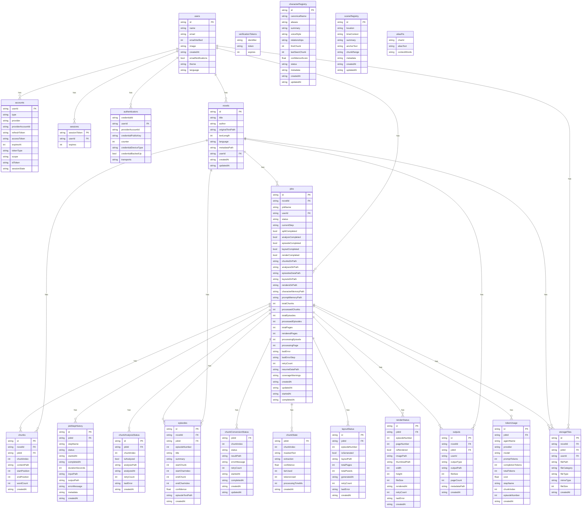

````markdown
# Entity-Relationship Diagram

This ER diagram is generated from `src/db/schema.ts`.


```mermaid
erDiagram
    users {
        string id PK
        string name
        string email
        int emailVerified
        string image
        string createdAt
        bool emailNotifications
        string theme
        string language
    }

    accounts {
        string userId FK
        string type
        string provider
        string providerAccountId
        string refreshToken
        string accessToken
        int expiresAt
        string tokenType
        string scope
        string idToken
        string sessionState
    }

    sessions {
        string sessionToken PK
        string userId FK
        int expires
    }

    verificationTokens {
        string identifier
        string token
        int expires
    }

    authenticators {
        string credentialId
        string userId FK
        string providerAccountId
        string credentialPublicKey
        int counter
        string credentialDeviceType
        bool credentialBackedUp
        string transports
    }

    novels {
        string id PK
        string title
        string author
        string originalTextPath
        int textLength
        string language
        string metadataPath
        string userId FK
        string createdAt
        string updatedAt
    }

    jobs {
        string id PK
        string novelId FK
        string jobName
        string userId FK
        string status
        string currentStep
        bool splitCompleted
        bool analyzeCompleted
        bool episodeCompleted
        bool layoutCompleted
        bool renderCompleted
        string chunksDirPath
        string analysesDirPath
        string episodesDataPath
        string layoutsDirPath
        string rendersDirPath
        string characterMemoryPath
        string promptMemoryPath
        int totalChunks
        int processedChunks
        int totalEpisodes
        int processedEpisodes
        int totalPages
        int renderedPages
        int processingEpisode
        int processingPage
        string lastError
        string lastErrorStep
        int retryCount
        string resumeDataPath
        string coverageWarnings
        string createdAt
        string updatedAt
        string startedAt
        string completedAt
    }

    jobStepHistory {
        string id PK
        string jobId FK
        string stepName
        string status
        string startedAt
        string completedAt
        int durationSeconds
        string inputPath
        string outputPath
        string errorMessage
        string metadata
        string createdAt
    }

    chunks {
        string id PK
        string novelId FK
        string jobId FK
        int chunkIndex
        string contentPath
        int startPosition
        int endPosition
        int wordCount
        string createdAt
    }

    chunkAnalysisStatus {
        string id PK
        string jobId FK
        int chunkIndex
        bool isAnalyzed
        string analysisPath
        string analyzedAt
        int retryCount
        string lastError
        string createdAt
    }

    chunkConversionStatus {
        string jobId FK
        int chunkIndex
        string status
        string resultPath
        string errorMessage
        int retryCount
        string startedAt
        string completedAt
        string createdAt
        string updatedAt
    }

    episodes {
        string id PK
        string novelId FK
        string jobId FK
        int episodeNumber
        string title
        string summary
        int startChunk
        int startCharIndex
        int endChunk
        int endCharIndex
        float confidence
        string episodeTextPath
        string createdAt
    }

    layoutStatus {
        string id PK
        string jobId FK
        int episodeNumber
        bool isGenerated
        string layoutPath
        int totalPages
        int totalPanels
        string generatedAt
        int retryCount
        string lastError
        string createdAt
    }

    renderStatus {
        string id PK
        string jobId FK
        int episodeNumber
        int pageNumber
        bool isRendered
        string imagePath
        string thumbnailPath
        int width
        int height
        int fileSize
        string renderedAt
        int retryCount
        string lastError
        string createdAt
    }

    outputs {
        string id PK
        string novelId FK
        string jobId FK
        string userId
        string outputType
        string outputPath
        int fileSize
        int pageCount
        string metadataPath
        string createdAt
    }

    storageFiles {
        string id PK
        string novelId FK
        string jobId FK
        string userId FK
        string filePath
        string fileCategory
        string fileType
        string mimeType
        int fileSize
        string createdAt
    }

    tokenUsage {
        string id PK
        string jobId FK
        string agentName
        string provider
        string model
        int promptTokens
        int completionTokens
        int totalTokens
        float cost
        string stepName
        int chunkIndex
        int episodeNumber
        string createdAt
    }

    characterRegistry {
        string id PK
        string canonicalName
        string aliases
        string summary
        string voiceStyle
        string relationships
        int firstChunk
        int lastSeenChunk
        float confidenceScore
        string status
        string metadata
        string createdAt
        string updatedAt
    }

    sceneRegistry {
        string id PK
        string location
        string timeContext
        string summary
        string anchorText
        string chunkRange
        string metadata
        string createdAt
        string updatedAt
    }

    chunkState {
        string jobId FK
        int chunkIndex
        string maskedText
        string extraction
        float confidence
        int tierUsed
        int tokensUsed
        int processingTimeMs
        string createdAt
    }

    aliasFts {
        string charId
        string aliasText
        string contextWords
    }

    users ||--o{ accounts : "has"
    users ||--o{ sessions : "has"
    users ||--o{ authenticators : "has"
    users ||--o{ novels : "has"
    users ||--o{ jobs : "has"
    users ||--o{ storageFiles : "has"

    novels ||--o{ jobs : "has"
    novels ||--o{ chunks : "has"
    novels ||--o{ episodes : "has"
    novels ||--o{ outputs : "has"
    novels ||--o{ storageFiles : "has"

    jobs ||--o{ jobStepHistory : "has"
    jobs ||--o{ chunks : "has"
    jobs ||--o{ chunkAnalysisStatus : "has"
    jobs ||--o{ chunkConversionStatus : "has"
    jobs ||--o{ chunkState : "has"
    jobs ||--o{ episodes : "has"
    jobs ||--o{ layoutStatus : "has"
    jobs ||--o{ renderStatus : "has"
    jobs ||--o{ outputs : "has"
    jobs ||--o{ storageFiles : "has"
    jobs ||--o{ tokenUsage : "has"
```
````
