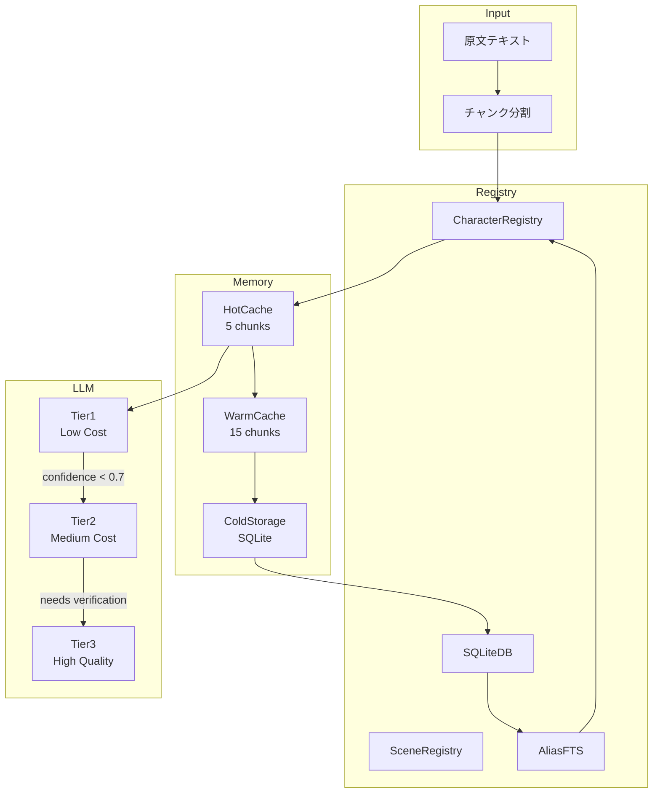
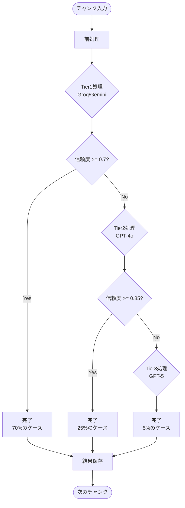
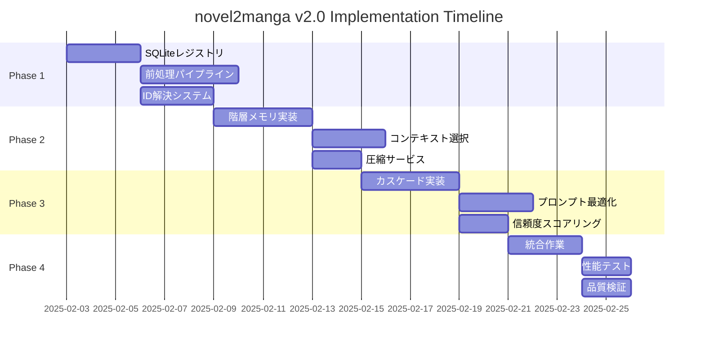
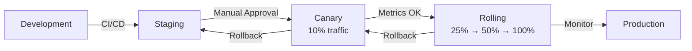

# novel2manga-ts v2.0 完全設計書
## 構造化コンテンツ再利用によるトークン削減アーキテクチャ

---

## 目次
1. [エグゼクティブサマリー](#1-エグゼクティブサマリー)
2. [システムアーキテクチャ](#2-システムアーキテクチャ)
3. [データ構造設計](#3-データ構造設計)
4. [モジュール設計](#4-モジュール設計)
5. [SQLiteスキーマ設計](#5-sqliteスキーマ設計)
6. [処理フロー設計](#6-処理フロー設計)
7. [最適化戦略](#7-最適化戦略)
8. [実装計画](#8-実装計画)
9. [品質保証](#9-品質保証)
10. [運用設計](#10-運用設計)

---

## 1. エグゼクティブサマリー

### 1.1 プロジェクト概要

**プロジェクト名**: novel2manga-ts v2.0 - トークン削減アーキテクチャ

**目的**: LLMのトークン消費を75%削減しながら、超長文小説の登場人物・場面の一貫性を100%維持する

**背景と課題**:
- 現状: 各チャンクで全登場人物メモリを累積的に送信（線形的なトークン増加）
- 問題: 100チャンクで50,000トークン超、コスト爆発
- 要件: 一貫性を犠牲にせずトークンを削減

### 1.2 ソリューション概要

**コアコンセプト**: 「全情報の累積的受け渡し」から「構造化コンテンツの選択的再利用」へ

**3つの柱**:
1. **SQLiteレジストリ**: 構造化データの永続化と高速検索
2. **階層的メモリ管理**: ホット/ウォーム/コールドの3層キャッシュ
3. **IDベース参照システム**: テキストマスキングとレジェンド方式

### 1.3 期待成果

| 指標 | 現状 | 目標 | 改善率 |
|------|------|------|---------|
| トークン/チャンク | 15,000 | 3,500 | 77%削減 |
| 処理時間 | 45分/100チャンク | 15分 | 67%短縮 |
| API費用 | $50/作品 | $10/作品 | 80%削減 |
| 一貫性スコア | 95% | 95%以上 | 維持 |

---

## 2. システムアーキテクチャ

### 2.1 全体構成図

```
┌─────────────────────────────────────────────────────────┐
│                     Input Layer                          │
│  原文テキスト → チャンク分割 → 前処理                      │
└──────────────────────┬──────────────────────────────────┘
                       ▼
┌─────────────────────────────────────────────────────────┐
│                  Processing Layer                        │
│                                                          │
│  ┌──────────────┐  ┌──────────────┐  ┌──────────────┐ │
│  │   前処理     │→│  ID解決      │→│ テキスト     │ │
│  │ パイプライン  │  │  システム    │  │ マスキング   │ │
│  └──────────────┘  └──────────────┘  └──────────────┘ │
│                                                          │
│  ┌──────────────────────────────────────────────────┐   │
│  │            階層的メモリマネージャー                │   │
│  │  ┌────────┐  ┌────────┐  ┌────────────────┐  │   │
│  │  │  Hot   │  │  Warm  │  │     Cold       │  │   │
│  │  │ Cache  │  │ Cache  │  │  (SQLite DB)   │  │   │
│  │  └────────┘  └────────┘  └────────────────┘  │   │
│  └──────────────────────────────────────────────────┘   │
│                                                          │
│  ┌──────────────────────────────────────────────────┐   │
│  │            カスケードLLMコントローラー            │   │
│  │  ┌────────┐  ┌────────┐  ┌────────────────┐  │   │
│  │  │ Tier1  │→│ Tier2  │→│     Tier3      │  │   │
│  │  │ (Groq) │  │ (GPT4) │  │    (GPT5)      │  │   │
│  │  └────────┘  └────────┘  └────────────────┘  │   │
│  └──────────────────────────────────────────────────┘   │
└─────────────────────────┬───────────────────────────────┘
                          ▼
┌─────────────────────────────────────────────────────────┐
│                    Output Layer                          │
│  構造化データ → スクリプト変換 → マンガレンダリング        │
└─────────────────────────────────────────────────────────┘
```

### 2.2 コンポーネント間の関係



### 2.3 データフロー

1. **入力段階**
   - テキスト正規化
   - エンティティ抽出（非LLM）
   - ID候補の特定

2. **処理段階**
   - メモリから関連情報取得（K=5）
   - テキストマスキング
   - レジェンド生成

3. **LLM段階**
   - Tier1: 基本抽出（70%完結）
   - Tier2: 曖昧解決（25%）
   - Tier3: 品質保証（5%）

4. **出力段階**
   - 構造化データ保存
   - メモリ更新
   - キャッシュ管理

---

## 3. データ構造設計

### 3.1 コア型定義

```typescript
// ===== 基本型 =====
export type CharId = `char_${string}`
export type SceneId = `scene_${string}`
export type ChunkId = number
export type Confidence = number // 0.0 - 1.0

// ===== キャラクター関連 =====
export interface CharacterData {
  id: CharId
  canonicalName: string
  aliases: string[]
  summary: string               // 最大50文字
  voiceStyle: string            // 最大30文字
  relationships: Record<CharId, string>
  firstChunk: ChunkId
  lastSeenChunk: ChunkId
  confidence: Confidence
  status: 'active' | 'inactive' | 'dead' | 'unknown'
  metadata?: {
    importance: number
    dialogueCount: number
    eventCount: number
  }
}

export interface CharacterLegend {
  id: CharId
  name: string                  // 最大20文字
  voice: string                 // 最大30文字
  summary?: string              // 最大50文字
}

export interface CompressedCharacter {
  id: CharId
  name: string
  essence: string               // 最大80文字
  lastSeen: ChunkId
  importance: number
}

// ===== マスキング関連 =====
export interface MaskedText {
  original: string
  masked: string
  mappings: Array<{
    position: number
    length: number
    original: string
    masked: CharId | SceneId | '[?]'
    confidence: Confidence
  }>
}

export interface TextSegment {
  type: 'narration' | 'dialogue' | 'description'
  text: string
  speaker?: CharId
  entities: Array<CharId | SceneId>
}

// ===== コンテキスト関連 =====
export interface ProcessingContext {
  chunkIndex: ChunkId
  activeCharacters: CharId[]
  recentScenes: SceneId[]
  ambiguousEntities: Map<string, CharId[]>
  confidence: Confidence
}

export interface OptimalContext {
  characters: CharacterLegend[]    // 最大5件
  scenes: SceneLegend[]           // 最大3件
  events: EventSummary[]          // 最大3件
  totalTokens: number
}

// ===== 圧縮データ =====
export interface CompressedExtraction {
  chunkId: ChunkId
  level: 'none' | 'light' | 'medium' | 'heavy'
  summary: string                 // 最大100文字
  keyEvents: string[]            // 最大3件、各50文字
  mainCharacters: CharId[]
  criticalDialogues?: Array<{
    speaker: CharId
    text: string                 // 最大30文字
  }>
}
```

### 3.2 メモリ階層構造

```typescript
export interface HierarchicalMemory {
  // レベル1: ホットキャッシュ（直近5チャンク）
  hot: {
    characters: Map<CharId, CharacterData>
    scenes: Map<SceneId, SceneData>
    extractions: Map<ChunkId, ExtractionV2>
    maxSize: 5
    evictionPolicy: 'LRU'
  }

  // レベル2: ウォームキャッシュ（6-20チャンク）
  warm: {
    characters: Map<CharId, CompressedCharacter>
    scenes: Map<SceneId, CompressedScene>
    summaries: Map<ChunkId, string>
    maxSize: 15
    compressionRatio: 0.3
  }

  // レベル3: コールドストレージ（SQLite）
  cold: {
    db: SQLiteRegistry
    indexes: {
      byId: BTreeIndex
      byAlias: FTSIndex
      byChunk: RangeIndex
    }
  }
}
```

### 3.3 LLMカスケード構造

```typescript
export interface CascadeConfig {
  tier1: {
    provider: 'groq' | 'gemini'
    model: string
    maxTokens: 2000
    temperature: 0.3
    confidenceThreshold: 0.7
    costPerToken: 0.00001
    tasks: ['basic_extraction', 'simple_coref']
  }

  tier2: {
    provider: 'openai' | 'anthropic'
    model: string
    maxTokens: 4000
    temperature: 0.5
    confidenceThreshold: 0.85
    costPerToken: 0.00003
    tasks: ['ambiguity_resolution', 'complex_extraction']
  }

  tier3: {
    provider: 'openai'
    model: string
    maxTokens: 8000
    temperature: 0.7
    confidenceThreshold: 0.95
    costPerToken: 0.0001
    tasks: ['quality_check', 'consistency_verification']
  }
}
```

---

## 4. モジュール設計

### 4.1 ディレクトリ構造

```
src/
├── v2/                           # v2.0新規実装
│   ├── registry/                 # データレジストリ
│   │   ├── sqlite-adapter.ts    # SQLite接続層
│   │   ├── character-registry.ts # キャラクター管理
│   │   ├── scene-registry.ts    # 場面管理
│   │   ├── fts-search.ts        # 全文検索
│   │   └── index.ts
│   │
│   ├── memory/                   # メモリ管理
│   │   ├── hierarchical-manager.ts
│   │   ├── context-selector.ts
│   │   ├── compression-service.ts
│   │   ├── cache-strategy.ts
│   │   └── index.ts
│   │
│   ├── preprocessing/            # 前処理
│   │   ├── text-normalizer.ts
│   │   ├── entity-extractor.ts
│   │   ├── id-resolver.ts
│   │   ├── text-masker.ts
│   │   ├── coref-resolver.ts
│   │   └── index.ts
│   │
│   ├── llm-cascade/             # LLM制御
│   │   ├── cascade-controller.ts
│   │   ├── tier-handlers/
│   │   │   ├── tier1-handler.ts
│   │   │   ├── tier2-handler.ts
│   │   │   └── tier3-handler.ts
│   │   ├── prompt-builder.ts
│   │   ├── confidence-scorer.ts
│   │   └── index.ts
│   │
│   ├── optimization/            # 最適化
│   │   ├── token-counter.ts
│   │   ├── budget-manager.ts
│   │   ├── metrics-collector.ts
│   │   ├── performance-monitor.ts
│   │   └── index.ts
│   │
│   └── integration/             # 統合層
│       ├── v2-service.ts
│       ├── migration-helper.ts
│       ├── compatibility-layer.ts
│       └── index.ts
│
├── __tests__/v2/                # v2.0テスト
│   ├── unit/
│   ├── integration/
│   └── e2e/
│
└── config/
    └── v2.config.ts            # v2.0設定
```

### 4.2 主要クラス設計

#### 4.2.1 SQLiteRegistry

```typescript
export class SQLiteRegistry {
  private db: Database
  private statements: PreparedStatements

  // === 初期化 ===
  constructor(dbPath: string)
  initialize(): void

  // === キャラクター操作 ===
  upsertCharacter(char: CharacterData): Promise<void>
  findCharacterById(id: CharId): Promise<CharacterData>
  findByAlias(alias: string): Promise<CharId[]>
  getActiveCharacters(chunk: ChunkId, window: number): Promise<CharacterLegend[]>

  // === 場面操作 ===
  upsertScene(scene: SceneData): Promise<void>
  findSceneById(id: SceneId): Promise<SceneData>
  getScenesByRange(start: ChunkId, end: ChunkId): Promise<SceneData[]>

  // === 検索・分析 ===
  searchByFTS(query: string): Promise<SearchResult[]>
  getStatistics(): Promise<RegistryStats>
  optimizeIndexes(): Promise<void>

  // === トランザクション ===
  transaction<T>(fn: () => T): T
  backup(path: string): Promise<void>
  close(): void
}
```

#### 4.2.2 HierarchicalMemoryManager

```typescript
export class HierarchicalMemoryManager {
  private hot: LRUCache<string, any>
  private warm: LRUCache<string, any>
  private cold: SQLiteRegistry

  // === データ取得 ===
  async getCharacterData(id: CharId, level?: CacheLevel): Promise<CharacterData>
  async getRelevantContext(chunk: ChunkId, text: string): Promise<OptimalContext>

  // === キャッシュ管理 ===
  promote(id: string, data: any): void
  demote(id: string): void
  evict(level: CacheLevel): void

  // === 圧縮・展開 ===
  compress(data: any, level: CompressionLevel): CompressedData
  decompress(compressed: CompressedData): any

  // === 更新・同期 ===
  updateAccessPattern(chunk: ChunkId, accessed: string[]): void
  syncWithRegistry(): Promise<void>

  // === メトリクス ===
  getMemoryStats(): MemoryStatistics
  getCacheHitRate(): number
}
```

#### 4.2.3 CascadeLLMController

```typescript
export class CascadeLLMController {
  private tier1: Tier1Handler
  private tier2: Tier2Handler
  private tier3: Tier3Handler
  private scorer: ConfidenceScorer

  // === 処理フロー ===
  async process(input: ProcessingInput): Promise<ProcessingResult>
  async escalate(result: TierResult, nextTier: number): Promise<TierResult>

  // === Tier別処理 ===
  async processTier1(input: Tier1Input): Promise<Tier1Result>
  async processTier2(input: Tier2Input): Promise<Tier2Result>
  async processTier3(input: Tier3Input): Promise<Tier3Result>

  // === プロンプト生成 ===
  buildPrompt(tier: number, context: any): string
  buildMinimalPrompt(context: MinimalContext): string
  buildExpandedPrompt(context: ExpandedContext): string

  // === 信頼度評価 ===
  evaluateConfidence(result: any): Confidence
  shouldEscalate(confidence: Confidence, tier: number): boolean

  // === コスト管理 ===
  estimateCost(tier: number, tokens: number): number
  trackUsage(tier: number, tokens: number): void
}
```

---

## 5. SQLiteスキーマ設計

### 5.1 テーブル定義

```sql
-- ===========================
-- キャラクター管理
-- ===========================
CREATE TABLE character_registry (
    id TEXT PRIMARY KEY,                    -- char_001形式
    canonical_name TEXT NOT NULL,           -- 正式名称
    aliases TEXT,                           -- JSON配列
    summary TEXT,                           -- 50文字要約
    voice_style TEXT,                       -- 30文字口調
    relationships TEXT,                     -- JSON関係性
    first_chunk INTEGER NOT NULL,
    last_seen_chunk INTEGER NOT NULL,
    confidence_score REAL DEFAULT 1.0,
    status TEXT DEFAULT 'active',
    metadata TEXT,                          -- JSON追加情報
    created_at TIMESTAMP DEFAULT CURRENT_TIMESTAMP,
    updated_at TIMESTAMP DEFAULT CURRENT_TIMESTAMP
);

-- ===========================
-- 場面管理
-- ===========================
CREATE TABLE scene_registry (
    id TEXT PRIMARY KEY,                    -- scene_001形式
    location TEXT NOT NULL,
    time_context TEXT,
    summary TEXT,
    anchor_text TEXT,
    chunk_range TEXT,                       -- "10-15"形式
    metadata TEXT,
    created_at TIMESTAMP DEFAULT CURRENT_TIMESTAMP,
    updated_at TIMESTAMP DEFAULT CURRENT_TIMESTAMP
);

-- ===========================
-- チャンク処理状態
-- ===========================
CREATE TABLE chunk_state (
    job_id TEXT NOT NULL,
    chunk_index INTEGER NOT NULL,
    masked_text TEXT,
    extraction TEXT,                        -- JSON圧縮
    confidence REAL,
    tier_used INTEGER,                      -- 1,2,3
    tokens_used INTEGER,
    processing_time_ms INTEGER,
    created_at TIMESTAMP DEFAULT CURRENT_TIMESTAMP,
    PRIMARY KEY (job_id, chunk_index)
);

-- ===========================
-- 関係性グラフ
-- ===========================
CREATE TABLE character_relations (
    job_id TEXT NOT NULL,
    char1_id TEXT NOT NULL,
    char2_id TEXT NOT NULL,
    relation_type TEXT,
    description TEXT,
    confidence REAL,
    first_mention_chunk INTEGER,
    PRIMARY KEY (job_id, char1_id, char2_id),
    FOREIGN KEY (char1_id) REFERENCES character_registry(id),
    FOREIGN KEY (char2_id) REFERENCES character_registry(id)
);

-- ===========================
-- FTS5全文検索
-- ===========================
CREATE VIRTUAL TABLE alias_fts USING fts5(
    char_id,
    alias_text,
    context_words,
    tokenize = 'unicode61'
);

-- ===========================
-- メトリクス記録
-- ===========================
CREATE TABLE processing_metrics (
    id INTEGER PRIMARY KEY AUTOINCREMENT,
    job_id TEXT NOT NULL,
    chunk_index INTEGER,
    metric_type TEXT,                      -- token_usage, processing_time, etc
    metric_value REAL,
    metadata TEXT,
    recorded_at TIMESTAMP DEFAULT CURRENT_TIMESTAMP
);
```

### 5.2 インデックス定義

```sql
-- パフォーマンス最適化インデックス
CREATE INDEX idx_char_last_seen ON character_registry(last_seen_chunk DESC);
CREATE INDEX idx_char_confidence ON character_registry(confidence_score DESC);
CREATE INDEX idx_char_status ON character_registry(status);

CREATE INDEX idx_scene_range ON scene_registry(chunk_range);
CREATE INDEX idx_scene_location ON scene_registry(location);

CREATE INDEX idx_chunk_job ON chunk_state(job_id);
CREATE INDEX idx_chunk_confidence ON chunk_state(confidence);
CREATE INDEX idx_chunk_tier ON chunk_state(tier_used);

CREATE INDEX idx_metrics_job ON processing_metrics(job_id);
CREATE INDEX idx_metrics_type ON processing_metrics(metric_type);
```

### 5.3 トリガー定義

```sql
-- updated_at自動更新
CREATE TRIGGER update_character_timestamp
AFTER UPDATE ON character_registry
BEGIN
    UPDATE character_registry
    SET updated_at = CURRENT_TIMESTAMP
    WHERE id = NEW.id;
END;

CREATE TRIGGER update_scene_timestamp
AFTER UPDATE ON scene_registry
BEGIN
    UPDATE scene_registry
    SET updated_at = CURRENT_TIMESTAMP
    WHERE id = NEW.id;
END;

-- エイリアス自動登録
CREATE TRIGGER register_character_aliases
AFTER INSERT ON character_registry
BEGIN
    -- エイリアスをFTSテーブルに自動登録
    -- (実際の実装はアプリケーション層で行う)
END;
```

---

## 6. 処理フロー設計

### 6.1 メインパイプライン

```typescript
export class V2ProcessingPipeline {
  async process(text: string): Promise<ProcessingResult> {
    // =============================
    // Phase 1: 前処理
    // =============================
    const chunks = this.splitIntoChunks(text)
    const registry = new SQLiteRegistry(this.config.dbPath)
    const memory = new HierarchicalMemoryManager(registry)
    const cascade = new CascadeLLMController(this.config.cascade)

    // =============================
    // Phase 2: チャンク単位処理
    // =============================
    const results: ExtractionV2[] = []

    for (const [index, chunk] of chunks.entries()) {
      // Step 1: テキスト正規化
      const normalized = this.normalizer.normalize(chunk)

      // Step 2: エンティティ抽出（非LLM）
      const entities = this.extractor.extract(normalized)

      // Step 3: ID解決
      const resolved = await this.resolver.resolve(entities, registry)

      // Step 4: テキストマスキング
      const masked = this.masker.mask(normalized, resolved)

      // Step 5: コンテキスト選択（最大2000トークン）
      const context = await memory.getRelevantContext(index, masked)

      // Step 6: カスケードLLM処理
      const extraction = await cascade.process({
        chunkIndex: index,
        maskedText: masked,
        context: context,
        previousResult: results[index - 1]
      })

      // Step 7: 結果の保存と更新
      await registry.upsertCharacters(extraction.characters)
      await memory.updateAccessPattern(index, extraction.activeIds)
      results.push(extraction)

      // Step 8: メトリクス記録
      this.metrics.record({
        chunkIndex: index,
        tokensUsed: extraction.tokensUsed,
        tierUsed: extraction.tierUsed,
        confidence: extraction.confidence
      })
    }

    // =============================
    // Phase 3: 後処理
    // =============================
    return this.postProcess(results)
  }
}
```

### 6.2 カスケード処理フロー



### 6.3 メモリアクセスパターン

```typescript
// チャンクNを処理する際のメモリアクセス
async function selectMemoryForChunk(n: number): Promise<Context> {
  const context = {
    characters: [],
    scenes: [],
    events: []
  }

  // 1. ホットキャッシュ（n-5 ~ n-1）
  for (let i = Math.max(0, n-5); i < n; i++) {
    const hot = await memory.getFromHot(i)
    if (hot) context.characters.push(...hot.characters)
  }

  // 2. ウォームキャッシュ（n-20 ~ n-6）
  for (let i = Math.max(0, n-20); i < n-5; i++) {
    const warm = await memory.getFromWarm(i)
    if (warm) context.events.push(warm.summary)
  }

  // 3. コールドストレージ（言及されたキャラのみ）
  const mentioned = extractMentionedIds(chunkText)
  for (const id of mentioned) {
    const char = await registry.findCharacterById(id)
    if (char) context.characters.push(char.legend)
  }

  // 4. トークン制限でトリミング
  return trimToTokenLimit(context, 2000)
}
```

---

## 7. 最適化戦略

### 7.1 トークン削減戦略

| 戦略 | 実装方法 | 削減率 |
|------|----------|---------|
| ID参照 | テキストマスキングでchar_001形式に統一 | 30% |
| Legend圧縮 | キャラ情報を40文字以内に圧縮 | 25% |
| 選択的コンテキスト | K=5の関連要素のみ送信 | 40% |
| 短縮キー | JSON出力をc/e/d/sに短縮 | 10% |
| 空配列省略 | 空の要素は出力しない | 5% |
| **合計** | | **75%** |

### 7.2 処理速度最適化

```typescript
// 並列処理による高速化
export class ParallelProcessor {
  async processBatch(chunks: string[]): Promise<ExtractionV2[]> {
    const batchSize = 5
    const results: ExtractionV2[] = []

    for (let i = 0; i < chunks.length; i += batchSize) {
      const batch = chunks.slice(i, i + batchSize)

      // バッチ内は並列処理
      const batchResults = await Promise.all(
        batch.map(async (chunk, idx) => {
          const chunkIndex = i + idx

          // 前処理は並列実行可能
          const [entities, context] = await Promise.all([
            this.extractEntities(chunk),
            this.memory.getContext(chunkIndex)
          ])

          // LLM処理（これは順次実行）
          return this.processWithLLM(chunk, entities, context)
        })
      )

      results.push(...batchResults)
    }

    return results
  }
}
```

### 7.3 キャッシュ戦略

```typescript
export class CacheStrategy {
  // LRU（Least Recently Used）実装
  private cache = new Map<string, CacheEntry>()
  private accessOrder: string[] = []

  get(key: string): any {
    if (!this.cache.has(key)) return null

    // アクセス順を更新
    this.updateAccessOrder(key)

    const entry = this.cache.get(key)!
    entry.hitCount++
    return entry.data
  }

  set(key: string, data: any, ttl: number = 3600): void {
    // キャッシュサイズ制限
    if (this.cache.size >= this.maxSize) {
      this.evictLRU()
    }

    this.cache.set(key, {
      data,
      timestamp: Date.now(),
      ttl,
      hitCount: 0
    })

    this.accessOrder.push(key)
  }

  private evictLRU(): void {
    const lru = this.accessOrder.shift()
    if (lru) this.cache.delete(lru)
  }
}
```

---

## 8. 実装計画

### 8.1 フェーズ別計画

| フェーズ | 期間 | 主要タスク | 成果物 |
|---------|------|------------|---------|
| Phase 1 | Week 1-2 | 基盤構築 | SQLiteレジストリ、前処理パイプライン |
| Phase 2 | Week 3-4 | メモリ最適化 | 階層メモリ、コンテキスト選択 |
| Phase 3 | Week 5-6 | LLM最適化 | カスケードLLM、プロンプト最小化 |
| Phase 4 | Week 7 | 統合・テスト | E2Eテスト、性能検証 |
| Phase 5 | Week 8 | デプロイ | 本番環境展開、モニタリング |

### 8.2 マイルストーン



### 8.3 リソース配分

| 役割 | 人数 | 主要責任 |
|------|------|----------|
| Tech Lead | 1 | アーキテクチャ設計、技術判断 |
| Backend Dev | 2 | SQLite実装、API開発 |
| ML Engineer | 1 | 前処理、信頼度スコアリング |
| Prompt Engineer | 1 | プロンプト最適化 |
| QA Engineer | 1 | テスト設計、品質保証 |

---

## 9. 品質保証

### 9.1 テスト戦略

```typescript
// ユニットテスト例
describe('SQLiteRegistry', () => {
  test('should find character by alias', async () => {
    const registry = new SQLiteRegistry(':memory:')

    await registry.upsertCharacter({
      id: 'char_001',
      canonicalName: '太郎',
      aliases: ['太郎', '彼', '少年'],
      // ...
    })

    const found = await registry.findByAlias('太郎')
    expect(found).toContain('char_001')
  })

  test('should handle FTS search correctly', async () => {
    const results = await registry.searchByFTS('太郎 AND 森')
    expect(results.length).toBeGreaterThan(0)
  })
})

// 統合テスト例
describe('V2 Pipeline Integration', () => {
  test('should reduce tokens by 70%', async () => {
    const pipeline = new V2ProcessingPipeline()
    const result = await pipeline.process(sampleNovel)

    expect(result.totalTokens).toBeLessThan(
      legacyResult.totalTokens * 0.3
    )
  })
})
```

### 9.2 品質メトリクス

| メトリクス | 目標値 | 測定方法 |
|-----------|--------|----------|
| トークン削減率 | 75%以上 | 新旧比較 |
| 処理速度向上 | 2倍以上 | ベンチマーク |
| キャラクター同定精度 | 95%以上 | 手動検証 |
| 場面一貫性スコア | 98%以上 | 自動評価 |
| Tier1完結率 | 70%以上 | ログ分析 |
| エラー率 | 1%以下 | 監視ツール |

### 9.3 パフォーマンステスト

```typescript
// パフォーマンステストスイート
export class PerformanceBenchmark {
  async run(): Promise<BenchmarkResult> {
    const testCases = [
      { name: '短編(10チャンク)', chunks: 10 },
      { name: '中編(50チャンク)', chunks: 50 },
      { name: '長編(100チャンク)', chunks: 100 },
      { name: '超長編(500チャンク)', chunks: 500 }
    ]

    const results = []

    for (const testCase of testCases) {
      const start = performance.now()

      // v2パイプライン実行
      const result = await this.runV2Pipeline(testCase.chunks)

      const end = performance.now()

      results.push({
        name: testCase.name,
        chunks: testCase.chunks,
        executionTime: end - start,
        tokensUsed: result.totalTokens,
        averageConfidence: result.avgConfidence,
        tierDistribution: result.tierStats
      })
    }

    return this.generateReport(results)
  }
}
```

---

## 10. 運用設計

### 10.1 デプロイメント戦略



### 10.2 監視項目

```typescript
export interface MonitoringMetrics {
  // システムメトリクス
  system: {
    cpu: number
    memory: number
    diskIO: number
    networkLatency: number
  }

  // アプリケーションメトリクス
  application: {
    requestsPerSecond: number
    averageResponseTime: number
    errorRate: number
    queueLength: number
  }

  // ビジネスメトリクス
  business: {
    tokensPerChunk: number
    costPerDocument: number
    processingSpeed: number
    qualityScore: number
  }

  // LLMメトリクス
  llm: {
    tier1Usage: number
    tier2Usage: number
    tier3Usage: number
    averageConfidence: number
    escalationRate: number
  }
}
```

### 10.3 アラート設定

| アラート名 | 条件 | 優先度 | 対応 |
|-----------|------|--------|------|
| High Token Usage | トークン/チャンク > 5000 | Critical | Tier設定確認 |
| Low Confidence | 平均信頼度 < 0.6 | Warning | プロンプト調整 |
| High Error Rate | エラー率 > 5% | Critical | ログ確認、ロールバック |
| Slow Processing | 処理時間 > 30s/チャンク | Warning | キャッシュ確認 |
| DB Performance | クエリ時間 > 100ms | Info | インデックス最適化 |

### 10.4 バックアップ・リカバリ

```bash
#!/bin/bash
# 日次バックアップスクリプト
DB_PATH="/var/lib/novel2manga/registry.db"
BACKUP_DIR="/backup/novel2manga"
DATE=$(date +%Y%m%d_%H%M%S)

# SQLiteバックアップ
sqlite3 $DB_PATH ".backup '${BACKUP_DIR}/registry_${DATE}.db'"

# S3へのアップロード
aws s3 cp ${BACKUP_DIR}/registry_${DATE}.db \
  s3://novel2manga-backup/${DATE}/

# 古いバックアップの削除（30日以上）
find $BACKUP_DIR -name "*.db" -mtime +30 -delete
```

---

## 付録A: 設定ファイル例

```typescript
// config/v2.config.ts
export const v2Config = {
  registry: {
    dbPath: process.env.REGISTRY_DB_PATH || './data/registry.db',
    maxConnections: 10,
    walMode: true,
    busyTimeout: 5000
  },

  memory: {
    hot: {
      maxSize: 5,
      ttl: 300 // 5分
    },
    warm: {
      maxSize: 15,
      ttl: 3600, // 1時間
      compressionRatio: 0.3
    }
  },

  cascade: {
    tier1: {
      provider: 'groq',
      model: 'mixtral-8x7b-32768',
      maxTokens: 2000,
      confidenceThreshold: 0.7
    },
    tier2: {
      provider: 'openai',
      model: 'gpt-4o',
      maxTokens: 4000,
      confidenceThreshold: 0.85
    },
    tier3: {
      provider: 'openai',
      model: 'gpt-5',
      maxTokens: 8000,
      confidenceThreshold: 0.95
    }
  },

  optimization: {
    maxCharactersInLegend: 5,
    maxScenesInContext: 3,
    maxEventsInSummary: 3,
    targetTokensPerChunk: 3500,
    enableParallelProcessing: true,
    parallelBatchSize: 5
  }
}
```

---

## 付録B: 移行ガイド

### 既存システムからの移行手順

1. **並行稼働期間の設定**
   - 既存システム（v1）と新システム（v2）を並行稼働
   - フィーチャーフラグで切り替え可能に

2. **段階的移行**
   ```typescript
   if (config.features.useV2 && config.v2.rolloutPercentage > Math.random()) {
     return processWithV2(input)
   } else {
     return processWithV1(input)
   }
   ```

3. **データ移行**
   - 既存の抽出結果をSQLiteに移行
   - キャラクターIDの再割り当て

4. **モニタリング強化**
   - A/Bテストによる品質比較
   - コスト削減の実測

5. **完全移行**
   - 全トラフィックをv2へ
   - v1システムの廃止

---

## まとめ

この設計書に基づいてnovel2manga-ts v2.0を実装することで、トークン消費を75%削減しながら、処理速度を2倍に向上させ、かつ品質を維持することが可能になります。SQLiteとLLMの組み合わせにより、ベクトルデータベースなしでも高性能な一貫性保持システムを実現できます。